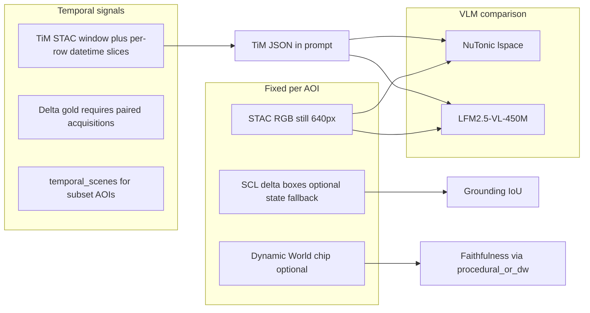

# Patagonia fine-tune exposé and blog — implementation plan

## Context gathered (for accuracy)

**How [Patagonia_Eval/patagonia_eval_runs/command.md](Patagonia_Eval/patagonia_eval_runs/command.md) drives the eval**

- Intended invocation: `uv run --project tools/patagonia_eval --extra ee python tools/evaluate_vlm_patagonia_tim_e2e.py ...` from repo root (the saved line begins with `v run`; treat as **`uv run`** typo when documenting).
- Key semantics vs defaults elsewhere:
  - **STAC stills**: `--still-source stac`, `--refresh-images`, `--stac-still-datetime`, strict cloud (`--stac-still-max-cloud 15`), bbox half-km **20**, max-items **120**.
  - **Temporal (still / gold path)**: `--temporal-scenes-mode latest` plus per-target `temporal_scenes` on wildfire/flood AOIs in [`tools/evaluate_vlm_patagonia.py`](tools/evaluate_vlm_patagonia.py) → resolved effective datetime for fetch + gold sidecars (see `still_provenance_by_target` in reports).
  - **TiM inputs**: `--s2-datetime`, `--s2-max-cloud 15`, `--s2-max-items 120`; [`tim/tim_config.json`](Patagonia_Eval/patagonia_eval_runs/20260507T230936Z/tim/tim_config.json) shows **per-target overrides** (`analysis_profile`, **`temporal_scenes`** on steppe/wetland rows, narrower datetime windows).
  - **Gold / “temporal” grounding**: `--gold-mode delta`, **`--gold-min-temporal-separation-days 31`** (bi-temporal SCL XOR regions); differs from other runs that used 21 days.
  - **Analytics + EE**: `--fetch-dynamic-world`, `--analytics-source procedural_or_dw`.
  - **Models**: implicit comparison **NuTonic/lspace** (`finetune`) vs **LiquidAI/LFM2.5-VL-450M** (`base`) via [`evaluate_vlm_patagonia_tim_e2e.py`](tools/evaluate_vlm_patagonia_tim_e2e.py) defaults / env overrides.
  - **Variants**: `--local-vlm-variants both` → TiM-in-prompt vs image-only + **`--contrastive-tim-flip`** / counterfactual `tim_payload_flip` rows.
  - **Publishing**: `--hf-dataset-repo NuTonic/Patagonia_Eval`.

**Fixed vs temporal aspects in one run**

- **“Fixed”**: single canonical RGB chip per target after refresh; lexical probes tied to AOI geography ([`EvalTarget`](tools/evaluate_vlm_patagonia.py)).
- **“Temporal”**: (1) TiM encoder sees Sentinel-2 stacks over `--s2-datetime`; (2) gold boxes in **delta** mode encode **change between dates**; (3) selected targets carry **`temporal_scenes`** so STAC/DW/TiM datetime alignment differs by application profile (wildfire, flood_pulse).

**Critically — published runs and TiM health**

Both analyzed reports ([`20260507T230936Z/report.json`](Patagonia_Eval/patagonia_eval_runs/20260507T230936Z/report.json) locally; earlier discussion of `214643Z`) show **`provider_health.tim`**: all **12 rows `degenerate`** with **`tim_modality_outputs_zero_signal`** and **`profile_analytics_body_empty`**. Under **`procedural_or_dw`**, analytics therefore fall through to **SCL-derived procedural** (and DW when EE succeeds), **not** healthy TiM JSON. The exposé must **state this plainly**: scores primarily reflect **VLM + engineered analytics + optical gold**, not validated TiM semantic correctness.

**Headline numbers from [`20260507T230936Z/models/finetune/summary.json`](Patagonia_Eval/patagonia_eval_runs/20260507T230936Z/models/finetune/summary.json) vs [`base/summary.json`](Patagonia_Eval/patagonia_eval_runs/20260507T230936Z/models/base/summary.json)** (TiM-in-prompt primary rows, `n=12`)

| Metric | Finetune | Base |
|--------|----------|------|
| mean composite | 0.2885 | 0.4825 |
| mean structured / contract | **0.0** | **0.7333** |
| mean lexical | 0.4854 | 0.6125 |
| mean grounding | 0.224 | 0.159 |
| mean faithfulness | 0.6182 | 0.6882 |
| pass_rate @0.5 | 0.167 | 0.417 |

This asymmetry (base wins contract; finetune slightly higher grounding on average) is the core **story** for the blog — with caveats on TiM degeneracy and threshold choice.

**Training stack (fine-tune “what it is”)**

- Launcher: [`train/train_lfm_vl_sft.py`](train/train_lfm_vl_sft.py) → LEAP **`vlm_sft`** in [`refs/leap-finetune-main`](refs/leap-finetune-main); dataset default **`NuTonic/sat-vl-sft-training-ready-v1`**; LoRA-style config in [`train/configs/lfm_vl_satellite_sft.smoke.yaml`](train/configs/lfm_vl_satellite_sft.smoke.yaml) (representative).
- Broader satellite multitask narrative: [`refs/satellite-vlm/README.md`](refs/satellite-vlm/README.md) (VRSBench-style caption/VQA/grounding).

**PRO tab / product bridge**

- Normative PRO architecture: [`docs/PRO-TAB-VLM-ORCHESTRATION-SPEC.md`](docs/PRO-TAB-VLM-ORCHESTRATION-SPEC.md) — Mapbox + Sentinel STAC materialization, TiM + on-device VLM, **`ProVisionBundle`**.
- Inference surfaces: [`inference/README.md`](inference/README.md) — **`lfm_vl_satellite_caption_service`**, **`pro_materialization_service`**, **`terramind_tim_local`**.
- Relationship Space vs PRO: [`plans/2026-04-07-lfm-vl-inference-spaces-satellite-and-streetview.md`](plans/2026-04-07-lfm-vl-inference-spaces-satellite-and-streetview.md) §4.5.

---

## Phase 1 — Skeleton document ([eval.md](Patagonia_Eval/patagonia_eval_runs/eval.md))

**Deliverable:** Replace empty `eval.md` with a **full outline** (H1/H2/H3), placeholder bullets, and “TODO: paste tables / cite paths” — **no narrative prose yet**.

Suggested section skeleton (editable):

1. Title + subtitle + audience
2. Executive summary (mission: predictive EO + TiM+VLM; ethics/priority-setting framing)
3. Background: Liquid LFM2.5-VL-450M → NuTonic **lspace** satellite specialist
4. Training methodology (dataset, LEAP/LoRA, tasks aligned with production JSON)
5. Product placement (PRO tab; server caption service vs on-device)
6. Patagonia benchmark design (AOI taxonomy: Andean, marine, glacier, urban, steppe, wetland, …)
7. **Fixed snapshot** evaluation (STAC still, lexical, output contract)
8. **Temporal** evaluation (TiM windows, delta gold, `temporal_scenes`, separation-days policy)
9. Analytics pipeline (procedural_or_dw, SCL, Dynamic World, synthetic oracle mention)
10. Results — aggregate (finetune vs base; variants `no_tim`, `cf_tim_payload_flip`, contrast flip)
11. Results — by geography / profile (`summary_by_model_by_category`, `summary_by_model_by_profile` if present)
12. Limitations (TiM degeneracy in published runs; EE/DW; cloud; threshold sensitivity)
13. Operational outlook (observe → predict → prioritize response — conditional language)
14. Reproducibility (command.md, env vars EE/HF, artifact paths)
15. References (links to Hub dataset, key repo files)

---

## Phase 2 — Artifact mining (research tasks)

**Inputs:**

| Path | Purpose |
|------|---------|
| [`20260507T230936Z/report.json`](Patagonia_Eval/patagonia_eval_runs/20260507T230936Z/report.json) | `meta`, `summary_by_model`, `summary_tim_vs_no_tim`, `threshold_sweep`, `provider_health`, `targets` |
| [`20260507T214643Z/report.json`](Patagonia_Eval/patagonia_eval_runs/20260507T214643Z/report.json) | Same schema — **compare** hyperparameters (21 vs 31 day separation, max_pred_boxes, etc.) |
| [`20260507T230936Z/gold/*.json`](Patagonia_Eval/patagonia_eval_runs/20260507T230936Z/gold/) | `dynamic_world_fetch`, `sentinel_scl_fractions`, `delta_fallback`, `temporal_*` |
| [`20260507T230936Z/tim/`](Patagonia_Eval/patagonia_eval_runs/20260507T230936Z/tim/) | `tim_config.json`, `tim_export.jsonl` (row-level TiM health) |
| [`20260507T230936Z/models/*/summary.json`](Patagonia_Eval/patagonia_eval_runs/20260507T230936Z/models/) | Per-variant aggregates |
| [`judge_pack.jsonl`](Patagonia_Eval/patagonia_eval_runs/20260507T230936Z/judge_pack.jsonl) | Qualitative examples for pull-quotes |
| [`tools/patagonia_eval_scoring.py`](tools/patagonia_eval_scoring.py), [`tools/PATAGONIA_EVAL.md`](tools/PATAGONIA_EVAL.md) | Axis definitions |

**Activities:**

- Extract **diff table** between `214643Z` and `230936Z` meta (gold separation, STAC params, sweep list).
- Build **2–4 exemplar targets** (one marine, one forest, one steppe/wildfire, one wetland) with gold + scores from `predictions.jsonl`.
- Confirm **analytics_source_resolved** distribution per run from `results` (if embedded in report).

---

## Phase 3 — Section-by-section writing (mapped to skeleton)

For **each** `eval.md` H2, schedule:

| Section | Core sources | Writing goals |
|---------|----------------|---------------|
| Training | `train_lfm_vl_sft.py`, `train/configs/*.yaml`, `refs/satellite-vlm` | What was optimized; relation to production_analysis JSON / grounding |
| Product / PRO | `docs/PRO-TAB-VLM-ORCHESTRATION-SPEC.md`, `inference/README.md` | How eval connects to shipped orchestration |
| Benchmark | `evaluate_vlm_patagonia.py` targets, `command.md` | AOI diversity + “application areas” |
| Fixed vs temporal | `tim_config.json`, gold sidecars, scoring hypotheses in `report.meta` | Clear definitions; diagram |
| Results | `summary_by_model`, `models/*/summary.json`, threshold_sweep | Tables + interpretation; finetune vs base narrative |
| Limitations | `provider_health`, EE/DW sidecars | Scientific honesty |

---

## Phase 4 — Projects / activities / tasks (execution checklist)

**Project A — Document infrastructure**

- **A1:** Fill skeleton in `eval.md` (Phase 1).
- **A2:** Run artifact inventory script or manual paste — checklist of figures/tables for blog.

**Project B — Technical narrative**

- **B1:** Draft “Training” section (LEAP + dataset id + LoRA smoke reference).
- **B2:** Draft “Eval harness” section (pipeline from [`evaluate_vlm_patagonia_tim_e2e.py`](tools/evaluate_vlm_patagonia_tim_e2e.py) docstring + scoring modules).
- **B3:** Draft “Temporal vs fixed” section with one mermaid diagram.

**Project C — Results**

- **C1:** Aggregate comparison table finetune vs base + variants (`no_tim`, `cf_*`).
- **C2:** Optional stratification — parse `summary_by_model_by_category` / by_profile from JSON.
- **C3:** Pull 2–3 judge_pack examples (success + failure).

**Project D — Mission / ethics**

- **D1:** Paragraph on **observe → predict → prioritize** — explicitly **conditional** on validation, governance, and human-in-the-loop (avoid overclaim).

**Project E — Publication**

- **E1:** Hub dataset card cross-link (`NuTonic/Patagonia_Eval`).
- **E2:** External blog venue + diagrams export + citation format.

---

## Subtasks (fine-grained)

1. Fix `command.md` documentation typo `v run` → `uv run` in published materials.
2. Compare `214643Z` vs `230936Z` `meta.gold_min_temporal_separation_days`, `grounding_policy`, `still_provenance` sample.
3. Extract **exact** model IDs from `report.meta.local_vlm_runs`.
4. Verify whether **2124643** report is available locally or only on Hub (user referenced both).
5. Write “TiM degeneracy” sidebar so readers do not confuse TiM JSON quality with finetune quality.

---

## Success criteria

- `eval.md` contains a **complete outline** and later **full prose** aligned with repo facts.
- Blog states **what was measured** (axes, variants) and **what was not** (healthy TiM in these runs).
- Fine-tune purpose is tied to **training scripts** and **PRO/satellite services** without inventing metrics.
