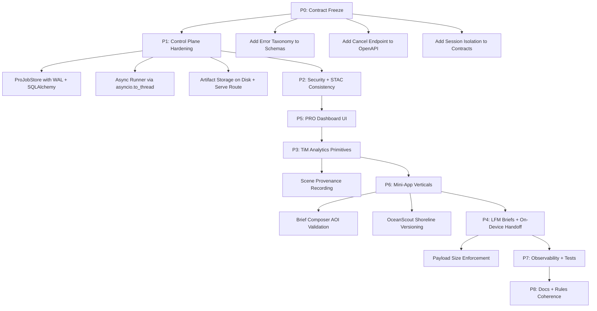

# PRO Mini-Apps Master Plan: Detailed Interface and Process Improvements

## 1. Assessment Summary

The existing plan (v0.2, 2026-04-24) correctly identifies the major footguns (in-memory jobs, poll-side-effects, HMAC replay, STAC divergence, gameplay contamination) and proposes a sound wave structure (W0-W6). However, it underspecifies **10 critical interface and process contracts** that will cause implementation ambiguity or runtime failures if not resolved before W1 begins.

This improvement adds concrete specifications for each gap, organized by the project they affect.

---

## 2. P1 Improvement: Async Runner Concurrency Model

**Problem:** The plan proposes a "background worker loop" without specifying the concurrency model. The current `InferenceClient` ([server/src/nutonic_server/inference_client.py](server/src/nutonic_server/inference_client.py)) uses synchronous `httpx.Client`. Running it in an asyncio task would block the event loop.

**Specified solution:** Use `asyncio.to_thread` for worker invocations. The runner claims a job from the store, then dispatches the blocking `InferenceClient` call via `asyncio.to_thread`. This preserves the existing synchronous client (no async rewrite needed) while keeping the FastAPI event loop responsive.

```python
# pro_jobs_runner.py - core dispatch pattern
async def _run_job(store: ProJobStore, ic: InferenceClient, job: ProJobRecord) -> None:
    store.transition(job.job_id, "queued", "running")
    try:
        result = await asyncio.to_thread(
            _invoke_worker_pipeline, ic, job
        )
        store.complete(job.job_id, result.artifacts, result.summary)
    except Exception as exc:
        store.fail(job.job_id, error_class=classify_error(exc), detail=str(exc)[:500])
```

**Startup hook:** Register a single `asyncio.Task` in FastAPI's `lifespan` that polls the store for queued jobs every N seconds (configurable via `pro_job_poll_interval_seconds`, default 2). Max concurrent jobs capped by `pro_max_concurrent_jobs` (default 2, preventing worker starvation).

---

## 3. P1 Improvement: ProJobStore SQLite Contract

**Problem:** No WAL mode, busy timeout, or connection strategy specified.

**Specified solution:** Follow the same pattern as `ranked_store` and `leaderboard_store` (SQLAlchemy engine). Add to [server/src/nutonic_server/settings.py](server/src/nutonic_server/settings.py):

```python
pro_job_database_url: str = Field(
    default="sqlite:///data/nutonic_pro_jobs.db",
    ...
)
pro_job_ttl_seconds: int = Field(default=86400, ...)  # 24h retention
pro_max_concurrent_jobs: int = Field(default=2, ...)
pro_job_poll_interval_seconds: float = Field(default=2.0, ...)
```

SQLite engine must use `connect_args={"timeout": 15}` and `pool_pre_ping=True`. WAL mode is set via `PRAGMA journal_mode=WAL` on first connection event.

**Schema (ProJobRecord):**

| Column | Type | Notes |
|--------|------|-------|
| job_id | TEXT PK | UUID hex |
| session_id | TEXT NOT NULL | From JWT claims; enables ownership filtering |
| status | TEXT NOT NULL | `queued`, `running`, `completed`, `failed`, `cancelled` |
| error_class | TEXT | NULL unless failed; see error taxonomy below |
| error_detail | TEXT | Truncated to 500 chars |
| analysis_profile | TEXT NOT NULL | Enum value |
| request_params | TEXT | JSON of ProJobCreateIn |
| created_at | TEXT | ISO8601 UTC |
| started_at | TEXT | NULL until running |
| finished_at | TEXT | NULL until terminal |
| progress_pct | INTEGER | 0-100, updated by runner stages |
| artifact_manifest | TEXT | JSON array of ProArtifactRef on completion |

---

## 4. P1 Improvement: Session-Scoped Job Isolation

**Problem:** Current `GET /api/v1/pro/jobs/{job_id}` has no ownership check. Any session can poll any job.

**Specified solution:** The poll route must verify `session_id` from the JWT matches the job's `session_id`. Return 404 (not 403) to avoid leaking job existence. Add `list_jobs` endpoint scoped by session:

```
GET /api/v1/pro/jobs?limit=20&status=running,completed
```

This returns only jobs owned by the requesting session. The store query is:

```sql
SELECT * FROM pro_jobs 
WHERE session_id = :sid 
  AND status IN (:statuses) 
ORDER BY created_at DESC LIMIT :limit
```

---

## 5. P1 Improvement: Job Cancellation Contract

**Problem:** No cancel endpoint or runner interrupt mechanism defined.

**Specified solution:** Add to OpenAPI and server:

```
POST /api/v1/pro/jobs/{job_id}/cancel
```

- Only the owning session can cancel.
- Store transition: `queued -> cancelled` (immediate) or `running -> cancelled` (runner checks a cancel flag between stages).
- The runner pipeline has 3 stages (materialize, TiM, LFM brief). Between each stage, the runner re-reads the job record and aborts if `status == cancelled`.
- Response: `{ "ok": true, "status": "cancelled" }`
- Cancelling a `completed` or `failed` job returns 409.

---

## 6. P1 Improvement: Error Taxonomy

**Problem:** The plan defines `failed` status but not failure categories. The UI cannot distinguish retryable from terminal errors.

**Specified error classes:**

| error_class | Meaning | UI guidance |
|------------|---------|-------------|
| `stac_no_coverage` | No Sentinel-2 scenes found for AOI/time range | "No satellite imagery available for this area and date range" |
| `stac_cloud_ceiling` | All scenes exceed cloud cover threshold | "Too cloudy. Try a wider date range" |
| `worker_timeout` | Materialization or TiM call exceeded deadline | "Processing took too long. Try again" |
| `worker_unreachable` | Health probe or connect failed | "Analysis service temporarily unavailable" |
| `worker_error` | Worker returned non-2xx | "Analysis failed. Our team has been notified" |
| `input_validation` | Invalid coordinates, bbox, or profile params | "Invalid input: {detail}" |
| `cancelled` | User-initiated cancellation | "Cancelled" |
| `internal` | Catch-all for unexpected exceptions | "Unexpected error. Try again later" |

Add to [server/src/nutonic_server/schemas.py](server/src/nutonic_server/schemas.py):

```python
class ProJobStatusOut(BaseModel):
    job_id: str
    status: Literal["queued", "running", "completed", "failed", "cancelled"]
    error_class: str | None = None
    error_detail: str | None = None
    progress_pct: int | None = None
    started_at: str | None = None
    finished_at: str | None = None
    analysis_profile: str | None = None
    artifacts: list[ProArtifactRef] | None = None
    # Compatibility fields (kept for existing callers)
    materialization_id: str | None = None
    cache_key: str | None = None
```

---

## 7. P1 Improvement: Artifact Storage and Serving

**Problem:** Plan defines artifact metadata but not where bytes live or how they're served.

**Specified solution:** PRO artifacts are stored on disk under `data/pro_artifacts/{job_id}/` with a manifest JSON. The server adds a new route:

```
GET /api/v1/pro/jobs/{job_id}/artifacts/{artifact_id}
```

- Session-scoped (same ownership check as job poll).
- Serves bytes from disk with `Content-Type` from manifest.
- `Cache-Control: private, max-age=3600` (not public -- PRO outputs are user-specific).

**ProArtifactRef schema:**

```python
class ProArtifactRef(BaseModel):
    artifact_id: str          # e.g. "vessel_overlay"
    kind: str                 # "geojson", "png", "json", "npz"
    mime_type: str            # "application/geo+json", "image/png", etc.
    size_bytes: int | None = None
    profile: str | None = None  # which mini-app produced this
    download_url: str | None = None  # populated by status route
```

Cleanup: the TTL-based job cleanup also deletes artifact directories.

---

## 8. P3 Improvement: Temporal STAC Determinism

**Problem:** Change detection profiles (LandShift, FloodPulse, FireWatch) need reproducible scene selection, but STAC queries are non-deterministic.

**Specified solution:** The runner records selected scene IDs in the job's artifact manifest under a `scene_provenance` block:

```json
{
  "scene_provenance": {
    "t0": {"item_id": "S2B_MSIL2A_20260301...", "datetime": "2026-03-01T10:30:00Z", "cloud_pct": 12.3},
    "t1": {"item_id": "S2A_MSIL2A_20260415...", "datetime": "2026-04-15T10:28:00Z", "cloud_pct": 8.1}
  }
}
```

For reproducibility, the `ProJobCreateIn` schema gains optional fields:

```python
scene_id_t0: str | None = None  # Pin specific STAC item for t0
scene_id_t1: str | None = None  # Pin specific STAC item for t1
```

When provided, the runner fetches those exact scenes instead of querying. When omitted, the runner selects scenes and records them. The Brief Composer includes scene provenance in its output metadata.

---

## 9. P4 Improvement: On-Device Handoff Payload Bounds

**Problem:** No concrete size limits specified for on-device payloads.

**Specified solution:** Define in the PRO orchestration spec:

- **Max total payload:** 4 MB (compressed JSON + artifact refs, not raw NPZ)
- **No raw NPZ transfer to device.** TiM outputs are server-side only; the device receives a summary JSON + overlay PNGs (max 1024x1024 each, max 4 overlays).
- **Narrative text:** max 2000 characters per brief section, max 5 sections.
- **Truncation rule:** If the TiM summary exceeds 4KB JSON, emit only top-5 findings by confidence score.

Add to Kotlin models:

```kotlin
@Serializable
data class ProOnDevicePayload(
    @SerialName("brief_sections") val briefSections: List<ProBriefSection>,
    @SerialName("overlay_refs") val overlayRefs: List<ProArtifactRef>,
    @SerialName("confidence_summary") val confidenceSummary: String? = null,
)
```

---

## 10. P6 Improvement: Brief Composer AOI Validation

**Problem:** Multi-profile briefs may combine runs from incompatible geographic areas.

**Specified solution:** The `/v1/pro/brief/fuse` endpoint validates that all input job AOIs overlap within a configurable tolerance (default: 500km centroid distance). If they don't, the endpoint returns:

```json
{
  "error": "aoi_mismatch",
  "detail": "FireWatch AOI (34.05, -118.24) is 12,400 km from FloodPulse AOI (23.81, 90.41). Max allowed: 500 km.",
  "job_ids": ["abc123", "def456"]
}
```

The UI should show this as a warning with an override toggle ("Compose anyway"), which re-submits with `force_compose: true`.

---

## 11. P6 Improvement: OceanScout Shoreline Buffer Versioning

**Problem:** Plan mentions versioning but doesn't define the mechanism.

**Specified solution:** The shoreline buffer policy is a versioned config block in the TiM profile defaults:

```python
OCEANSCOUT_SHORELINE_POLICY = {
    "version": "1.0",
    "buffer_m": 500,           # meters from coastline kept as "nearshore"
    "morphology_kernel_px": 3, # dilation kernel for harbor retention
    "min_water_fraction": 0.3, # tile must be >= 30% water to apply vessel detection
}
```

This version string is emitted in every OceanScout artifact manifest. When the policy changes, the version increments, and the Brief Composer includes a "policy version mismatch" warning if composing runs from different versions.

---

## 12. Updated Critical Path with Improvements



---

## 13. Files to Modify (Summary)

### New specifications to add to existing plan:
- [plans/2026-04-22-pro-mini-apps-master-implementation-plan.md](plans/2026-04-22-pro-mini-apps-master-implementation-plan.md) -- Version 0.3 with all improvements above

### Server files affected by improved specifications:
- [server/src/nutonic_server/settings.py](server/src/nutonic_server/settings.py) -- 4 new settings
- [server/src/nutonic_server/schemas.py](server/src/nutonic_server/schemas.py) -- Expanded `ProJobStatusOut`, new `ProArtifactRef`, error taxonomy types, cancel models
- [server/src/nutonic_server/main.py](server/src/nutonic_server/main.py) -- Cancel route, session-scoped poll, artifact serve route, list-jobs route
- `server/src/nutonic_server/pro_jobs_store.py` (new) -- Full schema with session_id, error_class, WAL setup
- `server/src/nutonic_server/pro_jobs_runner.py` (new) -- asyncio.to_thread dispatch, 3-stage pipeline with cancel checks, error classification

### Kotlin files affected:
- [nutonic/shared/src/commonMain/kotlin/com/nutonic/api/NutonicApiModels.kt](nutonic/shared/src/commonMain/kotlin/com/nutonic/api/NutonicApiModels.kt) -- PRO DTOs with error classes, artifact refs, on-device payload
- [nutonic/shared/src/commonMain/kotlin/com/nutonic/api/NutonicApiClient.kt](nutonic/shared/src/commonMain/kotlin/com/nutonic/api/NutonicApiClient.kt) -- `postProJob`, `getProJob`, `cancelProJob`, `listProJobs`, `getProArtifact`

### Inference files affected:
- [inference/pro_materialization_service/src/pro_materialization_service/inference_hmac.py](inference/pro_materialization_service/src/pro_materialization_service/inference_hmac.py) -- Nonce cache (already in plan, no change)
- [inference/terramind_tim_local/src/nutonic_terramind_tim_local/run.py](inference/terramind_tim_local/src/nutonic_terramind_tim_local/run.py) -- Scene provenance recording, shoreline policy versioning

### Docs:
- [docs/openapi.yaml](docs/openapi.yaml) -- Cancel endpoint, list-jobs, artifact route, expanded schemas
