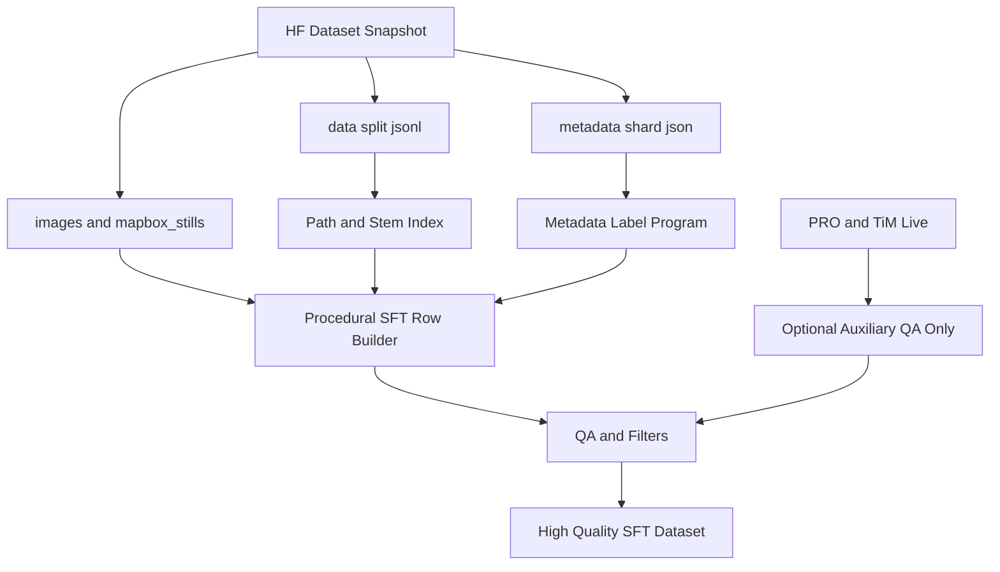

# High Quality Procedural Training Data Plan

## Diagnosis

The current live/offline assessment rows are not suitable as training targets because they are mostly scaffolding:

- `tmp_live_sat_bbox/out/data/train.jsonl` contains a generic assistant template, not image-specific supervision.
- `tmp_live_e2e_full/data/train.jsonl` embeds huge TiM internals (`_inputs`, tensor stats, token ids) in the user turn, making the prompt noisy and expensive.
- The live TiM `Coordinates` output can disagree with the materialized footprint (`run_manifest.bbox_wgs84`), but `data/scripts/lfm_vl_sft_dataset/terramind_assessment_sft.py` currently echoes it as an approximate coordinate hint.
- The system prompt asks for normalized boxes, but the assistant target produces no boxes.
- The existing `NuTonic/sat-image-boundingbox-sft-full` metadata already has the better signal: `caption`, `regions`, `class_fractions`, `bbox_wgs84`, `latitude`, `longitude`, `stac_item_id`, and tile geometry.

Key source of truth:

```120:123:C:\Users\MeMyself\.cursor\projects\c-Users-MeMyself-nutonic\uploads\poi_004613_g004_t0000-2.json
"tile_stem": "poi_004613_g004_t0000",
"caption": "This satellite imagery is dominated by trees (39.5%), built (19.9%), shrub_and_scrub (13.4%), and grass (3.6%).",
"regions": [
```

Existing generation pattern to reuse:

```160:188:c:\Users\MeMyself\nutonic\data\scripts\lfm_vl_sft_dataset\pipeline.py
sidecar: dict[str, Any] = {
    **common_sidecar,
    "tile_index": ti,
    "tile_stem": stem,
    "caption": cap,
    "regions": [
        {
            "bbox": list(r.bbox_xyxy),
            "label": r.label,
            "class_id": r.class_id,
            "area_px": r.area_px,
        }
        for r in regions
    ],
}
```

## Target Architecture



## Implementation Plan

1. Build a new metadata-first procedural builder.

- Add `data/scripts/build_sat_bbox_metadata_sft.py` or a focused module under `data/scripts/lfm_vl_sft_dataset/`.
- Inputs: `--dataset-root` or `--hf-repo`, `--split`, `--out-dir`, `--max-rows`, `--task-mix`, `--include-mapbox-context`, `--no-new-mapbox`.
- Read `data/*.jsonl` only for stable image paths and split membership.
- Read `metadata/sNNNNN/*.json` as the label source of truth.
- Never fetch Mapbox. Only reuse `mapbox_stills/...` paths already present.

2. Generate high-value task families from metadata.

- Caption rows: use sidecar `caption`, optionally normalized into cleaner prose.
- Grounding rows: convert `regions[*].bbox` from pixel coordinates to normalized `[x1,y1,x2,y2]` using `output_size`.
- Per-class rows: emit one task per dominant class from `class_fractions` / `regions`.
- Multi-image rows: when an existing `mapbox_stills` path can be paired with a Sentinel `images` path for the same `poi_id`, ask for cross-view context, but keep the answer grounded in sidecar labels.
- Negative / absence rows: choose classes not present above threshold and ask the model to state absence conservatively.

3. Add strict QA gates before writing rows.

- Drop rows with no `regions` for grounding tasks.
- Validate every bbox is numeric, ordered, and within `[0,1]` after normalization.
- Enforce answer schema by task type: JSON for grounding, short prose for captions, multi-section answer only for assessment-style rows.
- Cap prompt length and reject any row containing raw tensor stats, `_inputs`, `_internal_coords`, `npz_base64`, or large diagnostics.
- Ensure image path exists locally or is present in the Hub file index before writing.
- Ensure split is stable and no base POI leaks across train/validation/test if using geo-jitter variants.

4. Downgrade the live PRO/TiM path from teacher to auxiliary QA.

- Keep `build_terramind_assessment_sft.py` for smoke/eval fixtures, not primary SFT generation.
- Add a compact `summarize_tim_context_for_training()` in `terramind_assessment_sft.py` that removes `_inputs`, `_internal_coords`, `tensor`, `x`, `emb`, `ids`, masks, `engine.patch_diagnostics`, and raw samples.
- Add coordinate consistency checks: if TiM Coordinates fall outside `run_manifest.bbox_wgs84` plus tolerance, mark them as `out_of_footprint` and do not include them as a coordinate hint.
- Update assessment targets so they never echo contradictory TiM coordinates as if useful.

5. Add tests with realistic fixtures.

- Extend `data/scripts/tests/fixtures/sat_bbox_sft_mini/` with a metadata sidecar containing multiple regions and class fractions.
- Test caption generation, all-class grounding, per-class grounding, Mapbox pairing without downloads, and bbox normalization.
- Test rejection of malformed metadata, missing image paths, and prompt bloat.
- Add tests for TiM context summarization and coordinate mismatch handling.

6. Add docs and reproducible commands.

- Document the recommended pipeline in `data/scripts/README.md`:
  - seed export is for live PRO/TiM smoke and eval only;
  - metadata-first builder is for high-quality SFT training rows;
  - no Mapbox token is required when reusing existing `mapbox_stills`.
- Include a one-row dry run and a larger shard-aware run command.
- Document QA metrics printed at the end: rows emitted, rows dropped by reason, average prompt length, bbox count distribution, class distribution, Mapbox-paired rows.

## Validation Criteria

- A one-row dry run from `sat_bbox_sft_mini` produces an answer with actual caption or JSON boxes, not generic placeholder prose.
- A Hub-backed run can read `data/train.jsonl` plus `metadata/s*/...json` and emit rows without `MAPBOX_ACCESS_TOKEN`.
- No generated user prompt contains TiM tensor internals or raw diagnostics.
- Grounding targets contain normalized boxes and pass schema validation.
- Live PRO/TiM E2E remains available as a smoke/eval path, but not as the default teacher-data path.
