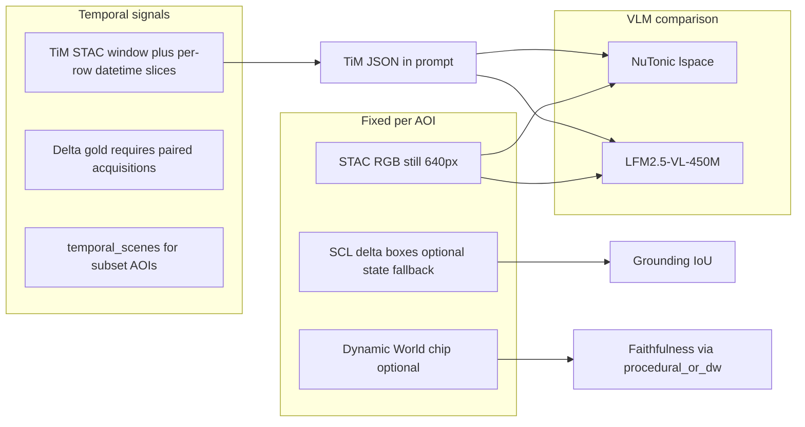

# NU:TONIC

**NU:TONIC is a cross-platform Earth intelligence prototype that combines satellite imagery, temporal AI, and vision-language models to help people understand what is changing on the planet.**

The easiest way to try the implementation is to use the build artifacts produced by GitHub Actions: Android APKs, iOS/TestFlight builds, desktop installers, and web bundles. The codebase also includes the satellite inference services behind the demo: a specialist LFM-VL satellite caption model, TerraMind TiM temporal reasoning, and PRO materialization workers that turn map selections into imagery and model-ready bundles.

For a public overview of the Patagonia satellite benchmark and competition narrative, start with [`Patagonia_Eval/patagonia_eval_runs/eval.md`](Patagonia_Eval/patagonia_eval_runs/eval.md).

## What NU:TONIC Demonstrates

NU:TONIC is built around a simple idea:

**TiM watches change over time. The VLM explains what changed. The app turns that into something people can inspect and act on.**



The project brings together:

- **Temporal satellite memory:** TerraMind TiM-style workflows reason over Sentinel-2 observations across time.
- **Vision-language explanation:** a satellite-specialized LFM-VL path turns imagery and temporal context into readable summaries, captions, and regions of interest.
- **Priority-oriented UX:** app surfaces are packaged for Android, iOS, desktop, and web so judges and testers can use the system without building from source.
- **Reproducible evaluation:** the Patagonia benchmark compares base and fine-tuned models on glacier, marine, forest, steppe, wetland, and coastal scenes.

## Fastest Way to Try It

Use a prebuilt artifact rather than building locally.

| Platform | Best artifact | Where to find it |
| --- | --- | --- |
| Windows | `.msi` installer | GitHub Release assets from `.github/workflows/nutonic-release.yml`, or the `release-windows-msi` / `desktop-windows-msi` workflow artifact |
| macOS | `.dmg` installer | GitHub Release assets, or the `release-macos-dmg` / `desktop-macos-dmg` workflow artifact |
| Linux | `.deb` package | GitHub Release assets, or the `release-linux-deb` / `desktop-linux-deb` workflow artifact |
| Android | `.apk` | `release-android-signed-apk` for signed releases, or `android-debug-apk` for CI/debug builds |
| iOS | TestFlight or `.ipa` | TestFlight invite after `ios-testflight.yml` / release upload, or `release-ios-ipa` / `ios-ipa` workflow artifact |
| Web | static JS bundle | `web-js-productionExecutable` workflow artifact |

### Build and launch desktop from source

If you want to run the desktop app locally instead of downloading an installer, point it at the hosted NU:TONIC server origin. Do **not** include `/api/v1`; the client adds API paths itself.

From the repository root:

```powershell
cd nutonic
.\gradlew.bat --no-configuration-cache :desktopApp:run -PnutonicServerOrigin=https://nutonic-nutonic-game-server.hf.space
```

On macOS/Linux:

```bash
cd nutonic
./gradlew --no-configuration-cache :desktopApp:run -PnutonicServerOrigin=https://nutonic-nutonic-game-server.hf.space
```

### Download from a GitHub Release

For most users and competition reviewers, this is the cleanest path:

1. Open the repository on GitHub.
2. Go to **Releases**.
3. Choose the latest release tag.
4. Download the file for your platform:
   - Windows: `.msi`
   - macOS: `.dmg`
   - Linux: `.deb`
   - Android: `.apk` when mobile assets were attached
   - iOS: use TestFlight when available; `.ipa` is mainly for signed distribution workflows

The release workflow is [`nutonic-release.yml`](.github/workflows/nutonic-release.yml). It builds desktop installers on every matching push to `main`; when manually dispatched with a tag, it can publish a GitHub Release and optionally attach signed Android/iOS builds.

### Download from a GitHub Actions Run

Use this when a release has not been published yet:

1. Open GitHub **Actions**.
2. Select either:
   - **`nutonic — release (installers + optional GitHub Release)`** for release installers, or
   - **`nutonic — quality, tests, clients`** for PR/manual CI artifacts.
3. Open the newest successful run.
4. Scroll to **Artifacts**.
5. Download the artifact for your platform.
6. Unzip the artifact; the installer or bundle is inside.

Artifact names to look for:

- `release-windows-msi`
- `release-macos-dmg`
- `release-linux-deb`
- `release-android-signed-apk`
- `release-ios-ipa`
- `android-debug-apk`
- `desktop-windows-msi`
- `desktop-macos-dmg`
- `desktop-linux-deb`
- `web-js-productionExecutable`
- `ios-ipa`

GitHub Actions artifacts may require being signed in to GitHub and may expire according to repository retention settings.

### TestFlight

iOS public testing uses Apple TestFlight:

1. Ask the project maintainer for a TestFlight invite link or tester invitation.
2. Install Apple’s **TestFlight** app.
3. Accept the invite and install the NU:TONIC iOS build.

Maintainers can trigger [`ios-testflight.yml`](.github/workflows/ios-testflight.yml) directly, or use the release workflow with `upload_ios_to_testflight=true`. Both paths require Apple signing and App Store Connect secrets configured in GitHub Actions.

## Competition Story

The Patagonia work is the clearest competition-facing example. It asks what happens when satellite imagery is paired with a model that remembers time.

In the main Patagonia run, adding temporal context improved average composite performance for both the base model and the satellite fine-tune. The satellite fine-tune showed the larger lift from the temporal context. This supports the central product claim: **Earth observation becomes more useful when a model can reason over change, not just describe a still image.**

Read the full public-facing write-up in [`Patagonia_Eval/patagonia_eval_runs/eval.md`](Patagonia_Eval/patagonia_eval_runs/eval.md).

## Repository Guide

| Area | Purpose |
| --- | --- |
| [`nutonic/`](nutonic/) | Kotlin Multiplatform clients for Android, iOS, desktop, and web. See [`nutonic/README.md`](nutonic/README.md) for artifact and local build notes. |
| [`inference/`](inference/) | Python services for satellite VLM captions, PRO materialization, TerraMind TiM, and related workers. |
| [`inference/lfm_vl_satellite_caption_service/`](inference/lfm_vl_satellite_caption_service/) | Satellite still image to caption / VQA / grounding-style output. |
| [`inference/terramind_tim_local/`](inference/terramind_tim_local/) | Local TerraMind TiM runner for temporal satellite exports. |
| [`inference/pro_materialization_service/`](inference/pro_materialization_service/) | Turns selected places into imagery, Sentinel-2 inputs, and model-ready PRO bundles. |
| [`Patagonia_Eval/`](Patagonia_Eval/) | Patagonia satellite VLM evaluation artifacts and public competition article. |
| [`tools/`](tools/) | Operator scripts for Hugging Face deploys, live smoke tests, hydration jobs, and evaluation tooling. |
| [`data/scripts/`](data/scripts/) | Dataset and satellite training-data generation pipelines. |
| [`server/`](server/) | Thin FastAPI orchestration layer for hosted demos and app data. |

## For Judges and Reviewers

Recommended review path:

1. Read the public article: [`Patagonia_Eval/patagonia_eval_runs/eval.md`](Patagonia_Eval/patagonia_eval_runs/eval.md).
2. Install the app using the platform artifact table above.
3. Inspect the inference architecture in [`inference/README.md`](inference/README.md).
4. Review the benchmark artifacts under [`Patagonia_Eval/patagonia_eval_runs/`](Patagonia_Eval/patagonia_eval_runs/).
5. If evaluating deployability, inspect GitHub Actions artifacts and the workflows under [`.github/workflows/`](.github/workflows/).

## For Developers

Local development is optional for competition use, but supported:

- Client build/run notes: [`nutonic/README.md`](nutonic/README.md)
- Inference services: [`inference/README.md`](inference/README.md)
- Hugging Face Space deploys: [`tools/hf_deploy/README.md`](tools/hf_deploy/README.md)
- Hugging Face Jobs: [`tools/hf_jobs/README.md`](tools/hf_jobs/README.md)
- Contribution and quality checks: [`CONTRIBUTING.md`](CONTRIBUTING.md)
- Project rules and implementation conventions: [`rules/README.md`](rules/README.md)

## One-Line Summary

**NU:TONIC combines temporal satellite memory with visual-language reasoning so AI can not only see Earth from space, but explain what is changing and help people act sooner.**
