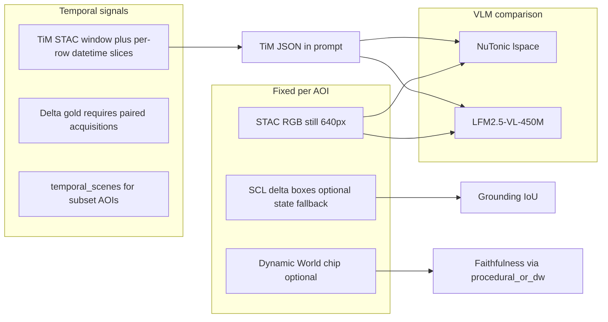

# NU:TONIC

**NU:TONIC is a cross-platform Earth intelligence prototype that combines satellite imagery, temporal AI, and vision-language models to help people understand what is changing on the planet.**

## Summary

**NU:TONIC combines temporal satellite memory with visual-language reasoning so AI can not only see Earth from space, but explain what is changing and help people act sooner.**

## Try it Out

> [!WARNING]
> **Build status notice:** We’ve seen recent instability/issues in the **Android**, **iOS**, and **desktop** builds.
>
> If you run into problems on those clients, please use the fully functional [**Hugging Face Space demo**](https://huggingface.co/spaces/Tonic/nutonic-pro-demo) instead (it mirrors the PRO workflow and returns the expected image outputs).

The easiest way to try the implementation is to use the build artifacts produced by GitHub Actions: Android APKs, iOS/TestFlight builds, desktop installers, and web bundles. The codebase also includes the satellite inference services behind the demo: a specialist LFM-VL satellite caption model, TerraMind TiM temporal reasoning, and PRO materialization workers that turn map selections into imagery and model-ready bundles.

For an overview of the Patagonia satellite benchmark and competition narrative, start with reading our [Presentation](https://huggingface.co/blog/Tonic/save-patagonia-by-predicting-earth) .

## What NU:TONIC Demonstrates

NU:TONIC is built around a simple idea:

**TiM watches change over time. The VLM explains what changed. The app turns that into something people can inspect and act on.**



The project brings together:

- **Temporal satellite memory:** TerraMind TiM-style workflows reason over Sentinel-2 observations across time.
- **Vision-language explanation:** a satellite-specialized LFM-VL path turns imagery and temporal context into readable summaries, captions, and regions of interest.
- **Priority-oriented UX:** app surfaces are packaged for Android, iOS, desktop, and web so judges and testers can use the system without building from source.
- **Reproducible evaluation:** the Patagonia benchmark compares base and fine-tuned models on glacier, marine, forest, steppe, wetland, and coastal scenes.

## Architecture / data flow

```mermaid
flowchart TD
  User[User] --> OnDeviceUI[OnDeviceUI]
  OnDeviceUI -->|submit| ProJobCreate["POST /api/v1/pro/jobs"]
  OnDeviceUI -->|poll| ProJobPoll["GET /api/v1/pro/jobs/\{job_id\}"]
  ProJobPoll -->|on_device_payload| Payload[ProOnDevicePayload]
  Payload --> ImageRefs[vlm_image_set[]]
  ImageRefs -->|fetch| ArtifactFetch["GET /api/v1/pro/jobs/\{job_id\}/artifacts/\{artifact_id\}"]
  OnDeviceUI -->|fetch| ModelManifest["GET /api/v1/pro/vlm/model-manifest"]
  ModelManifest -->|download| ModelWeights[model.safetensors]
  ArtifactFetch --> LocalVlm[Local_VLM_inference_ZeroGPU]
  ModelWeights --> LocalVlm
  LocalVlm --> Parse[Parse_caption_and_boxes_JSON]
  Parse --> Annotate[Draw_boxes_on_image]
  Annotate --> Outputs[Annotated_image+JSON]
```


## Solution Overview

NU:TONIC works as an end-to-end Earth intelligence loop:

1. **Select an area on Earth.** A user, workflow, or benchmark target identifies a place worth monitoring, such as a wetland, glacier margin, wildfire-prone steppe, marine reserve, or coastal zone.
2. **Materialize satellite evidence.** The system gathers Sentinel-2 imagery and prepares model-ready views of the area. In PRO-style flows, the materialization service packages RGB imagery, Sentinel inputs, and metadata into a bundle.
3. **Add temporal memory.** TerraMind TiM-style processing reads satellite observations across time, so the system can reason about change instead of treating the latest image as an isolated photograph.
4. **Explain with a satellite VLM.** The LFM-VL satellite model turns the image and temporal context into plain-language analysis: what the model sees, what appears to be changing, and which regions deserve attention.
5. **Score and validate the response.** The Patagonia evaluation checks vocabulary, structured output, grounding boxes, faithfulness to satellite analytics, and the lift from temporal context versus image-only prompts.
6. **Deliver a usable experience.** The app and CI-built installers make the result accessible on desktop, Android, iOS/TestFlight, and web surfaces without requiring judges or users to run the full ML stack locally.

In one sentence: **NU:TONIC turns satellite time series into explainable, reviewable priority signals.**

## Why Space-Based Compute Matters

Space-based compute matters because satellites face the hardest possible data problem: they observe huge areas, generate massive imagery streams, and often have limited downlink windows, bandwidth, power, and response time. Sending every raw frame to Earth for human review is slow, expensive, and increasingly unrealistic.

NU:TONIC is designed around the compute pattern that future orbital systems need:

- **Process closer to the sensor.** Temporal models can summarize what changed before all raw data is downlinked.
- **Send meaning, not just pixels.** A compact explanation, change flag, or priority region can be more valuable than another unfiltered image tile.
- **Reduce latency for disasters.** Floods, fires, illegal extraction, and rapid coastal change are time-sensitive; onboard or edge-assisted inference can surface risk earlier.
- **Use bandwidth intelligently.** If the model identifies the few places that changed most, operators can prioritize those chips for downlink and deeper analysis.
- **Support human decisions.** Vision-language outputs turn orbital compute into language people can act on: "this wetland expanded," "this burn context changed," or "inspect this region first."

That is why the Patagonia work is relevant to space-based compute specifically. It demonstrates a path from orbital observation to onboard/edge triage: **remember the recent past, explain the present, and prioritize what should be transmitted or reviewed next.**

## Fastest Way to Try It

Use a prebuilt artifact rather than building locally.

| Platform | Best artifact | Where to find it |
| --- | --- | --- |
| Windows | `.msi` installer | GitHub Release assets from `.github/workflows/nutonic-release.yml`, or the `release-windows-msi` / `desktop-windows-msi` workflow artifact |
| macOS | `.dmg` installer | GitHub Release assets, or the `release-macos-dmg` / `desktop-macos-dmg` workflow artifact |
| Linux | `.deb` package | GitHub Release assets, or the `release-linux-deb` / `desktop-linux-deb` workflow artifact |
| Android | `.apk` | `release-android-signed-apk` for signed releases, or `android-debug-apk` for CI/debug builds |
| iOS | TestFlight or `.ipa` | TestFlight invite after `ios-testflight.yml` / release upload, or `release-ios-ipa` / `ios-ipa` workflow artifact |
| Web | static JS bundle | `web-js-productionExecutable` workflow artifact |

### Build and launch desktop from source

If you want to run the desktop app locally instead of downloading an installer, point it at the hosted NU:TONIC server origin. Do **not** include `/api/v1`; the client adds API paths itself.
From the repository root:

```powershell
cd nutonic
.\gradlew.bat --no-configuration-cache :desktopApp:run -PnutonicServerOrigin=https://nutonic-nutonic-game-server.hf.space
```

On macOS/Linux:

```bash
cd nutonic
./gradlew --no-configuration-cache :desktopApp:run -PnutonicServerOrigin=https://nutonic-nutonic-game-server.hf.space
```

### Download from a GitHub Release

For most users and competition reviewers, this is the cleanest path:

1. Open the repository on GitHub.
2. Go to **Releases**.
3. Choose the latest release tag.
4. Download the file for your platform:
   - Windows: `.msi`
   - macOS: `.dmg`
   - Linux: `.deb`
   - Android: `.apk` when mobile assets were attached
   - iOS: use TestFlight when available; `.ipa` is mainly for signed distribution workflows

The release workflow is [`nutonic-release.yml`](.github/workflows/nutonic-release.yml). It builds desktop installers on every matching push to `main`; when manually dispatched with a tag, it can publish a GitHub Release and optionally attach signed Android/iOS builds.

### Download from a GitHub Actions Run

Use this when a release has not been published yet:

1. Open GitHub **Actions**.
2. Select either:
   - **`nutonic — release (installers + optional GitHub Release)`** for release installers, or
   - **`nutonic — quality, tests, clients`** for PR/manual CI artifacts.
3. Open the newest successful run.
4. Scroll to **Artifacts**.
5. Download the artifact for your platform.
6. Unzip the artifact; the installer or bundle is inside.

Artifact names to look for:

- `release-windows-msi`
- `release-macos-dmg`
- `release-linux-deb`
- `release-android-signed-apk`
- `release-ios-ipa`
- `android-debug-apk`
- `desktop-windows-msi`
- `desktop-macos-dmg`
- `desktop-linux-deb`
- `web-js-productionExecutable`
- `ios-ipa`

GitHub Actions artifacts may require being signed in to GitHub and may expire.

### TestFlight

iOS public testing uses Apple TestFlight:

1. Ask the project maintainer for a TestFlight invite link or tester invitation.
2. Install Apple’s **TestFlight** app.
3. Accept the invite and install the NU:TONIC iOS build.

## The Patagonia Story

what happens when satellite imagery is paired with a model that remembers time ?

Adding temporal context improved average composite performance for both the base model and the satellite fine-tune. The satellite fine-tune showed the larger lift from the temporal context. This supports the central product claim: **Earth observation becomes more useful when a model can reason over change, not just describe a still image.**

Read the full public-facing write-up in [Teaching Satellites to Remember: Patagonia as a Testbed for Predictive Earth Intelligence](https://huggingface.co/blog/Tonic/save-patagonia-by-predicting-earth) .

## Repository Guide

| Area | Purpose |
| --- | --- |
| [`nutonic/`](nutonic/) | Kotlin Multiplatform clients for Android, iOS, desktop, and web. See [`nutonic/README.md`](nutonic/README.md) for artifact and local build notes. |
| [`inference/`](inference/) | Python services for satellite VLM captions, PRO materialization, TerraMind TiM, and related workers. |
| [`inference/lfm_vl_satellite_caption_service/`](inference/lfm_vl_satellite_caption_service/) | Satellite still image to caption / VQA / grounding-style output. |
| [`inference/terramind_tim_local/`](inference/terramind_tim_local/) | Local TerraMind TiM runner for temporal satellite exports. |
| [`inference/pro_materialization_service/`](inference/pro_materialization_service/) | Turns selected places into imagery, Sentinel-2 inputs, and model-ready PRO bundles. |
| [`Patagonia_Eval/`](Patagonia_Eval/) | Patagonia satellite VLM evaluation artifacts and public competition article. |
| [`tools/`](tools/) | Operator scripts for Hugging Face deploys, live smoke tests, hydration jobs, and evaluation tooling. |
| [`data/scripts/`](data/scripts/) | Dataset and satellite training-data generation pipelines. |
| [`server/`](server/) | Thin FastAPI orchestration layer for hosted demos and app data. |

### Recommended review path

1. Read the public article: [Teaching Satellites to Remember](https://huggingface.co/blog/Tonic/save-patagonia-by-predicting-earth).
2. Install the app using the platform artifact table above.
3. Inspect the inference architecture in [`inference/README.md`](inference/README.md).
4. Review the benchmark artifacts.
5. If evaluating deployability, inspect GitHub Actions artifacts and the workflows under [`.github/workflows/`](.github/workflows/).

## For Developers

- Client build/run notes: [`nutonic/README.md`](nutonic/README.md)
- Inference services: [`inference/README.md`](inference/README.md)
- Hugging Face Space deploys: [`tools/hf_deploy/README.md`](tools/hf_deploy/README.md)
- Hugging Face Jobs: [`tools/hf_jobs/README.md`](tools/hf_jobs/README.md)
