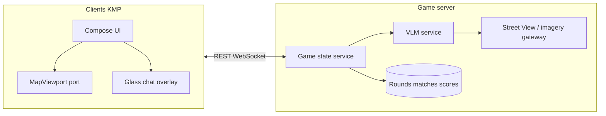

# NU:TONIC — Game engine design

This document specifies the **authoritative game engine** for NU:TONIC: a multi-user, geo-guessing experience that combines **Street View–driven VLM clues**, a **server-controlled progressive map zoom**, **glass-style in-world chat**, **join-in-progress multiplayer**, and a **post-human AI guess** phase. It aligns with the Cursor rules under [`rules/`](rules/README.md)—especially [`10-terramesh-vlm-progressive-zoom-game-engine.md`](rules/10-terramesh-vlm-progressive-zoom-game-engine.md), [`04-maps-and-gameplay.md`](rules/04-maps-and-gameplay.md), [`05-networking-leaderboard.md`](rules/05-networking-leaderboard.md), and [`06-server-embedding-and-ai.md`](rules/06-server-embedding-and-ai.md).

---

## 1. Purpose and scope

### 1.1 What this document defines

- **Logical engine**: match and round lifecycle, zoom progression, turn semantics, guess submission, AI phase, scoring inputs/outputs.
- **Trust boundaries**: what the **server** must own vs what **clients** may assume or render optimistically.
- **Relationship** to the **TerraMind / TerraMesh** reference codebase under `refs/terramind-geogen-main/` (research and server-side metrics—not an in-app runtime).
- **Non-goals**: pixel-level UI specification (see `refs/DESIGN.md` and `refs/stitch/`), Kotlin module layout (see `rules/03-kotlin-multiplatform-structure.md`), or a frozen OpenAPI document—those live beside the reference server implementation.

### 1.2 Audience

Implementers of the **reference server**, **client** engineers (KMP/Compose), and **ML/VLM** owners who own hint quality and AI guess policy.

---

## 2. Executive summary

Players compete to infer a **secret ground-truth location** (lat/lon). They do **not** receive raw coordinates during the round. Instead:

1. A **vision-language model (VLM)** consumes **Street View–style imagery** (and allowed metadata) and produces **natural-language descriptions and hints** for humans.
2. The **map** starts **zoomed out**; the **server** advances **discrete zoom tiers** toward the truth as the round progresses (chat turns, hint requests, or ticks—per chosen contract), up to **`max_zooms`** for the difficulty profile.
3. A **glass-like chat overlay** on the map carries VLM text, player messages (if enabled), and system lines without blocking **tap-to-place**.
4. **Multiple humans** may share a match; **late joiners** receive a **consistent snapshot** of zoom tier, transcript, and summary. Each human submits **one guess marker** (unless rules define multiple guesses).
5. When **all humans** have submitted or **forfeited**, the **AI** places **one marker** via server policy; then the round **resolves** with distances/scores and feeds **leaderboard** and **results** UIs.

All **mechanics that affect fairness** (zoom bounds, ground truth, hint release, score) are **server-authoritative**.

---

## 3. Architectural principles

| Principle | Implication |
|-----------|-------------|
| **Server authority** | Ground truth, zoom state, VLM outputs (sanitized), eligibility to guess, and final scores are computed or validated on the server. Clients are not trusted for hidden state. |
| **Contract-first** | HTTP/WebSocket payloads are described in a shared API spec (OpenAPI, AsyncAPI, or equivalent) co-located with the reference server (`rules/05-networking-leaderboard.md`). |
| **Client = presentation + intent** | Clients render **viewport** from server messages, show **optimistic** markers with reconciliation, and send **explicit player actions** (place guess, send chat, request hint). |
| **No ML stack in KMP** | PyTorch, WebDataset, TerraMesh loaders, and VLM weights run **only** in server (or batch) environments. Clients never embed production VLM/embedding weights unless an explicit product exception exists (`rules/06-server-embedding-and-ai.md`). |
| **Parity** | The same state machine and actions exist on Android, iOS, Desktop, and Web targets; only map providers and secure storage differ (`rules/00-product-intent.md`). |
| **Graceful degradation** | VLM/embedding **live** inference outages must not freeze the map; use **cached** hints, **simpler** copy, or **pre-hydrated** artifacts. The **AI guess phase remains part of the round contract**—coordinates are **always** emitted to clients (typically from **cache / Jobs / dataset**); only explicit **round abort** or **engine fault** paths may omit a normal resolution (`rules/06-server-embedding-and-ai.md`, `rules/13-client-cache-and-data-plane.md`). |

---

## 4. System context

**Street View / Maps**: Imagery fetch may use provider APIs with keys held **per environment** and **never** in `commonMain` (`rules/04-maps-and-gameplay.md`).

---

## 5. Relationship to TerraMind / TerraMesh (`refs/terramind-geogen-main`)

That repository is a **geospatial ML pipeline** for **TerraMesh** (satellite / multimodal tiles, WebDataset shards, Terramind generation models). It is **not** the live game loop runtime.

### 5.1 Concepts reused by NU:TONIC (server-side)

| Reference artifact | Reuse in NU:TONIC |
|--------------------|-------------------|
| `src/geo_utils.py` — **Haversine** | **Canonical geometric distance** (km) between guess and ground truth for scoring and analytics; implement equivalent math in the server language for bit-stable parity where needed. |
| `src/terramesh.py` — metadata **`center_lon` / `center_lat`** | **Pattern** for treating coordinates as first-class ground truth attached to a sample; same discipline for round definitions in the location pool. |
| `scripts/generate_and_evaluate.py` | **Pattern** for batch evaluation of predictions vs targets (metrics pipelines, not user requests). |
| `scripts/plot_error_heatmap.py` | **Regional difficulty analytics** (binned lon/lat error)—inform **difficulty tuning**, A/B tests, and “hard region” flags—not the in-game zoom API. |
| `src/terramesh_statistics.yaml` | Normalization bounds when **server-side models** consume TerraMesh-like tensors; irrelevant to pure Street View + VLM rounds unless product merges modalities. |
| Notebooks | **Validate transforms** and workflows; not shipped to clients. |

### 5.2 Explicit separation: GeoGuessr-style pool vs TerraMesh

- **Primary player-facing loop** in this document assumes a **preloaded location pool** with **Street View** (or equivalent panoramic) **imagery handles** and **WGS84** ground truth—similar in *spirit* to GeoGuessr-style datasets.
- **TerraMesh** imagery may appear in **future round types** (e.g. satellite-only challenges); if added, treat as a **separate `round_type`** with its own VLM prompt and clue pipeline, still sharing **haversine scoring**.

---

## 6. Domain model

### 6.1 Core entities

- **Player** — Authenticated or guest identity; stable `player_id` for leaderboard and “YOU” rows.
- **Role** — Human-facing fiction (Human, Astronaut, Alien); may affect **hint style** or **scoring modifiers** only if the server defines them.
- **Match** — Container for one or more rounds, roster, visibility (private/public/joinable), and realtime channel.
- **Round** — Single secret location, one ground truth `(lat, lon)`, difficulty profile, zoom state, transcript, guess ledger, phase (`ACTIVE` → `RESOLVING` → `COMPLETE`).
- **Location pool entry** — Immutable definition: ground truth, imagery references, optional tags (country, biome), **difficulty suggestion**, compliance flags.
- **Zoom state** — Integer **tier** `z ∈ [0, max_zooms]` (or explicit bounding box); each tier maps to **geographic bounds** the client must show. Tier `0` = most zoomed **out**.
- **Guess** — `(player_id | ai)`, coordinates, timestamp, optional provisional flag until server ack.
- **VLM artifact** — Server-stored outputs: initial description, subsequent hints, moderation flags; **never** leak raw coordinates to clients before resolution unless product explicitly allows “reveal” modes.

### 6.2 IDs and versioning

- Every match and round exposes **`match_id`**, **`round_id`**, **`engine_version`** (or `ruleset_version`), and **`difficulty_profile_id`** so clients render correct copy and analytics stay comparable.

---

## 7. Difficulty: Easy, Medium, Hard

Difficulty is a **server-defined profile**—not a client toggle that changes truth.

### 7.1 Recommended tunables

| Parameter | Easy (example direction) | Hard (example direction) |
|-----------|--------------------------|---------------------------|
| **Initial viewport radius** | Large (e.g. continent / multi-country) | Small (e.g. single large region) |
| **`max_zooms`** | More steps (more tightening) | Fewer steps |
| **Per-step shrink** | Gentler (less information per step) | Aggressive |
| **VLM hint strength** | More concrete vocabulary allowed | More abstract / “memory fragment” tone |
| **Turn or time budget** | Relaxed | Tight |
| **Chat turns before next zoom** | More messages allowed | Fewer |
| **Optional clue distortion** | Less blur / noise | Stronger |

Exact numeric defaults are **data-driven**; regional heatmaps from TerraMind-style evaluation can **inform** defaults per region (`plot_error_heatmap` philosophy).

### 7.2 Profile publication

Server includes in every round payload at minimum:

- `difficulty_profile_id`, human-readable **label**, **`max_zooms`**, **current tier**, and optional **UX strings** (“Hard: 4 signal locks remaining”).

---

## 8. State machines

### 8.1 Match (multiplayer shell)

Suggested states:

1. **`LOBBY`** — Host configures mode, difficulty, max players; others join.
2. **`IN_PROGRESS`** — At least one active round; **join-in-progress** allowed if policy says yes.
3. **`PAUSED`** (optional) — Host pause or server maintenance.
4. **`COMPLETED`** — All rounds finished; results available.

**Join-in-progress**: Joining client receives **`sync_payload`**: current round id, **zoom tier + bounds**, **sanitized transcript**, **VLM summary** (optional compressed), roster, and **allowed actions** (e.g. cannot guess if already submitted globally forbidden).

### 8.2 Round

1. **`SETUP`** — Server selects pool entry, fetches/builds VLM inputs, runs initial VLM call.
2. **`CLUE`** — Initial description pushed to clients; map at tier `0`.
3. **`PLAY`** — Players may chat (if enabled), request hints, trigger **zoom advances** per contract; players may place/update guess per rules.
4. **`HUMAN_LOCK`** (optional) — All humans locked after submit or timeout.
5. **`AI_GUESS`** — Server computes AI marker once human phase complete.
6. **`RESOLVED`** — Distances, XP, narrative; events for results UI and leaderboard writes.

### 8.3 Zoom progression

**Authoritative rule**: The client **must not** infer the next tier from local heuristics. Only the server emits **`viewport_bounds`** (or center + radius + min/max zoom level) after valid transitions.

**Transition triggers** (choose **one** primary model per product; document in API):

- **A. Chat-turn model** — Each player message or aggregated “conversation turn” increments an internal counter; at threshold, server bumps tier.
- **B. Explicit hint model** — Each “Request hint” action consumes a **hint credit** and bumps tier.
- **C. Hybrid** — Combination with daily caps.

When `z == max_zooms`, further hint requests may return **narrative-only** hints **without** changing bounds, or return **`ZOOM_EXHAUSTED`**.

---

## 9. VLM pipeline

### 9.1 Inputs (allowlisted)

- Street View (or equivalent) **images** or **tiles** referenced by server; optionally **heading/pitch** metadata if helpful for description quality.
- **Non-leaking context**: difficulty, language, role flavor text—**not** lat/lon.

### 9.2 Outputs

- **Initial plan / description** — Shown once round enters `CLUE`.
- **Subsequent hints** — Shorter, tier-aware (more specific as zoom increases only if design allows—**still no coordinate leak** unless product defines cheat/teach modes).

### 9.3 Safety and leakage

- Server runs **moderation** (policy filter) on VLM outputs.
- Strip patterns that encode coordinates (digits + cardinal patterns), plus structured leaks.
- Log **prompt hashes** and **model version** for reproducibility, not raw secrets.

### 9.4 Failure behavior

- Timeout → serve **cached generic hint** or **static fallback line**; round continues.
- Hard failure → optional **abort round** with refund/no-score flag; never infinite spinner on map (`rules/06-server-embedding-and-ai.md`).

---

## 10. Map and client `MapViewport` contract

Clients implement a **single abstraction** (`rules/04-maps-and-gameplay.md`):

- **Apply `viewport_bounds`** from server as the **maximum** visible region (or exact camera lock—product choice).
- **Tap-to-place** with **large invisible hit slop**; pin is visual only.
- **Optimistic marker** with server reconciliation; **~100ms** perceived feedback.
- **Peer ghosts** (optional): show other players’ **in-progress** markers if design allows; otherwise hide until resolve.
- **Platform engines**: Google Maps, MapKit, OSM, Web map—each satisfies the same interface; document in one matrix.

---

## 11. Glass chat overlay

Functional requirements:

- **Semi-transparent** panel over map; respects **reduced motion** and **high contrast** (`rules/08-ux-and-performance-footguns.md`, `rules/02-design-system.md`).
- **Does not capture** map taps meant for guessing—use **pointer routing** (e.g. chat focus vs map mode) or **margins** so primary CTA remains reachable.
- **Scrollable** transcript; **newest** hints visible without hiding timer/score HUD.
- **Roles** and **system** lines visually distinct (color/tag), consistent across platforms.

---

## 12. Guesses and AI marker

### 12.1 Human guesses

- **Submit** sends `(lat, lon)` + optional `accuracy_radius_m` from device (if ever used for tie-break—product decision).
- Server validates: inside allowed window, player eligible, round phase allows guess.
- **One guess per human per round** unless rules define **re-guess** with cost.

### 12.2 AI guess (mandatory phase; inference may be cached)

- **Normative:** Every round that **resolves normally** includes **exactly one** AI marker after humans finish. Trigger when **all** roster humans **submitted** or **forfeited** (timeout with explicit forfeit).
- **Implementation (cache-first):** The server **must** be able to serve AI coordinates **without live GPU** on the hot path by reading **precomputed rows** (keyed by `round_id` / `location_id` / `ruleset_version`) written by **HF Jobs** or batch workers into a **Dataset** the server syncs—aligned with `refs/terramind-geogen-main` patterns for **metadata + scoring geometry**, and optional **TerraMind/TiM** outputs for policy.
- **Live inference** (e.g. TerraTorch, VLM reranking) is **optional optimization** when GPU/ZeroGPU capacity exists; on failure or timeout, fall back to **cached** row or **documented heuristic**—still emit **`AI_GUESS_PLACED`** so UI parity holds.
- Server policy may use **VLM embeddings**, **retrieval**, **TerraMind-like models**, or **heuristics**—opaque to client except **final coordinates** and **optional explanation string** post-reveal.
- Broadcast **single `AI_GUESS_PLACED`** event with same schema as human guesses for results rendering.

---

## 13. Scoring, results, and leaderboard

### 13.1 Distance

- Primary metric: **great-circle distance** in km (haversine aligned with `refs/terramind-geogen-main/src/geo_utils.py` semantics).
- Optional: combine with **time bonus**, **difficulty multiplier**, **role modifier**, **streak**—all **server-defined** and returned in **`score_breakdown`**.

### 13.2 Leaderboard

- **Eventually consistent** REST (or query) separate from **live match** WebSocket (`rules/05-networking-leaderboard.md`).
- Support **role filters** if UI shows Human/Astronaut/Alien tabs.
- **Hydrate** on screen enter + refresh; no hardcoded production rows.

---

## 14. Networking patterns

| Concern | Suggested channel |
|---------|-------------------|
| Matchmaking, join, roster | REST + WebSocket subscribe |
| Round start, zoom updates, VLM lines | WebSocket (or SSE) events |
| Guess submit | REST **or** WebSocket command with idempotency key |
| Leaderboard | REST |
| Reconnect | Resume: client sends `last_event_id`; server replays or sends snapshot |

**Idempotency**: Guess and hint requests carry **client-generated keys** to avoid double-submit on flaky networks.

---

## 15. API sketch (illustrative—not normative)

Normative contracts live with the reference server. Illustrative endpoints:

- `POST /matches` — create; body includes mode, difficulty, join policy.
- `POST /matches/{id}/join` — join; returns `sync_payload` if `IN_PROGRESS`.
- `GET /matches/{id}/stream` — WebSocket upgrade for events.
- `POST /rounds/{id}/guess` — body: lat, lon, idempotency key.
- `POST /rounds/{id}/chat` — body: text (if enabled).
- `POST /rounds/{id}/hint` — consumes hint credit, may advance zoom.
- `GET /leaderboard` — query: role, season, pagination.

Event examples: `ROUND_STARTED`, `ZOOM_CHANGED`, `VLM_MESSAGE`, `PLAYER_GUESS`, `AI_GUESS_PLACED`, `ROUND_RESOLVED`.

---

## 16. Anti-cheat and abuse

- **Never trust** client-reported zoom or tier.
- Rate-limit **hint** and **chat** endpoints; moderate text.
- **Obfuscate** exact ground truth in logs for non-admin roles.
- **Join abuse**: cap roster, report host-kick rules, optional **trust score** for public lobbies.

---

## 17. Observability

- Trace **`match_id` / `round_id`** across VLM calls and map events.
- Metrics: VLM latency, zoom transition counts, guess distribution, dropout rate, AI guess error vs human median.
- Dashboards may reuse **heatmap** ideas from `plot_error_heatmap.py` for **live ops** (not player-facing).

---

## 18. Migration and feature flags

- **`engine_version`** gates incompatible rule changes.
- **Round types** (`STREETVIEW_VLM`, future `SATELLITE_TERRAMESH`) allow gradual rollout without forking clients.

---

## 19. Testing strategy (engine-level)

- **Deterministic simulations**: seed location pool, mock VLM responses, assert zoom tier transitions and score math.
- **Property tests**: haversine monotonicity, bounds containment (guess inside viewport policies if enforced).
- **Load tests**: concurrent matches, VLM queue backlog, WebSocket fanout.

---

## 20. Related documents

| Document | Role |
|----------|------|
| [`rules/10-terramesh-vlm-progressive-zoom-game-engine.md`](rules/10-terramesh-vlm-progressive-zoom-game-engine.md) | Cursor rule summary for TerraMesh + VLM loop |
| [`rules/04-maps-and-gameplay.md`](rules/04-maps-and-gameplay.md) | Map abstraction and client responsibilities |
| [`rules/05-networking-leaderboard.md`](rules/05-networking-leaderboard.md) | API and leaderboard rules |
| [`rules/06-server-embedding-and-ai.md`](rules/06-server-embedding-and-ai.md) | Server-side AI and fallbacks |
| [`rules/01-navigation-architecture.md`](rules/01-navigation-architecture.md) | App shell navigation vs engine |
| [`refs/DESIGN.md`](refs/DESIGN.md) | Visual system for chat and HUD |
| [`refs/stitch/nu_tonic_interface_design_specification.html`](refs/stitch/nu_tonic_interface_design_specification.html) | UX footguns and flows |

---

## 21. Revision history

| Version | Date | Notes |
|---------|------|--------|
| 0.1 | 2026-04-07 | Initial consolidated engine design from rules + TerraMind reference alignment |

---

*End of document.*
