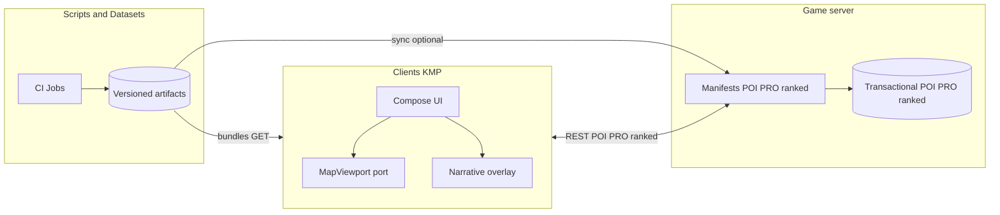

# NU:TONIC — Game engine design

This document specifies the **logical game engine** for NU:TONIC: a **solo-first** geo-guessing loop—**no lobbies**, **no waiting for other humans** to submit—centered on **one primary guess submission** per round (no multi-step “repeat rounds” loop), **narrative text** from **build-serialized** `prompts/**/*.md` (see [`NARRATIVE-AND-PROMPTS.md`](NARRATIVE-AND-PROMPTS.md)), **levels** and **map assets** sourced from **`data/`** plus **scripts and Hugging Face Datasets–driven hydration** (everything **pre-cached** for play except **live `POST` POIs** and **PRO** job flows), a **navigable world map** with **satellite / map / hybrid** basemaps, and—**for locating the answer**—a **primary** **downsampled Mapbox static still** (bundled or manifest-delivered) the player aligns with their map marker, plus **optional, explicit assists** (see **§9**). **Optional assists** include: **pre-cached AI text** describing **Street View** captures at **non–golden** sample viewpoints for the round target, **pre-cached “useful hints”** in **three progressive specificity levels** (e.g. continent → regional EO landmarks such as major ranges or rivers → country-level labels—**script- or job-generated**, schema-bounded), and an **optional peer marker** (“Reveal uplink”) when the product exposes another player’s guess as a **hint**, not a gate. **Non-ranked:** assists are **optional** and **do not** change local score math. **Ranked:** consuming **any** ranked-forbidden assist (peer marker, Street View description pack, or any useful-hint tier) **before** successful **`submit`** **forfeits verified ranked placement** for that `round_id`—server-attested per **`docs/RANKED-MODE.md`**. **SCAN** surfaces (reference still, map, guess modal, narrative, assist panels, peer reveal) are **individually collapsible** so the map stays usable (`rules/04-maps-and-gameplay.md`). A **narrative overlay** remains **always invocable** for **authorial** copy and **user text** (tone per [`NARRATIVE-AND-PROMPTS.md`](NARRATIVE-AND-PROMPTS.md) / [`DESIGN.md`](DESIGN.md)); assists are **labeled** UI, not smuggled spoilers. **Progressive map zoom** (optional), **per-`map_id` device-local leaderboards** for **non-ranked** play, **on-device VLM only for the PRO tab** per **`refs/VLMExample/`** / [`PRO-TAB-VLM-ORCHESTRATION-SPEC.md`](PRO-TAB-VLM-ORCHESTRATION-SPEC.md), and a **post-human AI marker** phase using **cached** `ai_lat` / `ai_lon` (**`AiGuessStore`**, TerraMind **`Coordinates`** when enabled). It aligns with [`rules/`](rules/README.md)—especially [`00-product-intent.md`](rules/00-product-intent.md), [`10-terramesh-vlm-progressive-zoom-game-engine.md`](rules/10-terramesh-vlm-progressive-zoom-game-engine.md), [`04-maps-and-gameplay.md`](rules/04-maps-and-gameplay.md), [`05-networking-leaderboard.md`](rules/05-networking-leaderboard.md), and [`06-server-vlm-tim-and-on-device-ml.md`](rules/06-server-vlm-tim-and-on-device-ml.md).

---

## 0. Binding product stance (client authority)

The following **override** any older “server-authoritative fairness” wording later in this document where they conflict:

- **No required user-account sign-in** for opening the main shell. Clients **should** obtain a **game-server session JWT** (device-bound, anonymous OK) for **API** calls so the server can **rate-limit**, **cache expensive work**, and reduce leaderboard spam (`rules/00-product-intent.md`, `rules/05-networking-leaderboard.md`). **Ranked** **start/submit**, **store-gated** writes, and **PRO jobs** use stricter tokens per OpenAPI. **Human / Astronaut / Alien** is a **mandatory, explicit player choice** in the UI (`rules/01-navigation-architecture.md`, `rules/07-screens-checklist.md`).
- **Gameplay state**, **mission / assist configuration**, **levels**, **scoring math**, and **fairness** for **non-ranked** missions are **owned by the client** (`commonMain`). Ground truth is **local round state** (bundled pool and/or downloaded manifest). **Ranked** missions are the exception: **server-held** truth for the active round (`docs/RANKED-MODE.md`).
- **Leaderboard (non-ranked):** entries are **device-local by default**—after each round the client **persists** rows per **`map_id`**; **no** score **`POST`** is required (`rules/05-networking-leaderboard.md`, `rules/13-client-cache-and-data-plane.md`). An **optional** community **`POST`/`GET`** path may exist in OpenAPI; it **does not** prove non-ranked math against client-held truth.
- **Ranked missions** — **no ADR required** beyond OpenAPI + product toggle: the server **holds** ground truth until resolve, issues **`round_ticket`**, accepts **guess coordinates only**, and **recomputes** distance/score server-side. See **`docs/RANKED-MODE.md`** and **`rules/05-networking-leaderboard.md`**. **Local**, **optional community**, and **ranked** views should stay **separable** in UI (and API where applicable) unless product explicitly merges them with labels.
- Expose clear **dimensions** for display and filters: **Human vs Human**, **Human vs Alien**, **Human vs Astronaut**, **Alien vs Astronaut**, and a separate **AI vs golden answer** (truth) track (`rules/05-networking-leaderboard.md`).
- **Optional** Python/FastAPI services may supply **manifest URLs**, **precomputed AI coordinates** (**TerraMind TiM `Coordinates`** inside **`tim_modality_outputs`**, **HF Jobs → Dataset**, and/or **TerraMesh per-`map_id` cache**), or **static POI bundles** (see **`docs/POI-PACKAGES-AND-OFFICIAL-CLIENTS.md`**); for **non-ranked** play they **do not** replace client-side resolution for **mathematical** trust. For **ranked** missions, the server is the **score authority** for that round.
- **Marketplace / store builds:** Writes may require **JWT + official-client registration** and **schema-strict POSTs**; **ranked** missions add **server verification** of the guess vs server-held truth (`docs/POI-PACKAGES-AND-OFFICIAL-CLIENTS.md` §4, `docs/RANKED-MODE.md`).

Sections **6–14** below describe **phases, events, and payloads** useful for implementation and for optional server-assisted modes. Treat **“server authoritative”** language in those sections as **optional** when the product runs **client-only** or **client-trust** reference play—**except** where **ranked** missions explicitly require server-owned round/score steps.

---

## 1. Purpose and scope

### 1.1 What this document defines

- **Logical engine**: **solo-first** **round** lifecycle (phases in **`commonMain`**), zoom progression, turn semantics, guess submission, AI phase, scoring inputs/outputs. **No** live opponent rooms or player-surface realtime transport—see **`docs/SOCIAL-AND-COMPETITION.md`**.
- **Trust boundaries**: default **client-owned** round truth and scoring; **optional server** hints and aggregation (`rules/00-product-intent.md` §0).
- **Relationship** to the **TerraMind TiM / generation / TerraMesh** reference material under `refs/terramind-geogen-main/` (research and batch metrics; **product** server EO may use **`*_tim`** and **`terramind_v1_*_generate`** per `rules/06-server-vlm-tim-and-on-device-ml.md`—not an in-app PyTorch runtime).
- **Non-goals**: pixel-level UI specification (see **`docs/DESIGN.md`** for shipped tokens/type and `refs/stitch/` for layout reference), Kotlin module layout (see `rules/03-kotlin-multiplatform-structure.md`), or a frozen OpenAPI document—those live beside the reference server implementation.
- **Screen-adaptive BGM** and **header music mute**: not engine math—see [`SCREEN-MUSIC-SPEC.md`](SCREEN-MUSIC-SPEC.md) and [`CLIENT-SETTINGS-SPEC.md`](CLIENT-SETTINGS-SPEC.md) §6.7; `track_id` switches with route (e.g. gameplay vs results).

### 1.2 Audience

Implementers of the **reference server**, **client** engineers (KMP/Compose), and **data / bundle** owners who curate cached maps and AI-guess rows.

---

## 2. Executive summary

Players compete to infer a **secret ground-truth location** (lat/lon). They do **not** receive raw coordinates during the round unless the product explicitly adds a teach/reveal mode.

**Primary loop (simplified product default):**

1. **Mission / map / level selection** shows **simple narrative text boxes** backed by **pre-generated, build-serialized** copy from `prompts/` ([`NARRATIVE-AND-PROMPTS.md`](NARRATIVE-AND-PROMPTS.md))—cached in-app, no fetch required for default play.
2. On the **world map**, the player uses a **satellite, roadmap, or hybrid** basemap (provider per platform), sees the **downsampled Mapbox static still** as the **primary** geographic reference, and opens an **expandable modal anchored bottom-right** to **search / refine** and **submit one guess** (coordinates + optional label). An optional **§7.3** elapsed/budget HUD is **cosmetic** (HUD / INTEL copy only). **Optional assist panels** (Street View description text, useful-hint tiers, peer marker) are **off by default or collapsed**; expanding any **ranked-forbidden** assist in **ranked** play requires the **forfeit-assists** (or equivalent) server flow before showing content (**`docs/RANKED-MODE.md`**). There is **no** lobby and **no** wait for other humans; optional peer data is **hint-only**.
3. The **narrative overlay** is **always available** for **authorial** `prompts/` copy and **user text**—flavor and briefing. **Assists** live in **separate collapsible** chrome from the authorial overlay so they are never mistaken for neutral copy. **PRO** uses **on-device** VLM per **`docs/PRO-TAB-VLM-ORCHESTRATION-SPEC.md`** (separate from SCAN play).
4. When the human phase completes (**committed submit** for the default solo loop—**§7.3**), the **AI** places **one marker** per product rules (client policy, **`AiGuessStore`** row from **TiM `Coordinates`**, **TerraMesh per-`map_id` cache**, bundled table, or optional server); the round **resolves** with **client-computed** distances/scores and **local** leaderboard persistence for **non-ranked** play (**plus** **AI vs golden answer** metrics for display). **Optional** community **`POST`** is separate.

**Optional advanced layers** (not required for the simplified default): **progressive zoom tiers**, optional glass chat, and chat-turn–driven zoom—see **§8.3** and [`rules/10-terramesh-vlm-progressive-zoom-game-engine.md`](rules/10-terramesh-vlm-progressive-zoom-game-engine.md).

**Mechanics that affect fairness** (ground truth, hint release policy, score) remain **client-authoritative** for reference play unless an ADR moves trust; optional server assists must not contradict `rules/00-product-intent.md` §0.

---

## 3. Architectural principles

| Principle | Implication |
|-----------|-------------|
| **Client authority (default)** | Ground truth for the active round, zoom state, eligibility to guess, and final scores live in **`commonMain`** state. Optional server messages may **suggest** viewport or hints but do not replace client trust for reference play (`rules/00-product-intent.md`, `rules/10-terramesh-vlm-progressive-zoom-game-engine.md`). |
| **Contract-first** | **HTTP (REST)** payloads for VLM, caches, **optional** community leaderboard, and **ranked** flows are described in OpenAPI when those features ship (`rules/05-networking-leaderboard.md`). |
| **Client = presentation + engine** | Clients render **viewport**, run the **state machine**, compute **scores**, and **persist non-ranked rows locally**; **optional** **`POST`** for community sync; **ranked** **`POST`** guess-only; optional server paths supply hints and **per-`map_id` TerraMesh cache** rows. |
| **On-device vs server ML** | **Heavy** TerraTorch **TiM** stacks and training jobs stay **server or HF Jobs** (`rules/06-server-vlm-tim-and-on-device-ml.md`). **SCAN** play ships **cached** Mapbox stills, assist text bundles, and catalogs from Jobs/Datasets—**no** PyTorch in KMP; VLM for **Street View descriptions** runs **offline in batch**, not on the player hot path. **PRO** tab: **on-device** VLM per **`refs/VLMExample/`** and **`docs/PRO-TAB-VLM-ORCHESTRATION-SPEC.md`**. |
| **Parity** | The same state machine and actions exist on Android, iOS, Desktop, and Web targets; only map providers and secure storage differ (`rules/00-product-intent.md`). |
| **Graceful degradation** | Missing bundle assets must not freeze the map; ship **fallback** stills or skip-round copy from the same cache policy. The **AI guess phase** still resolves from **pre-cached** rows (**Dataset / bundle**); only explicit **round abort** or **engine fault** paths may omit a normal resolution (`rules/06-server-vlm-tim-and-on-device-ml.md`, `rules/13-client-cache-and-data-plane.md`). |

---

## 4. System context

**Map imagery**: Mapbox (or equivalent) **keys** for **static stills** used in bundles stay in **build / server config**—**never** in `commonMain` (`rules/04-maps-and-gameplay.md`). **Unranked maps**, **clue stills**, and **non–POI / non–PRO server reads** are satisfied from **pre-built caches**; see **`rules/13-client-cache-and-data-plane.md`** and **`docs/SERVER-AND-INFERENCE-ARCHITECTURE.md`**.

---

## 5. Relationship to TerraMind TiM / TerraMesh (`refs/terramind-geogen-main`)

That repository is a **geospatial ML pipeline** for **TerraMesh** (satellite / multimodal tiles, WebDataset shards, Terramind generation models). It is **not** the live game loop runtime.

### 5.1 Concepts reused by NU:TONIC (server-side)

| Reference artifact | Reuse in NU:TONIC |
|--------------------|-------------------|
| `src/geo_utils.py` — **Haversine** | **Canonical geometric distance** (km) between guess and ground truth for scoring and analytics; implement equivalent math in the server language for bit-stable parity where needed. |
| `src/terramesh.py` — metadata **`center_lon` / `center_lat`** | **Pattern** for treating coordinates as first-class ground truth attached to a sample; same discipline for round definitions in the location pool. |
| `scripts/generate_and_evaluate.py` | **Pattern** for batch evaluation of predictions vs targets (metrics pipelines, not user requests). |
| `scripts/plot_error_heatmap.py` | **Regional difficulty analytics** (binned lon/lat error)—inform **difficulty tuning**, A/B tests, and “hard region” flags—not the in-game zoom API. |
| `src/terramesh_statistics.yaml` | Normalization bounds when **server-side models** consume TerraMesh-like tensors; optional for satellite-heavy round types. |
| Notebooks | **Validate transforms** and workflows; not shipped to clients. |

### 5.2 Explicit separation: primary still vs optional assists vs optional EO round types

- **Primary geographic reference (SCAN):** each round ships a **downsampled Mapbox still** aligned to the target; the player matches it on the **world map** with their guess marker.
- **Optional assists (SCAN, all pre-cached in bundle / manifest):** (1) **Street View description pack**—AI-generated **text** from **LFM-VL** (or equivalent) over **cached** multi-pano frames at **decoy / sampling** viewpoints for that target (see **`plans/2026-04-07-streetview-lfm-vl-hint-inference-plane.md`**); (2) **Useful hints**—**up to six** monotonic specificity bands (continent → marine/hydro framing → subnational → country-scale synthesis, **script-generated** by default), **schema-capped**, and **coordinate-free in every band including the strongest**—never raw latitude/longitude literals in hint text unless product ships an explicit teach mode. **Ranked:** opening these forfeits verified placement (**`docs/RANKED-MODE.md`**). **Non-ranked:** no score consequence.
- **TerraMesh** or other EO modalities may appear in **future `round_type`s**; if added, treat as a **separate** pipeline while sharing **haversine scoring**.

---

## 6. Domain model

### 6.1 Core entities

- **Player** — **No auth required**; optional display handle. Stable **local session id** or last-submitted id for “YOU” row highlight (`rules/05-networking-leaderboard.md`).
- **Role** — **Player-selected** **Human**, **Astronaut**, or **Alien**; drives **presentation** (copy salutation, icons, leaderboard filters, optional **authorial** flavor in `prompts/`) and **must not** change **distance/score math**, ranked verification, or baseline clue rules unless an **ADR** + OpenAPI update say otherwise (`docs/NARRATIVE-AND-PROMPTS.md` §2, `rules/06-server-vlm-tim-and-on-device-ml.md`). **Assist density** and mission knobs remain on **`mission_id` / `assist_level` / `challenge_tone`**, not on role.
- **Match** — **Out of scope:** synchronized opponent rooms or lobby wait states are **not** part of the product model; async comparison uses **`map_id` + leaderboard** only (`docs/SOCIAL-AND-COMPETITION.md`).
- **Round** — Single secret location, one ground truth `(lat, lon)`, optional **`challenge_tone` / `assist_level`**, optional zoom transcript, guess ledger, phase (`SETUP` → `PLAY` → `RESOLVED` by default; optional substates for assist UI). **No** multi-player roster wait: default **one** human slot per round unless an ADR adds explicit paired play.
- **Location pool entry** — Immutable definition: ground truth, **Mapbox still** asset reference (downsampled), optional tags (country, biome), optional **assist / mission** metadata.
- **Zoom state** — **Optional** when progressive zoom is enabled: integer **tier** `z ∈ [0, max_zooms]` (or explicit bounding box); each tier maps to **geographic bounds**. Tier `0` = most zoomed **out**. Omitted in simplified missions.
- **Guess** — `(player_id | ai)`, coordinates, timestamp, optional provisional flag until server ack.
- **Clue bundle slice** — Per-round **cached** still + metadata consumed from the bundle or manifest; ranked rounds use **server-selected** slices without embedding answer coordinates in the clue asset.

### 6.2 IDs and versioning

- Every **round** exposes **`round_id`**, **`engine_version`** (or `ruleset_version`), and optional **`difficulty_profile_id`** / **`assist_level`** / **`mission_id`** so clients render correct copy and analytics stay comparable. An optional **`match_id`** (or session aggregate id) is **correlation / analytics only**—**not** a live multiplayer “room” or synchronized session (`docs/SOCIAL-AND-COMPETITION.md`).

---

## 7. Difficulty and pacing (simplified)

**Product stance:** Players should **not** face long chains of **repeat micro-rounds** before they may submit. **One clear guess action** per play attempt is the default. “Easy / medium / hard” are **not** exposed as a heavy ladder of modes; instead, tune **mission parameters** and **assist density** lightly.

### 7.1 Single dimension (recommended)

Replace a three-level **Easy / Medium / Hard** matrix with **one optional `challenge_tone`** (or `assist_level`) on the **mission / map** definition—still versioned in `ruleset_version`:

| Knob | Low assist | High assist |
|------|----------------|-------------|
| **Reference still fidelity** | Smaller crop / lower zoom on Mapbox static image | Larger or sharper static clue |
| **Optional progressive zoom** | Off or minimal tiers | On with more tiers—**only** if product enables §8.3 |

**Initial map camera** may still vary by mission (continent vs region) without implying the player must “complete” zoom stages before guessing.

### 7.2 Legacy `difficulty_profile_id` (optional)

If OpenAPI or analytics still carry **`difficulty_profile_id`**, map it to **`challenge_tone`** or a single **`mission_tier`** enum—**do not** require multiple gated submission cycles. When using optional server sync, payloads may include **`assist_level`**, **`mission_id`**, and short **UX strings** derived from narrative blocks—not “Hard: N signal locks remaining” unless progressive zoom is enabled.

### 7.3 Play timer (**cosmetic only** — no time-based fails)

**Product rule:** **`elapsed_play_ms`** (count **up** from entering **`PLAY`**) and **`play_budget_ms`** (from the **bundled mission / map catalog**) exist **only** for **HUD flavor** and **INTEL / session copy** (e.g. “Sector time 04:12”). They are **not** competitive signals: **no** score math, **no** server verification, **no** “time’s up” fail state, and **no** automatic exit from **`PLAY`** or block on **guess submit**—**non-ranked and ranked**. There is **no** server-synchronized countdown and **no** timer-driven forfeit.

**While backgrounded**, the client **does not** advance **`elapsed_play_ms`** (optional polish); persist `round_id`, phase, and counters in **`commonMain`** + platform storage per **`rules/13-client-cache-and-data-plane.md`**.

**Ranked:** the server **does not** return **`play_budget_ms`**, **`submit_deadline`**, or any duration used to **accept or reject** **`submit`**. Optional body fields such as **`client_reported_ms`** are **accepted and may be stored** for analytics or copy—**never** used to verify, reject, or adjust **verified** distance or points (`docs/RANKED-MODE.md` §4).

**Human phase progression** (when to leave **`PLAY`** for resolution) is driven by **player submit** or **explicit** product actions (e.g. abandon control if shipped)—**not** by reaching **`play_budget_ms`**.

**Shipped UI:** Any HUD that surfaces **`elapsed_play_ms`** or **`play_budget_ms`** must use **player-facing** copy that states the timer is **not scored** (see **`plans/2026-04-21-publishable-ui-stitch-parity-and-ship-criteria.md`** §2.5). **Internal** phase names (`PLAY`, `AI_GUESS`, …) belong in **debug** tooling only (`rules/15-publishable-ui-and-release-readiness.md`).

---

## 8. State machines

### 8.1 Synchronized multiplayer (out of scope)

**Live opponent rooms**, **matchmaking lobbies**, and **any player-channel transport beyond REST** used to simulate **synchronized live rounds** are **not** in scope for shipped NU:TONIC. Competition is **async** on a shared **`map_id`** plus **local** or **ranked-verified** rows. See **`docs/SOCIAL-AND-COMPETITION.md`** and **`rules/05-networking-leaderboard.md`**.

### 8.2 Round

**Simplified default path:**

1. **`SETUP`** — **Client** selects mission / `map_id` / pool entry; loads **narrative blocks** for `mission_select` / `map_select` / `map_overlay` from the **serialized prompt bundle**; loads **reference imagery** handle (e.g. Mapbox Static Images URL or local asset).
2. **`PLAY`** — Player explores the **world map** (basemap + reference overlay), opens the **bottom-right modal** to search and **submit exactly one guess**. Optional **§7.3** cosmetic timer (count-up / notional budget) may show in HUD; it **does not** gate submit. Optional: move pin on main map before confirm—still **one** committed submission per ruleset.
3. **`AI_GUESS`** — **Default ON** for shipped rounds: after the **human phase** ends (**§12.1**), run **one** AI placement pass, then emit **`AI_GUESS_PLACED`** (**§12.2**). A product flag (e.g. `ai_marker_phase_enabled=false` in catalog / `ruleset_version`) may **omit** this phase for special modes; when disabled, skip straight to **`RESOLVED`** and still persist **AI vs golden** as **N/A** or bundle default per OpenAPI.
4. **`RESOLVED`** — Distances, XP, narrative; events for results UI and **local** leaderboard persistence (plus **optional** community **`POST`** and/or **optional non-ranked guess recording** per **`rules/05-networking-leaderboard.md`** when enabled).

**Optional adjunct phases** (when VLM / chat modes are enabled): insert **`CLUE`** (initial VLM line), **`HUMAN_LOCK`**, and substates inside **`PLAY`** for chat and hint credits—without adding mandatory **repeat rounds** before the first guess is allowed.

### 8.3 Zoom progression (optional adjunct only)

**Not part of the simplified default.** When enabled, the **client** advances zoom tiers per local rules, or a **server-assisted** mode emits **`viewport_bounds`** (`rules/10-terramesh-vlm-progressive-zoom-game-engine.md`). **Transition triggers** (chat-turn, hint credit, hybrid) apply only if product ships that mode.

When `z == max_zooms`, further hint requests may return **narrative-only** hints **without** changing bounds, or return **`ZOOM_EXHAUSTED`**.

---

## 9. Cached clue pipeline (SCAN — primary still + optional assists)

**Product default (SCAN):** Map definitions, **round reference stills** (downsampled **Mapbox** static images), catalogs, **assist payloads** (Street View description text, useful-hint tier strings), and auxiliary JSON ship from **repo scripts**, **CI**, and **Dataset-backed** materialization into **bundles** or **versioned manifests** (`content_version` per slice).

| Layer | Role | Ranked integrity |
|-------|------|------------------|
| **Mapbox still** | **Primary** visual anchor the player matches on the world map | Allowed—clue manifest may still omit golden coords |
| **World map + guess modal** | Placement and **one** committed submit | Allowed |
| **Street View description pack** | **Pre-cached** prose from multi-viewpoint Street View + VLM batch jobs (`plans/2026-04-07-lfm-vl-inference-spaces-satellite-and-streetview.md`) | **Optional assist** — **forfeit** verified ranked row if consumed before `submit` |
| **Useful hints (≤ 6 tiers)** | **Pre-cached** strings increasing specificity (broad continental → marine/hydro → subnational → country-scale, **no coordinate literals in any tier**); generated offline (`data/scripts/compile_useful_hint_tiers.py`) | **Tier 0 / “closed”** may be empty; **any revealed tier** in ranked = same **forfeit** policy as other ranked assists unless OpenAPI defines a **ranked-safe** subset (default: **all shipped tiers forfeit**) |
| **Peer marker (Reveal uplink)** | Optional **hint** from another player’s stored guess | **Forfeit** if shown before `submit` (**`docs/RANKED-MODE.md`**) |

**UX:** Each of still, assists, narrative, and peer affordance must be **collapsible** so players can maximize map workspace (`rules/04-maps-and-gameplay.md`).

**Server / live paths:** Aside from **`POST` POIs**, **PRO** jobs, and **ranked** transactional APIs, the reference server **serves cached artifacts**. Optional **between-release** manifest `GET`s point at newer **precomputed** revisions.

**PRO tab:** On-device VLM over server-prepared bundles — **`docs/PRO-TAB-VLM-ORCHESTRATION-SPEC.md`**, **`rules/06-server-vlm-tim-and-on-device-ml.md`** (separate product surface).

### 9.1 Bundle contents (illustrative)

- **`map_id` / `round_id`** handles, **WGS84** truth for non-ranked local scoring (or ranked clue manifest without truth), **URI or inline ref** to the **downsampled Mapbox PNG/WebP**, `content_version`, optional **`ruleset_version`**.
- **`streetview_hint_pack`** (optional): ordered **text** entries + metadata (viewpoint ids, **no** golden pano id in ranked bundles unless redaction policy allows).
- **`useful_hints`** (optional): `{ "tier_1": string, … "tier_6": string }` — **OpenAPI** allows **`tier_4`–`tier_6`** as optional extensions; strings are **length-capped**; **no latitude/longitude literals in any tier** (including **`tier_6`**) unless teach mode. Older bundles may ship only **`tier_1`–`tier_3`**.

### 9.2 Failure behavior

- Missing or corrupt still → use **bundled placeholder** or **skip round** per catalog policy; never infinite spinner on map (`rules/06-server-vlm-tim-and-on-device-ml.md`).

---

## 10. Map and client `MapViewport` contract

Clients implement a **single abstraction** (`rules/04-maps-and-gameplay.md`):

- **Basemap style** — Expose **`SATELLITE`**, **`ROADMAP`** (or “map”), and **`HYBRID`** (labels on satellite) where the platform SDK allows; fall back gracefully with one combined toggle if a target lacks a literal hybrid mode.
- **Reference clue image** — A **Mapbox Static Images** (or equivalent) **still** for the round, composited **above** the basemap or in a **dedicated layer**, sized for readability; **API keys** stay out of `commonMain` (build config / plist / env).
- **Guess submission modal** — **Expandable** panel **anchored bottom-right** of the reference image (not necessarily full screen): contains **search** (geocoder / places), **coordinate display**, and **primary submit**; expanding must not permanently obscure the map—user can collapse to pan/zoom.
- **Apply `viewport_bounds`** (optional) from **local engine** or server when progressive zoom is enabled.
- **Tap-to-place** on the **main map** with **large invisible hit slop**; modal may mirror or commit the same coordinates.
- **Immediate local feedback**; **~100ms** perceived response for pin/move (`rules/08-ux-and-performance-footguns.md`).
- **Platform engines**: Google Maps, MapKit, OSM, Web map—each satisfies the same interface; document in one matrix.

### 10.1 Map markers — human, optional peer, AI (display rules)

Implementers **must** keep **three** marker concepts visually and logically distinct on `MapViewport` (glyph, color, label, z-order per **`docs/DESIGN.md`** / **`rules/02-design-system.md`**):

| Marker | When shown | Non-ranked (`client` truth) | Ranked (server truth) |
|--------|------------|----------------------------|------------------------|
| **Self (human)** | After the player **locks** their guess (`PLAYER_GUESS` / submit). Optional **provisional** pin while adjusting before confirm. | Same. | Same; coordinates are what will be sent on **`submit`** (no second authoritative pin). |
| **Peer (another player)** | **Only** after an explicit **Reveal uplink**—**optional hint**, never auto-spoil; **not** a lobby or multi-submit gate. | **Optional** social / telemetry-backed marker when OpenAPI exposes peer/ghost rows. | **Ranked:** reveal **before** `submit` **forfeits** verified placement (**`docs/RANKED-MODE.md`**). |
| **AI (cached)** | **After** the human phase ends: during **`AI_GUESS`** and/or on **results** surface—**never** before the player’s guess is committed (unless product ships an explicit spoiler/teach mode). Coordinates from **§12.2** (bundle / `AiGuessStore` / heuristic). | Same timing. | Same timing; ranked **score numbers** for AI rows follow **server payload** after resolve where applicable. |

**Z-order (recommended):** basemap → **peer** (if revealed) → **AI** → **self** on top for legibility, or peer above self when comparing—pick one per platform and document in the map engine matrix.

**Optional server recording (non-ranked):** After local resolution, the client **may** `POST` a **non-authoritative** guess record (coordinates + client-computed distance + ids) for **telemetry / replay / ops dashboards**; the server **does not** replace local scoring or local leaderboard rows (**`rules/05-networking-leaderboard.md`**).

---

## 11. Narrative panels, assists, and optional glass chat

**Primary (simplified):** **Simple text boxes** driven by **serialized `prompts/`** blocks (`mission_select`, `map_select`, `map_overlay`)—stack vertically or in a dismissible sheet; keep line length readable; respect **reduced motion** (no mandatory typewriter effect).

**Narrative overlay (normative):** A **glass-like overlay** shows **authorial** `prompts/` copy and **user-typed** input (**always invocable**—`rules/06-server-vlm-tim-and-on-device-ml.md`). **Authorial overlay** does **not** smuggle coordinates; **location assists** (Street View text packs, useful-hint tiers) live in **separate collapsible panels** labeled as **assists** / **signal** per `docs/NARRATIVE-AND-PROMPTS.md` §8 so players know ranked consequences.

- **Semi-transparent** panel; respects **high contrast** (`rules/08-ux-and-performance-footguns.md`, `rules/02-design-system.md`).
- **Does not capture** map gestures meant for pan/zoom/guess—use **pointer routing** or **margins**; the **bottom-right submit modal** remains reachable.
- **Scrollable** transcript; distinguish **authorial narrative**, **assist (cached AI / EO hints)**, **system**, and **user** visually where helpful.

---

## 12. Guesses and AI marker

### 12.1 Human guesses

- **Submit** sends `(lat, lon)` + optional `accuracy_radius_m` from device (if ever used for tie-break—product decision).
- **Client** validates: inside allowed window, player eligible, round phase allows guess (optional server may duplicate checks for **ranked** ticket validity only—**not** a live sync session).
- **Normative (simplified product):** **One committed guess per human per round**—no “repeat rounds” requirement before submit. **Pin adjust before confirm** is allowed.
- **Timer:** while in **`PLAY`**, **§7.3** timer display is **cosmetic only**—**never** affects guess eligibility or submit.

### 12.2 AI guess (default phase; inference may be cached)

- **Normative:** Every round that **resolves normally** and has **`ai_marker_phase_enabled`** (catalog default **true**) includes **exactly one** AI marker after the **human phase** ends (**committed submit** for the solo default). If the flag is **false**, skip placement but document **`AI_GUESS_SKIPPED`** in telemetry/results per OpenAPI. The human phase ends when the **solo** player (default **one** slot—**no lobby**) **submits**—**not** on cosmetic timer thresholds (**§7.3**). **Multi-human** roster modes, if ever added, are **explicit ADR** only.
- **Implementation (cache-first, client or server):** The **client** should be able to resolve AI coordinates **without live GPU** using **bundled precomputed rows** or **optional** server fetch (HF Jobs → Dataset → reference server). **Primary cache row (when product enables EO TiM):** **`ai_lat` / `ai_lon`** in **`AiGuessStore`** (or bundle slice) are **hydrated from** the **TerraMind TiM** forward’s **`Coordinates`** entry inside **`tim_modality_outputs`** for that `map_id` / `content_version` — same worker contract as **PRO** (`docs/PRO-TAB-VLM-ORCHESTRATION-SPEC.md`, `rules/06-server-vlm-tim-and-on-device-ml.md`). **TerraMesh-only** legacy rows remain supported. **Live inference** on the server is **optional**; on failure, **client** falls back to **cached** row or **documented heuristic**—still emit **`AI_GUESS_PLACED`** for UI parity.
- **PRO jobs must not populate `AiGuessStore` by default:** A **PRO** run returns **`tim_modality_outputs.Coordinates`** for the **dashboard / VLM strip** at **user-chosen** WGS84. That is **not** the same persistence event as **`AiGuessStore`**, which holds **catalog-scoped** synthetic guesses for **published** `map_id` rounds. Writing PRO **`Coordinates`** into **`AiGuessStore`** **without** a **`map_id`** clue context or explicit OpenAPI flag (**`register_ai_guess_row`**, operator pipeline) **corrupts** the **AI vs golden** track, **bypasses** POI / moderation paths, and creates **privacy and ops** risk — see **`docs/PRO-TAB-VLM-ORCHESTRATION-SPEC.md` §1.1.1**.
- Policy may use **VLM**, **TerraMind TiM** (server or precomputed cache, including **full `tim_modality_outputs`** for operator/debug), **retrieval over allowed features**, or **heuristics** on the **server** when enabled—opaque to casual play except **final coordinates** and **optional explanation string** post-reveal; otherwise **client** heuristic applies.
- Broadcast **single `AI_GUESS_PLACED`** event with same schema as human guesses for results rendering.

### 12.3 Optional non-ranked guess recording (server)

When the product enables the path in OpenAPI, the client **may** send **`POST .../maps/{map_id}/guesses/record`** (name illustrative) **after** local lock-in: **`guess_lat` / `guess_lon`**, **`client_distance_km`** (or points), **`ruleset_version`**, **`round_instance_id`** / `location_id`, **`Idempotency-Key`**. The server **stores** rows for **analytics, ghost markers, or moderation**—it **must not** be treated as proof of non-ranked score honesty. **Local** leaderboard and **`commonMain`** resolution remain authoritative (**§0**). **Ranked** verified scores use **only** the ranked **`submit`** contract, not this endpoint.

### 12.4 Peer reveal and ranked assist forfeits

- **Peer reveal:** Optional **hint**—another participant’s guess as a **second map marker** (async social / compare)—without conflating with **POI** or lock-in (**`rules/04-maps-and-gameplay.md`**).
- **Non-ranked:** Reveal and other assists are **opt-in** and **do not** change local distance/score math.
- **Ranked:** Any **peer reveal** or **consumption of ranked-forbidden assists** (Street View description pack, any **useful-hint** tier—product may whitelist none by default) **before** successful **`submit`** ends **verified** participation for that `round_id` (**DNF**). Client **must** call server-attested endpoints: **`POST .../ranked/rounds/{round_id}/forfeit-reveal`** for peer marker, **`POST .../ranked/rounds/{round_id}/forfeit-assists`** (illustrative name) when the player expands assist UI—both invalidate **`round_ticket`** per **`docs/RANKED-MODE.md`**. If endpoints are absent, **hide** those controls in ranked UI.

---

## 13. Scoring, results, and leaderboard

### 13.1 Distance

- Primary metric: **great-circle distance** in km (haversine aligned with `refs/terramind-geogen-main/src/geo_utils.py` semantics), computed in **`commonMain`**.
- Optional: combine with **time bonus**, **mission / assist multiplier**, **streak**—all **client-defined** for reference play and stored on **local** leaderboard rows (and in any **optional** community **`POST`**). **No role-based score multiplier** by default (`rules/06-server-vlm-tim-and-on-device-ml.md`, `docs/NARRATIVE-AND-PROMPTS.md` §2).

### 13.2 Leaderboard (per-map, selection entry, optional Update)

- **Non-ranked default:** **local** list per **`map_id`** (and optional **`level_id`**) loaded from device storage on enter; **Update** reloads from disk (`rules/05-networking-leaderboard.md`, `rules/13-client-cache-and-data-plane.md`).
- **Optional** community board: **eventually consistent** REST for **aggregated** remote rows when OpenAPI defines it—**auto-refetch off by default**.
- **SCAN** hub **map / level selection** must surface **per-map leaderboard** access without deep navigation (navigate to **RANK** with `map_id`, or sheet—`rules/01-navigation-architecture.md`). **Final results → RANK** with the round’s **`map_id`** (`rules/05-networking-leaderboard.md`).
- **Dimensions:** **Human vs Human**, **Human vs Alien**, **Human vs Astronaut**, **Alien vs Astronaut**, plus **AI vs golden answer** (truth) metrics—apply to **local** rows; match OpenAPI for **optional** community/`GET` slices **per map**.
- Support **role filters** if UI shows Human/Astronaut/Alien tabs (consistent with matchup dimensions).
- **Hydrate:** on enter, **local** first; **optional** **`GET`** for golden / AI reference bundles per `rules/13-client-cache-and-data-plane.md` when configured.
- **POI `POST`** and **score `POST`** are **optional** server features (community / store paths only)—see `docs/LEADERBOARD-MAP-POI-SCORES.md`.
- No hardcoded production rows; **no server validation** of non-ranked gameplay math (local truth).

---

## 14. Networking patterns

**Normative (player-visible product):** integration uses **HTTP (REST)** and **local engine state** only. **Do not** ship a **player-facing** realtime **“live session”** channel (push/streaming transport) for core gameplay, leaderboards, or INTEL—the async **solo-first** model must not read as live PvP (`docs/SOCIAL-AND-COMPETITION.md`, `docs/INTEL-TAB-SPEC.md` §10).

| Concern | Suggested channel |
|---------|-------------------|
| Leaderboard (optional community), reference bundles, manifest refresh | **REST** when enabled (`rules/05-networking-leaderboard.md`) |
| Ranked round start / submit | **REST** + **`round_ticket`** per OpenAPI |
| Non-ranked round completion | **Local persist** (default); **optional** community score **`POST`** and/or **optional** **`POST .../guesses/record`** (telemetry only) with idempotency key |

**Idempotency**: Guess and hint requests carry **client-generated keys** to avoid double-submit on flaky networks.

---

## 15. API sketch (illustrative—not normative)

Normative contracts live with the reference server. Illustrative endpoints (REST-first; synchronized live-opponent session servers **out of scope**):

- `POST /ranked/rounds/start` — ranked mission: returns `round_ticket`, clue manifest (when ranked).
- `POST /ranked/rounds/submit` — body: lat, lon, `round_ticket`, idempotency key.
- `POST /api/ranked/rounds/{round_id}/forfeit-reveal` — **optional** ranked: user chose **peer reveal** before `submit`; server invalidates ticket, records **DNF/forfeit**, returns **no** verified score row.
- `POST /api/ranked/rounds/{round_id}/forfeit-assists` — **optional** ranked: user opened **Street View description** and/or **useful-hint** tiers before `submit`; same ticket invalidation as **`forfeit-reveal`** (OpenAPI may merge into one **forfeit-ranked-integrity** endpoint with a `reason` enum).
- `POST /rounds/{id}/hint` — consumes hint credit, may advance zoom (optional).
- `GET /api/v1/maps` — list maps/levels for selection (normative reference server; older prose may say `/api/maps`).
- `GET /api/v1/maps/{map_id}/leaderboard` — query: matchup, role, pagination, ETag.
- `GET /api/v1/maps/{map_id}/reference` — optional golden / precomputed AI bundle + `content_version`.
- `POST /api/v1/maps/{map_id}/scores/self-report` — **optional** community sync: sanitized body + idempotency key (**not** default non-ranked).
- `POST /api/v1/maps/{map_id}/guesses/record` — **optional** non-ranked telemetry: guess coords + **client-reported** distance/points + ids; **not** score authority.
- `POST /api/v1/maps/{map_id}/poi` — optional POI proposal (`device_gps` | `map_pick` | `manual_entry`).
- Legacy/global: `GET /leaderboard` — only if product keeps a non–map-scoped view; must not contradict per-map rows in UI.

**In-process engine / UI events** (typed in **`commonMain`** for navigation and results—**not** a network wire protocol): e.g. `ROUND_STARTED`, `ZOOM_CHANGED`, `PLAYER_GUESS`, `AI_GUESS_PLACED`, `ROUND_RESOLVED`.

---

## 16. Operational notes

- **Reference play:** Gameplay truth and scoring are **client-held** (`rules/00-product-intent.md` §0) for non-ranked rounds backed by bundles.
- **Ranked** uses **server-held** secrets and **guess-only** submit—see **`docs/RANKED-MODE.md`**.

---

## 17. Observability

- Trace **`round_id`** (and optional **`match_id`** only as **non–player-visible** correlation) across map events and bundle loads.
- Metrics: bundle load latency, zoom transition counts, guess distribution, dropout rate, AI guess error vs human median.
- Dashboards may reuse **heatmap** ideas from `plot_error_heatmap.py` for **live ops** (not player-facing).

---

## 18. Migration and feature flags

- **`engine_version`** gates incompatible rule changes.
- **Round types** (`STREETVIEW_VLM`, future `SATELLITE_TERRAMESH`) allow gradual rollout without forking clients.

---

## 19. Testing strategy (engine-level)

- **Deterministic simulations**: seed location pool, assert zoom tier transitions and score math.
- **Property tests**: haversine monotonicity, bounds containment (guess inside viewport policies if enforced).
- **Load tests**: concurrent **ranked** starts/submits, leaderboard **GET** fanout.

---

## 20. Related documents

| Document | Role |
|----------|------|
| [`rules/10-terramesh-vlm-progressive-zoom-game-engine.md`](rules/10-terramesh-vlm-progressive-zoom-game-engine.md) | Cursor rule summary for TerraMesh + VLM loop |
| [`rules/04-maps-and-gameplay.md`](rules/04-maps-and-gameplay.md) | Map abstraction and client responsibilities |
| [`rules/05-networking-leaderboard.md`](rules/05-networking-leaderboard.md) | API and leaderboard rules (per-map, POI, submit) |
| [`docs/LEADERBOARD-MAP-POI-SCORES.md`](LEADERBOARD-MAP-POI-SCORES.md) | Per-map leaderboards, hydration, POI/score implications |
| [`rules/06-server-vlm-tim-and-on-device-ml.md`](rules/06-server-vlm-tim-and-on-device-ml.md) | VLM, TerraMind **TiM**, on-device ML, fallbacks |
| [`rules/01-navigation-architecture.md`](rules/01-navigation-architecture.md) | App shell navigation vs engine |
| [`INTEL-TAB-SPEC.md`](INTEL-TAB-SPEC.md) | **INTEL** tab: progress, dailies, PLAY NOW, session card, optional intel APIs |
| [`INTEL-SCORING-AND-PROGRESSION-SPEC.md`](INTEL-SCORING-AND-PROGRESSION-SPEC.md) | **INTEL** progression stats: copy + bindings to client metrics and ranked server snippets (no separate intel score) |
| [`NARRATIVE-AND-PROMPTS.md`](NARRATIVE-AND-PROMPTS.md) | `prompts/` Markdown, build-time bundle, narrative slots |
| [`SOCIAL-AND-COMPETITION.md`](SOCIAL-AND-COMPETITION.md) | Async competition by `map_id`, no lobbies, roles vs leaderboards, POI share |
| [`POI-PACKAGES-AND-OFFICIAL-CLIENTS.md`](POI-PACKAGES-AND-OFFICIAL-CLIENTS.md) | POI directory shape, server bundles, lightweight client, store JWT / official-app |
| [`RANKED-MODE.md`](RANKED-MODE.md) | Ranked missions: server-secret rounds, verified scores, round_ticket |
| [`docs/DESIGN.md`](DESIGN.md) | Shipped visual system (chat, HUD, typography) |
| [`refs/stitch/nu_tonic_interface_design_specification.html`](refs/stitch/nu_tonic_interface_design_specification.html) | UX footguns and flows |
| [`plans/2026-04-21-publishable-ui-stitch-parity-and-ship-criteria.md`](../plans/2026-04-21-publishable-ui-stitch-parity-and-ship-criteria.md) | Store-ready client UI: cosmetic timer copy, offline/manifest messaging, debug vs release |
| [`docs/PUBLISHABLE-UI-EXIT-CRITERIA.md`](PUBLISHABLE-UI-EXIT-CRITERIA.md) | Release checklist tying engine UX to shippable builds |

---

## 21. Revision history

| Version | Date | Notes |
|---------|------|--------|
| 0.1 | 2026-04-07 | Initial consolidated engine design from rules + TerraMind reference alignment |
| 0.2 | 2026-04-07 | Per-map leaderboards, map-selection entry, optional Update, POI/score POST sketch, hydration commit (`docs/LEADERBOARD-MAP-POI-SCORES.md`, `rules/05`, `13`) |
| 0.3 | 2026-04-07 | Simplified difficulty and single-submit loop; narrative + `prompts/`; basemap + Mapbox reference + bottom-right modal; optional zoom/VLM as adjunct; AI assist layering; anti-cheat section aligned with client authority |
| 0.4 | 2026-04-07 | Social model: optional **Match** shell; async abuse limits; link **`SOCIAL-AND-COMPETITION.md`** |
| 0.5 | 2026-04-07 | POI packages doc; **Mode B** marketplace writes; static bundles; clarify score-trust vs identity-trust in §0 |
| 0.6 | 2026-04-07 | **Ranked missions** in §0: server-held truth, guess-only submit, server score authority; §6–14 caveat |
| 0.7 | 2026-04-07 | VLM always-on overlay + user text; **`refs/VLMExample/`** mandatory on-device ML; TerraMesh per-`map_id` AI cache; REST-first; remove live match shell; auto-refetch off by default (`rules/05`) |
| 0.8 | 2026-04-07 | **Non-ranked leaderboards default to device-local** (no score POST); optional community + ranked unchanged (`rules/05`, `docs/LEADERBOARD-MAP-POI-SCORES.md`) |
| 0.9 | 2026-04-12 | §6 **Role** aligned with narrative / `rules/06` (presentation-only, no default score modifiers); §12.2 solo **roster** clarification; §13.1 removed ambiguous “role modifier” |
| 0.10 | 2026-04-12 | **§7.3** stop timer: pause on close, resume on next open (**no forfeit**); §8.2 `PLAY`, §12.2 AI trigger; cross-link ranked timer policy |
| 0.11 | 2026-04-12 | **§7.3** client **count-up** + **`play_budget_ms`**; **§9** cached SCAN bundles; **on-device VLM = PRO only**; **`data/`** pools; **§0** session JWT for API |
| 0.12 | 2026-04-12 | **§7.3** ranked: **no** server play budget or deadline; duration **client catalog only** |
| 0.13 | 2026-04-12 | **§12.2** / §0 / §8: **cached AI-guess** may hydrate **`ai_lat`/`ai_lon`** from **TerraMind TiM `Coordinates`** (`tim_modality_outputs`) alongside TerraMesh; **`AiGuessStore`** |
| 0.14 | 2026-04-12 | **SCAN** = **cached Mapbox still** as sole location clue; scripts/Datasets for bundles; trim VLM/leakage/moderation path from engine doc; **§4** diagram cache-centric |
| 0.15 | 2026-04-12 | **§8.2** / **§12.2**: **AI_GUESS** default ON + product flag off; **§10.1** map markers (self / optional peer / AI); **§12.3–12.4** optional guess `POST` + peer reveal vs ranked forfeit |
| 0.16 | 2026-04-12 | **SCAN disambiguation:** solo-first, no lobby; **primary** Mapbox still + optional pre-cached **Street View descriptions** + **three-tier useful hints** + optional **peer hint**; panels **collapsible**; ranked assist use **forfeits** verified row (**§9**, **§12.4**, **`forfeit-assists`** sketch) |
| 0.17 | 2026-04-12 | **§7.3** play timer **cosmetic only**—no time-based fails; human phase ends on **submit** only; **`client_reported_ms`** optional on ranked submit, stored/analytics only (**§8.2**, **§12.1–12.2**) |
| 0.18 | 2026-04-12 | **§12.2** — explicit bullet: **PRO** TiM **`Coordinates`** **must not** default into **`AiGuessStore`**; cross-link **`docs/PRO-TAB-VLM-ORCHESTRATION-SPEC.md` §1.1.1** |
| 0.19 | 2026-04-12 | **Solo-first / transport:** §1.1 / §6.2 / §8.1 / §12.1 / §14–§15 / §17 — **REST + local state** for players; **no** player-facing realtime session channel; **`match_id`** = optional correlation only; engine events = **in-process** naming |
| 0.20 | 2026-04-12 | Cross-links: **`docs/RANKED-MODE.md`** (renamed from `RANKED-AND-PRO-MODE.md`)—ranked vs **PRO** tab vocabulary |
| 0.21 | 2026-04-14 | **§9 useful hints:** up to **six** coordinate-free tiers; OpenAPI optional **`tier_4`–`tier_6`**; pipeline **`hint_compile_facts`** + **`compile_useful_hint_tiers`** |
| 0.22 | 2026-04-21 | **§20** related docs: publishable UI plan + exit criteria (player-facing copy for timer §7.3 and manifest offline states). |

---

*End of document.*
