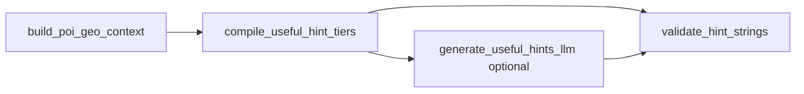

# Script specification: `generate_useful_hints_llm.py`

**Path:** `data/scripts/generate_useful_hints_llm.py`  
**Status:** **CLI landed (dry-run default)** — `--enable-llm-polish` + `--no-dry-run` reserved for HTTP backends per §5 (torch stays out of this process).  
**Plan:** [`plans/2026-04-14-shipped-cache-narrative-hint-pipeline.md`](../../plans/2026-04-14-shipped-cache-narrative-hint-pipeline.md) §5.0 smallest-model policy.

---

## 1. Purpose

**Optionally** rephrase or enrich **`useful_hints`** using a **small** LLM (text-only API or local runner) from **structured, non-spoiler fact JSON** only. This script **does not** replace **`compile_useful_hint_tiers`** for the default ship path; it is a **post-pass** or an **A/B polish** gated by flags.

**TerraTorch / LFM-VL vs this script:** `data/scripts/*` stays **torch-free** per shipped-cache plan (`refs/` usage table). **Do not** import TerraTorch or load Hub weights **in this script process**. **LFM-VL / text LM** polish is always via **HTTP**: the URL may be a **`inference/lfm_vl_hint_service`**-style FastAPI app, a **[vLLM](https://docs.vllm.ai/)** OpenAI-compatible server, **Ollama**, or another gateway — each of those **may** use **`transformers` + torch** or vLLM internally (`inference/README.md` §Runtime backends). Record pins in `model_pins.json`.

---

## 2. Position in the DAG



- **Default:** `compile_useful_hint_tiers` → `validate_hint_strings` → done.
- **`--enable-llm-polish`:** read **validated** deterministic tiers + `geo_context` facts → LLM → **must** pass `validate_hint_strings` again before write.
- **`--replace-tiers`:** LLM output **replaces** tier strings on disk (same paths as compile); **forbidden** in ranked ship configs unless product ADR + stricter review — prefer polish that preserves tier **specificity ordering** (tier_3 ⊄ tier_1 semantics).

---

## 3. Inputs (normative)

| Input | Flag / path | Notes |
|-------|-------------|--------|
| Per-location geo facts | `--geo-context-dir data/cache/<v>/geo_context/` | Same schema as [SPEC-build-poi-geo-context.md](SPEC-build-poi-geo-context.md); may be read alongside existing `useful_hints/*.json`. |
| Deterministic tiers (optional baseline) | `--useful-hints-dir data/cache/<v>/useful_hints/` | When polishing, LLM sees **both** facts and baseline strings unless `--facts-only-prompt`. |
| System prompt | `--system-prompt prompts/llm/useful_hints_system.md` | Repo-root path; must exist when `--enable-llm-polish`. |
| Tier policy | `--tier-policy tier_policy.yaml` | Max lengths, `easy_hints`, banned substrings — **post-LLM** enforcement uses same policy as compile. |

---

## 4. Sector binning (no raw golden coords in prompt text)

Precompute from `geo_context` / catalog truth **inside the script** but **emit to the model** only discretized codes (examples — tune to product):

| Field | Example output in prompt | Rule |
|-------|-------------------------|------|
| `lat_band` | `S08` | Floor(`lat / 5°`) mapped to signed band id; **never** paste `truth.lat` as a decimal. |
| `lon_band` | `E115` | Same for longitude with wrap-safe bucketing near ±180°. |
| `coast_bucket` | `coastal_lt_25km` | From `coast_distance_km` thresholds in policy YAML. |
| `hydrology` | `river: Citarum (near)` | **Names** from NE only; distances as coarse buckets (`<10km`, `10–50km`). |

**Footgun:** leaking `truth` decimals via **error messages**, **debug logs**, or **templating bugs** (`{{truth.lat}}`). CI should grep stdout capture for coordinate-like digit runs when `ranked_safe: true`.

---

## 5. Backends (adapter interface)

Implement **one** active backend per run:

| Backend | `--backend` | Env / auth | Use when |
|---------|-------------|------------|----------|
| **vLLM (OpenAI API)** | `vllm` | Base URL to **`vllm serve`**, API key if enabled | Local or datacenter when the text/VLM server is vLLM-backed |
| **Ollama** | `ollama` | `OLLAMA_HOST`, model tag | Local dev |
| **OpenAI-compatible** | `openai` | `OPENAI_API_KEY`, base URL | Cloud LLM |
| **HF Inference / router** | `hf` | `HF_TOKEN` | Hosted text model |
| **LFM-VL HTTP** | `lfm_vl_http` | `LFM_VL_HINT_SERVICE_URL`, `INFERENCE_SERVICE_TOKEN` | **Text-only** path: send **no images**; user message is JSON facts + instruction to output tier JSON only (service may use **torch** or vLLM internally) |

Each backend returns **raw text** → parse JSON → **`UsefulHintsTiers`** Pydantic model → validator.

**`--dry-run`:** Parse inputs, print **hashed** sector summary + **would-call** backend line; **no network**; exit **0**.

---

## 6. Output

- **In-place or sibling write:** default overwrites **`data/cache/<v>/useful_hints/<location_id>.json`** when polish succeeds; optional **`--output-suffix .llm`** writes parallel files for diff review.
- **`reports/model_pins.json`** append:

```json
{
  "script": "generate_useful_hints_llm",
  "backend": "ollama",
  "model_id": "…",
  "revision": "…",
  "prompt_template_version": "useful_hints_system.md@<git_sha>"
}
```

---

## 7. CLI (full)

```text
python data/scripts/generate_useful_hints_llm.py
  --geo-context-dir data/cache/<v>/geo_context
  [--useful-hints-dir data/cache/<v>/useful_hints]
  [--content-version <v>]
  [--backend vllm|ollama|openai|hf|lfm_vl_http]
  [--model-profile tiny]
  [--enable-llm-polish]
  [--facts-only-prompt]
  [--replace-tiers]
  [--tier-policy tier_policy.yaml]
  [--system-prompt prompts/llm/useful_hints_system.md]
  [--dry-run]
  [--location-id poi_0067]
```

- **`--location-id`:** optional single-POI filter for smoke.

---

## 8. Post-condition

Always run **`validate_hint_strings`** (library or subprocess) on every candidate write; **exit non-zero** on violations.

---

## 9. Non-goals

- No image inputs (Street View + VLM live under [SPEC-batch-streetview-hints.md](SPEC-batch-streetview-hints.md)).
- No training / fine-tuning.
- No in-process **TerraTorch** / **torch** inside **`data/scripts/generate_useful_hints_llm.py`** (remote workers may use them).

---

## 10. Related

- [SPEC-compile-useful-hint-tiers.md](SPEC-compile-useful-hint-tiers.md)
- [SPEC-validate-hint-strings.md](SPEC-validate-hint-strings.md)
- [SPEC-build-poi-geo-context.md](SPEC-build-poi-geo-context.md)

---

*Spec version: 2026-04-14d — vLLM + remote torch backends*
