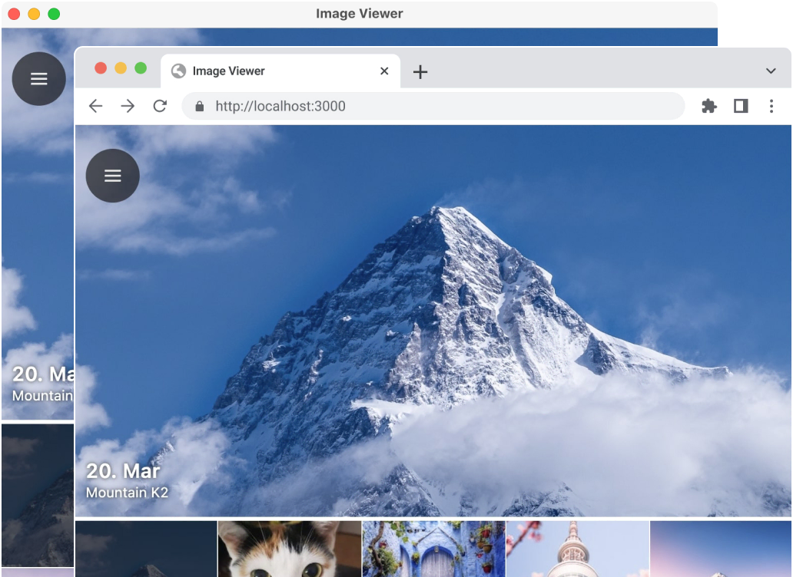

# NU:TONIC clients



This directory contains the Kotlin Multiplatform clients for the NU:TONIC Earth intelligence prototype: Android, iOS, desktop, and web. For competition use, prefer prebuilt artifacts from GitHub Actions or GitHub Releases; local builds are mainly for developers.

## Use a prebuilt client

| Platform | Artifact | Notes |
| --- | --- | --- |
| Windows | `release-windows-msi` or `desktop-windows-msi` | Contains a `.msi` installer. |
| macOS | `release-macos-dmg` or `desktop-macos-dmg` | Contains a `.dmg` installer. |
| Linux | `release-linux-deb` or `desktop-linux-deb` | Contains a `.deb` package. |
| Android | `release-android-signed-apk` or `android-debug-apk` | Install the `.apk` on a device or emulator. |
| iOS | TestFlight, `release-ios-ipa`, or `ios-ipa` | TestFlight is the intended reviewer path. |
| Web | `web-js-productionExecutable` | Static browser bundle. |

To download artifacts:

1. Open GitHub **Actions**.
2. Use **`nutonic — release (installers + optional GitHub Release)`** for release installers, or **`nutonic — quality, tests, clients`** for CI/debug artifacts.
3. Open a successful run and download the artifact from the **Artifacts** section.
4. Unzip the artifact and install or serve the contained build.

For the most polished path, use GitHub **Releases** when a release tag has been published by `.github/workflows/nutonic-release.yml`.

## TestFlight

For iOS public testing, use a TestFlight invite supplied by the maintainer. The workflow [`../.github/workflows/ios-testflight.yml`](../.github/workflows/ios-testflight.yml) builds a signed IPA and uploads it to TestFlight when Apple signing secrets are configured.

## Local development

Use **JDK 17+** and set **`JAVA_HOME`** or `org.gradle.java.home` in `~/.gradle/gradle.properties`. See `gradle.properties.PERSONAL.example` and [`../rules/11-vscode-testing-linting-and-ci.md`](../rules/11-vscode-testing-linting-and-ci.md).

Compose Multiplatform setup notes are available in the [JetBrains documentation](https://www.jetbrains.com/help/kotlin-multiplatform-dev/compose-multiplatform-setup.html).

## Run desktop locally

```bash
./gradlew desktopApp:run
```

## Build desktop installers locally

From `nutonic/`:

```bash
./gradlew :desktopApp:packageReleaseDeb    # Linux
./gradlew :desktopApp:packageReleaseMsi    # Windows; WiX Toolset required
./gradlew :desktopApp:packageReleaseDmg    # macOS
```

Outputs are written under `desktopApp/build/compose/binaries/main-release/`.

## Run web locally

```bash
./gradlew :webApp:jsBrowserDevelopmentRun
```

Web support follows Compose Multiplatform's browser target maturity and is best treated as a demo/reviewer surface.

## Run Android locally

1. Get a [Google Maps API key](https://developers.google.com/maps/documentation/android-sdk/get-api-key) if using map-backed local screens.
2. Create or update `local.properties` in `nutonic/`:

   ```properties
   MAPS_API_KEY=YOUR_KEY
   sdk.dir=YOUR_ANDROID_SDK_PATH
   ```

3. Open the project in Android Studio or IntelliJ IDEA and run the `androidApp` configuration.

CI builds debug APKs with `MAPS_API_KEY=CI_STUB`; release APKs can be signed by the release workflow when Android keystore secrets are configured.

## Relation to the satellite AI stack

The client is the easiest way for reviewers to experience the project, but the satellite intelligence work lives in the services and artifacts outside this directory:

- Public Patagonia write-up: [`../Patagonia_Eval/patagonia_eval_runs/eval.md`](../Patagonia_Eval/patagonia_eval_runs/eval.md)
- Inference services: [`../inference/README.md`](../inference/README.md)
- PRO materialization: [`../inference/pro_materialization_service/README.md`](../inference/pro_materialization_service/README.md)
- Satellite VLM captions: [`../inference/lfm_vl_satellite_caption_service/README.md`](../inference/lfm_vl_satellite_caption_service/README.md)
- TerraMind TiM: [`../inference/terramind_tim_local/README.md`](../inference/terramind_tim_local/README.md)
