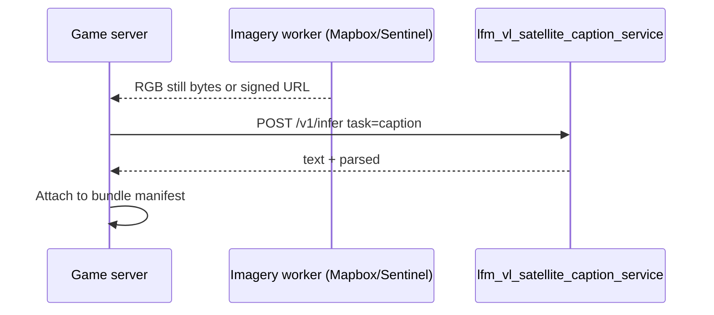

# Plan: LFM-VL inference Spaces — Street View hints (standard) + satellite captioning (specialized)

**Date:** 2026-04-07  
**Status:** Normative **master** plan for all **LFM-VL–based** Hugging Face–hosted inference that the **game server** calls. It **extends** the Street View orchestration in **`plans/2026-04-07-streetview-lfm-vl-hint-inference-plane.md`** with an explicit **standard vs specialized** model policy and adds a **third** deployable for **satellite** imagery using prompt contracts from **`refs/satellite-vlm/`**.

**Authority:** `docs/GAME-ENGINE.md` §5.2 / §9, `docs/PRO-TAB-VLM-ORCHESTRATION-SPEC.md` (PRO vs SCAN pipelines), `docs/SERVER-AND-INFERENCE-ARCHITECTURE.md`, `rules/06-server-vlm-tim-and-on-device-ml.md`, `rules/12-python-gradio-terramind-server.md`, `rules/13-client-cache-and-data-plane.md`, **`refs/satellite-vlm/README.md`** (VQA, captioning, **normalized [0,1] grounding JSON**).

**Client invariant (unchanged):** Apps call **only** the game server OpenAPI; **no** Hub tokens on device; **no** direct calls to Spaces from KMP.

**Local batch + datasets (2026-04-14):** Offline production of **`streetview_hint_pack`** and other cached SCAN rows runs **locally** first on **`data/downloads/geoguessr_poi_12`** (smoke) then **`geoguessr_poi_120`**, using the **smallest** LFM-VL checkpoint for contract validation — see **`plans/2026-04-14-shipped-cache-narrative-hint-pipeline.md`** §5.0 and §5 Phase **D**. **`useful_hints` three-tier strings** are **not** owned by this LFM plan; they come from **programmatic proximity + templates** (**shipped-cache plan** §5 Phase **C**).

---

## 0. Executive summary

| Surface | Model | Monorepo package | HF Space role | Game server use |
|---------|--------|-------------------|---------------|-----------------|
| **Street View multi-pano hints** | **Standard** LFM-VL (e.g. Hub **`LiquidAI/LFM2.5-VL-450M`** or newer **LFM-VL** tag per ML ADR—**not** the satellite-finetuned checkpoint) | `inference/lfm_vl_hint_service/` | GPU / ZeroGPU; **minimal** public UI (`/ops` + health); **machine JSON** primary | **Batch / Jobs → bundle:** `suggestions[]` (or equivalent) materialize **`streetview_hint_pack`** text for **optional SCAN assist** UI—**not** the primary Mapbox still (`docs/GAME-ENGINE.md` §9). **Ranked:** assist consumption **forfeits** verified row per **`docs/RANKED-MODE.md`**. |
| **Satellite captioning / VQA / grounding** | **Specialized** LFM-VL (**your** VRSBench-style finetune from `refs/satellite-vlm/` configs, published to **your** Hub repo + pinned `revision`) | `inference/lfm_vl_satellite_caption_service/` | GPU / ZeroGPU; **full Gradio demo** at `/demo` (or `/`) **plus** same FastAPI pattern for automation | Optional **PRO**-adjacent bundles, **Intel** cards, **server-assisted** clue text for `round_type` satellite paths; **never** mix pipeline labels with Street View hints |

**Design pattern (all LFM Spaces):** **`fastapi.FastAPI()`** registers **versioned `POST /v1/...`** routes for the **game server** (Bearer or mTLS). **`gr.mount_gradio_app(app, blocks, path="...")`** for **operator / public demo** surfaces. **Satellite** service intentionally exposes a **richer** Gradio demo (image upload, task selector: caption / VQA / grounding) aligned with **`refs/satellite-vlm`** UX expectations; **hint** service keeps Gradio **thin** so casual Space visitors do not confuse “hint lines” with product UI.

---

## 1. Why two LFM-VL services instead of one

| Reason | Detail |
|--------|--------|
| **Weight / VRAM** | Loading **two** large heads in one process doubles failure risk; separate Spaces allow **different GPU tiers** and **independent** scaling. |
| **Release cadence** | **Standard** hint model tracks **Liquid** base releases on a schedule; **satellite** specialist tracks **your** finetune + eval (`refs/satellite-vlm` BLEU / grounding IoU). |
| **Prompt templates** | Street-hint vs satellite use **different** template packs (including **JSON bbox** for grounding—`refs/satellite-vlm/README.md` §Data Format). Mixing risks **wrong template** on wrong image modality. |
| **Blast radius** | A bad satellite deploy must **not** take down Street View hints. |

**Anti-pattern:** One mega-service with a dozen flags (`task=street|satellite|...`)—harder to test and to document in OpenAPI.

---

## 2. Monorepo layout (normative)

```text
inference/
  README.md
  streetview_pano_service/              # CPU — unchanged (see streetview plan §2)
  lfm_vl_hint_service/                  # GPU — standard LFM-VL, multi-pano → hint JSON
  lfm_vl_satellite_caption_service/     # GPU — specialized LFM-VL, single (or few) satellite RGB → captions / VQA / grounding JSON
    pyproject.toml
    README.md
    Dockerfile
    src/lfm_vl_satellite_caption_service/
      __init__.py
      main.py                           # FastAPI + mount_gradio_app(demo, path="/demo")
      config.py                         # MODEL_ID, REVISION, MAX_NEW_TOKENS (align yaml benchmarks)
      prompts/                          # Vendored from refs/satellite-vlm *patterns* (see §6)
        caption_system.md
        vqa_template.md
        grounding_user.txt              # 0–1 bbox JSON instruction block (README §Data Format)
      model_loader.py
      infer_caption.py
      infer_vqa.py
      infer_grounding.py
      gradio_demo.py                    # Blocks: image, task dropdown, output, examples
      gradio_ops.py                     # Health, revision, VRAM (optional duplicate of demo footer)
    tests/
plans/
  2026-04-07-lfm-vl-inference-spaces-satellite-and-streetview.md   # this file
  2026-04-07-streetview-lfm-vl-hint-inference-plane.md               # Street View A→B drill-down
refs/
  satellite-vlm/                        # **Training reference only** — not imported at runtime from KMP; inference service may **vendor** prompt snippets and **mirror** eval params from configs/*.yaml
```

**Training vs inference:** **`refs/satellite-vlm/`** stays the **source of truth** for **Modal / leap-finetune** jobs (outside the hot Space container). The **specialized** Space loads **`MODEL_ID`** pointing to the **artifact you pushed to Hub** after training—not the Modal volume path.

---

## 3. Standard LFM-VL — `lfm_vl_hint_service` (Street View hints)

### 3.1 Policy change from “finetuned-only”

- **Default production model** for **SCAN** Street View hint captioning is the **standard** (base) **LFM-VL** checkpoint on Hugging Face (e.g. **`LiquidAI/LFM2.5-VL-450M`**—update to **`LFM2.5-VL-1.6B`** or newer when ADR says so).  
- **Rationale:** General world priors for **pano** appearance; **lower** maintenance than coupling hint release to every satellite finetune.  
- **Optional later:** `HINT_USE_FINETUNED_CHECKPOINT=true` + separate Hub id **only** if A/B proves quality win—document in ML ADR; **do not** conflate with satellite specialist weights.

### 3.2 Contract (unchanged shape)

- **`POST /v1/suggestions/from_frames`** — multi-image in, **`suggestions[]`** JSON out (`streetview` plan §3.4).  
- **`prompt_template_version`** — bump when **standard** model family changes.  
- **Gradio:** `/ops` thin; **no** full player-facing hint transcript on Space.

### 3.3 Environment (illustrative)

| Variable | Example |
|----------|---------|
| `LFM_VL_MODEL_ID` | `LiquidAI/LFM2.5-VL-450M` |
| `LFM_VL_REVISION` | `main` or commit SHA |

---

## 4. Specialized LFM-VL — `lfm_vl_satellite_caption_service`

### 4.1 Responsibility

- **Input:** One **RGB satellite** image (Mapbox static still, Sentinel pseudo-RGB thumb, or user upload in **demo** mode)—**bounded** max side (e.g. 1024) and bytes.  
- **Output:** Depends on **`task`**:
  - **`caption`** — free text or short structured prose (CIDEr-style quality target per `refs/satellite-vlm`).  
  - **`vqa`** — short answer string (eval: substring match per README).  
  - **`grounding`** — **valid JSON array** of `{ "label", "bbox": [x1,y1,x2,y2] }` with **0–1 normalized** coordinates relative to **input image width/height** (same convention as `refs/satellite-vlm/README.md` §Data Format and `docs/PRO-TAB-VLM-ORCHESTRATION-SPEC.md` §7.1).

### 4.2 FastAPI (game server + automation)

| Route | Purpose |
|-------|---------|
| `GET /healthz` | liveness |
| `GET /v1/meta` | `{ "model_id", "revision", "prompt_pack_version", "supported_tasks": [...] }` |
| `POST /v1/infer` | Body: `{ "request_id", "task", "image_base64" \| "image_url" (internal only), "question?" (vqa), "user_instruction?" (grounding) }` → structured response per task |
| `POST /v1/batch/infer` | Optional **Job-style** array (rate-limited); same schema |

**Auth:** Same **`INFERENCE_SERVICE_TOKEN`** pattern as other inference services.

**Responses (sketch):**

```json
{
  "request_id": "uuid",
  "task": "grounding",
  "model_id": "your-org/nutonic-lfm-vl-satellite-v1",
  "revision": "…",
  "text": "[{\"label\":\"ship\",\"bbox\":[0.37,0.0,0.8,0.99]}]",
  "parsed": [ { "label": "ship", "bbox": [0.37, 0.0, 0.8, 0.99] } ],
  "flags": []
}
```

Server-side **JSON parse validation** before 200; on parse fail return **422** with raw model text in **`debug_text`** field **only** when `DEBUG=1` (never default prod).

### 4.3 Gradio.server — **demo interface** (Hugging Face visitors)

- **`gr.mount_gradio_app(app, build_satellite_demo(), path="/demo")`** (or `/` if product wants landing = demo).  
- **Blocks:** Image input, **Radio** (`caption` | `vqa` | `grounding`), optional **Textbox** for VQA question / grounding user instruction, **Submit**, Markdown output.  
- **Examples:** Curated thumbnails checked into `examples/` small subset.  
- **Footer:** Model id, revision, link to **model card**, “**Not** the NU:TONIC game client” disclaimer (`rules/12` spirit).  
- **Same `infer_*` functions** as FastAPI routes to avoid drift.

### 4.4 Model weights

- **`MODEL_ID`** = **your** Hub repo produced by **`refs/satellite-vlm`** leap-finetune path (merged weights preferred for Space simplicity).  
- **`REVISION`** pinned per deploy.  
- **Base** named in `refs/satellite-vlm/configs/*.yaml` (`model_name: lfm2.5-VL-450M`) is the **starting point**; your published specialist may be **450M fine-tuned** or a **larger** base if you retarget configs—document in Space README.

### 4.5 Relationship to PRO tab

- **PRO** tab on-device VLM remains per **`docs/PRO-TAB-VLM-ORCHESTRATION-SPEC.md`**.  
- **Satellite specialist Space** is a **server-side** option for: (a) **pre-captioning** tiles in worker jobs, (b) **optional** `server_caption` fallback if product adds OpenAPI, (c) **Intel** / mission copy hydration—**not** a substitute for ranked truth.  
- Label every bundle with **`pipeline: "satellite_lfm_vl_specialist"`** vs **`pipeline: "streetview_lfm_vl_standard"`** in manifests (`docs/GAME-ENGINE.md` §5.2 separation).

---

## 5. Vendoring prompts from `refs/satellite-vlm/`

**Do not** mount `refs/` as a Python package path in the Docker image from arbitrary monorepo layouts. **Copy** (or generate at build time) the **instruction strings** the README documents:

1. **Grounding** — user message template ending in **valid JSON** array requirement and **0–1** normalization (`refs/satellite-vlm/README.md` lines 108–114).  
2. **VQA / captioning** — “standard question-answer format” per README; align **`max_new_tokens`** with `configs/vrsbench_multitask.yaml` **`benchmarks.max_new_tokens`** (e.g. 50 VQA, 200 captioning, 256 grounding) unless ADR changes.  
3. **`prompt_pack_version`** — semver in **`GET /v1/meta`**; bump when vendored text changes.

**Optional:** CI check that hashes of `inference/.../prompts/*` match a slice of `refs/satellite-vlm/README.md` (fragile)—manual review each bump is acceptable for v1.

---

## 6. Game server orchestration

### 6.1 Environment variables

| Variable | Target |
|----------|--------|
| `STREETVIEW_PANO_SERVICE_URL` | Service A |
| `LFM_VL_HINT_SERVICE_URL` | Service B — **standard** LFM-VL |
| `LFM_VL_SATELLITE_CAPTION_SERVICE_URL` | Service C — **specialized** satellite |
| `INFERENCE_SERVICE_TOKEN` | Shared Bearer (or per-service tokens) |

### 6.2 When to call which

| Game feature | Calls |
|--------------|--------|
| **SCAN** Street View hint hydration | A → B |
| **Satellite / EO clue** missions, Intel cards, optional server caption | C (with `task` + image bytes from your Mapbox/Sentinel worker) |
| **Ranked active round** | Neither A/B/C with **undisclosed** golden `(lat,lon)` **unless** clue images are **pre-redacted** per `docs/RANKED-MODE.md` |

### 6.3 Sequence (satellite)



---

## 7. Hugging Face Spaces and Docker

| Space | Dockerfile context | Hardware |
|-------|--------------------|----------|
| **`spaces/<org>/nutonic-streetview-pano`** | `inference/streetview_pano_service` | CPU |
| **`spaces/<org>/nutonic-lfm-vl-hints`** | `inference/lfm_vl_hint_service` | ZeroGPU or T4+ |
| **`spaces/<org>/nutonic-lfm-vl-satellite`** | `inference/lfm_vl_satellite_caption_service` | ZeroGPU or T4+ |

**Each** Space: **`CMD`** runs **`uvicorn ... --host 0.0.0.0 --port 7860`**. **`@spaces.GPU`** on infer functions where ZeroGPU applies (`plans/2026-04-07-terramind-gradio-spaces-comprehensive-demo.md` pattern).

---

## 8. GitHub Actions — publish all Spaces

**File:** `.github/workflows/publish-lfm-vl-inference-spaces.yml`

- **`workflow_dispatch`** inputs: `target: all | pano | hints | satellite`.  
- **`push`** to `main` when `inference/**` changes.  
- **Matrix** job:

```yaml
strategy:
  matrix:
    include:
      - { folder: inference/streetview_pano_service, space: nutonic-streetview-pano }
      - { folder: inference/lfm_vl_hint_service, space: nutonic-lfm-vl-hints }
      - { folder: inference/lfm_vl_satellite_caption_service, space: nutonic-lfm-vl-satellite }
```

- **Steps:** `hf auth login`, then `hf upload` / `upload_folder` per matrix row (`HF_TOKEN` secret).  
- **Optional:** **two** workflows if you want **satellite** releases less frequent than hints.

---

## 9. OpenAPI artifacts

1. **`inference/openapi-internal-hints.yaml`** — A + B (or extend existing).  
2. **`inference/openapi-internal-satellite.yaml`** — C only (`/v1/infer`, `/v1/meta`).  
3. **Game server public OpenAPI** — only aggregated hint / intel fields; **no** internal URLs.

---

## 10. Testing and quality

| Layer | Street hints (B) | Satellite (C) |
|-------|-------------------|----------------|
| **Unit** | Mock `generate`; JSON schema | Mock generate; **parse** grounding JSON; bbox clamp [0,1] |
| **Golden** | Few pano fixtures (LFS or CI artifact) | VRSBench-style eval images or synthetic RGB |
| **Regression** | `prompt_template_version` bump diff | `prompt_pack_version` vs `refs/satellite-vlm` README |

---

## 11. Operations

- **Demo uploads:** **max file size**; rate-limit per deploy.  
- **Logs:** log **sha256** + **`request_id`** for image payloads (avoid huge blobs in logs).

---

## 12. Implementation phases

| Phase | Deliverable |
|-------|-------------|
| **P0** | This plan + **`inference/README.md`** + internal OpenAPI stubs |
| **P1** | `streetview_pano_service` MVP (existing plan) |
| **P2** | `lfm_vl_hint_service` with **standard** `LiquidAI/LFM2.5-VL-*` + `/v1/suggestions/from_frames` |
| **P3** | `lfm_vl_satellite_caption_service` FastAPI **`/v1/infer`** + vendored prompts + **standard** specialist weights (or first finetune checkpoint) |
| **P4** | **Gradio `/demo`** for satellite Space + examples |
| **P5** | GitHub Actions matrix → three Spaces |
| **P6** | Game server clients + integration tests + **`docs/SERVER-AND-INFERENCE-ARCHITECTURE.md`** env table |

---

## 13. Related documents

- **`plans/2026-04-07-streetview-lfm-vl-hint-inference-plane.md`** — Street View **A→B** detail  
- **`plans/2026-04-07-terramind-gradio-spaces-comprehensive-demo.md`** — ZeroGPU + `hf` CI patterns  
- **`refs/satellite-vlm/README.md`** — task definitions, JSON bbox format, eval limits  
- **`docs/PRO-TAB-VLM-ORCHESTRATION-SPEC.md`** — normalized bbox overlay parity  
- **`docs/GAME-ENGINE.md`** — §5.2 pipeline labels, §9 cached clues  

---

## 14. Version history

| Ver | Date | Notes |
|-----|------|-------|
| 0.1 | 2026-04-07 | Initial: standard LFM-VL hints + specialist satellite Space + Gradio demo + game orchestration |

*End of document.*
