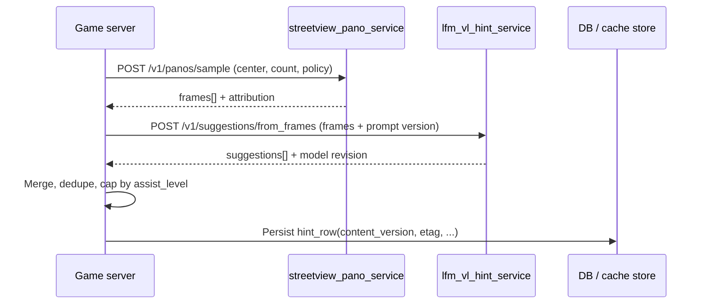

# Plan: Street View pano plane + LFM-VL hint inference (separate from game server)

> **Shipped client cache (where this service fits):** CI batch outputs feed `**streetview_hint_pack`** in manifests / ranked clue slices — see `**plans/2026-04-14-shipped-cache-narrative-hint-pipeline.md**` §5 Phase **D** and §4 OpenAPI follow-up.  
> **Master plan (model policy + satellite service):** `**plans/2026-04-07-lfm-vl-inference-spaces-satellite-and-streetview.md`** — **standard** LFM-VL for Street View hints, **specialized** satellite captioning Space (`inference/lfm_vl_satellite_caption_service/`) with `**refs/satellite-vlm/`** prompts and a **Gradio demo**. This file remains the **A → B** Street View drill-down.

**Date:** 2026-04-07  
**Status:** Normative implementation plan for the **inference plane** only. **Game server** (`server/` or equivalent) remains the **sole public orchestrator** for clients; it calls these services over **private HTTP** with **timeouts, circuit breakers, and fallbacks** (`docs/SERVER-AND-INFERENCE-ARCHITECTURE.md`, `rules/12-python-gradio-terramind-server.md`, `rules/13-client-cache-and-data-plane.md`).

**Scope note:** **SCAN** gameplay ships **cached Mapbox stills** as the **primary** on-screen reference; **optional** **Street View + LFM-VL** outputs are **pre-cached AI descriptions** at sampled viewpoints for **assist panels** (bundle field `**streetview_hint_pack`**), **not** live player inference. This plan describes the **batch / CI** microservices that produce those strings; the **game client** reads **bundled text** only. **Ranked:** consuming this assist **forfeits** verified placement before `submit` (`docs/RANKED-MODE.md` §4).

**Authority:** Binds to `docs/GAME-ENGINE.md` §9, `docs/NARRATIVE-AND-PROMPTS.md` §3, `docs/CLIENT-SETTINGS-SPEC.md` §5–6, `docs/RANKED-MODE.md`, `rules/06-server-vlm-tim-and-on-device-ml.md`, `refs/satellite-vlm/README.md` (JSON discipline for **training and eval shape**—not shipped in KMP).

**Model stance:** Production **Street View hint** captioning uses a **standard** (base) **LFM-VL** Hub checkpoint (e.g. `**LiquidAI/LFM2.5-VL-450M`** or newer per ML ADR)—**not** the satellite-finetuned specialist. Log `**model_id` + `revision` + `prompt_template_version`** on every inference. **Satellite** specialist weights live only in `**inference/lfm_vl_satellite_caption_service/`** per the master plan.

---

## 0. Executive outcomes


| Outcome                  | Definition of done                                                                                                                                                                                                                                                                                                                                                                                                                       |
| ------------------------ | ---------------------------------------------------------------------------------------------------------------------------------------------------------------------------------------------------------------------------------------------------------------------------------------------------------------------------------------------------------------------------------------------------------------------------------------- |
| **Monorepo separation**  | Two deployable Python packages live under `**inference/streetview_pano_service/`** and `**inference/lfm_vl_hint_service/**`. Neither imports the game FastAPI app; neither exposes player JWT flows. `**server/**` has **no** `torch` / `transformers` dependency for hint hydration (optional thin HTTP clients only).                                                                                                                  |
| **Imagery acquisition**  | **Street View Static** (or agreed successor) behind **server-side** keys; optional internal disk cache for repeat jobs.                                                                                                                                                                                                                                                                                                                  |
| **LFM-VL hints**         | `**lfm_vl_hint_service`** loads **standard** LFM-VL (HF snapshot); accepts **N** images + allowlisted text; returns **JSON** `suggestions[]` validated by Pydantic **before** HTTP 200.                                                                                                                                                                                                                                                  |
| **Hidden from Space UI** | Anonymous visitors to the HF Space see **health + ops Gradio** only; **machine JSON** is served on `**POST /v1/...`** FastAPI routes **not** wired to Gradio output components (`rules/12`: players never depend on Gradio for gameplay—here, **operators** may use `/ops`; **game server** uses REST only).                                                                                                                             |
| **Game orchestration**   | Game server env `**STREETVIEW_PANO_SERVICE_URL`**, `**LFM_VL_HINT_SERVICE_URL**`, `**INFERENCE_HMAC_SECRET**` (or mTLS). Integration tests mock both URLs. **All** viewpoint selection, heading/pitch policy, radial sampling, and Street View Static API URL construction **stay inside** `streetview_pano_service` — the thin game server forwards parameters and bytes only (`plans/2026-04-07-game-server-thin-orchestrator.md` §2). |
| **CI → HF Spaces**       | GitHub Actions workflow(s) publish **both** Spaces via `**huggingface_hub` / `hf` CLI** using `**HF_TOKEN`**; optional matrix for `streetview-pano` vs `lfm-vl-hints` Space names.                                                                                                                                                                                                                                                       |


---

## 1. Monorepo layout (normative)

```text
nutonic/                              # KMP client (unchanged ownership)
server/                               # Game API only: OpenAPI, ranked, manifests, orchestration clients
inference/
  streetview_pano_service/            # Service A — imagery acquisition + sampling (CPU-first)
    pyproject.toml
    README.md
    Dockerfile                        # HF Space or generic container (CPU)
    src/streetview_pano_service/
      __init__.py
      main.py                         # FastAPI app + optional gr.mount_gradio_app(..., path="/ops")
      config.py
      sampling.py                     # WGS84 → pano availability + heading/pitch policy
      fetch.py                        # Static API client, retries, size caps
      models.py                       # Pydantic request/response DTOs
      gradio_ops.py                   # Thin Blocks: health, quota display, manual smoke (no prod secrets in UI)
    tests/
  lfm_vl_hint_service/                # Service B — standard LFM-VL multi-image → suggestions (GPU)
    pyproject.toml
    README.md
    Dockerfile                        # HF Space ZeroGPU or GPU tier
    src/lfm_vl_hint_service/
      __init__.py
      main.py                         # FastAPI + @spaces.GPU wrapped infer
      config.py
      model_loader.py                 # snapshot download, revision pin
      prompts.py                    # versioned templates
      infer.py                        # batch images → structured output
      gradio_ops.py                   # Model card link, VRAM smoke, optional single-image dev tab (off in prod flag)
    tests/                            # unit tests with mocked model; no GPU in CI
docs/
plans/
  2026-04-07-streetview-lfm-vl-hint-inference-plane.md   # this file
```

**Forbidden couplings**

- **Not the TiM / TerraTorch service:** These two packages **must not** load TerraTorch, `**BACKBONE_REGISTRY`** `*_tim`, or `**terramind_v1_*_generate**`. TerraMind **TiM** (and optional `**_generate**`) stay in `**demos/terramind_space/**` and/or a **distinct** internal URL such as `**TERRAMIND_TIM_URL**` on the game node (`rules/12`, `plans/2026-04-07-terramind-gradio-spaces-comprehensive-demo.md`). Street-view hints and EO TiM are **different pipelines** (`rules/12` alignment with `rules/10` / `docs/GAME-ENGINE.md` §5.2).
- Do **not** add `from streetview_pano_service` inside `server/src/...` as a library import—**HTTP only** between processes so language/runtime splits stay possible (`docs/SERVER-AND-INFERENCE-ARCHITECTURE.md` §3).
- Do **not** embed **Google API keys** in `lfm_vl_hint_service** if that service only receives **image bytes** from the game server or from **streetview_pano_service**; simplest split: **keys only in A** and optionally duplicated read-only in game server for unrelated map features.

---

## 2. Service A — `streetview_pano_service`

### 2.1 Responsibility

- Given `**center_lat`, `center_lon*`*, policy `**radius_m**`, `**count**`, `**fov**`, `**size**`, `**pitch_policy**`, return **K** pano captures (JPEG/PNG bytes or base64) plus `**pano_id`**, `**copyright**`, `**google_maps_url**` per frame.
- **Idempotent-ish:** same inputs → same cache key; optional internal disk cache to protect quotas.

### 2.2 API sketch (internal REST)

**Normative implementation WBS (field-level tasks, providers, tests):** `[plans/2026-04-18-streetview-google-perpendicular-sampling-full-scope.md](2026-04-18-streetview-google-perpendicular-sampling-full-scope.md)` — projects **PR-A–PR-J**. Until that WBS is closed in code, treat the JSON below as the **contract sketch**; prefer HTTP path `**POST /api/v1/panos/sample`** (legacy `**POST /v1/panos/sample**` retained).

`POST /v1/panos/sample`

```json
{
  "request_id": "uuid",
  "center": { "lat": -33.86, "lon": 151.20 },
  "count": 6,
  "sampling_mode": "STOCHASTIC_S2_FOOTPRINT",
  "area_radius_m": null,
  "jitter_seed": null,
  "min_anchor_separation_m": null,
  "radius_m": 120,
  "heading_mode": null,
  "fov_deg": null,
  "pitch_jitter_deg": null,
  "image_width": 640,
  "image_height": 640
}
```

**Semantics (2026-04-18):** Normative sampling is in `**[plans/2026-04-18-streetview-google-perpendicular-sampling-full-scope.md](2026-04-18-streetview-google-perpendicular-sampling-full-scope.md)`**. `**sampling_mode**`: `**STOCHASTIC_S2_FOOTPRINT**` (default) — seeded random anchors in a disk of radius `**area_radius_m**` (or server default **R** from `**STREETVIEW_S2_GSD_M`** × `**STREETVIEW_S2_CHIP_EDGE_PX**`, capped), metadata per anchor, `**pano=**` Static when Google returns a pano id, random heading per frame; optional `**min_anchor_separation_m**`. `**LEGACY_RADIAL_OFFSET**` — legacy radial offsets + spaced headings (`**radius_m**` only); deprecated `**heading_mode": "RADIAL_OR_RANDOM"**` maps here when `**sampling_mode**` is omitted. `**OMNI_SINGLE_PANO**` — one center metadata call, `**N**` static views, same pano when available, headings `**i·360/N**`. Optional `**jitter_seed**` (else derived from `**request_id**` hash). Road-bearing / perpendicular modes remain **deferred** per that WBS.

Response:

```json
{
  "request_id": "uuid",
  "frames": [
    {
      "pano_id": "...",
      "heading_deg": 142.0,
      "pitch_deg": 0.0,
      "image_base64": "...",
      "attribution": "© Google"
    }
  ],
  "cache_key": "sha256:...",
  "terms_version": "2026-01"
}
```

### 2.3 Non-goals

- No VLM, no PyTorch in this package (keeps image **CPU + network** bounded).
- No persistence of player identity.

### 2.4 HF Space packaging

- **SDK:** Docker Space, **CPU** sufficient.
- **Secrets:** `GOOGLE_MAPS_API_KEY` (or Street View–scoped key), `SERVICE_TOKEN` for game server / B to call A.
- **Scaling:** single replica default; rate-limit per `Authorization` subject.

---

## 3. Service B — `lfm_vl_hint_service` (standard LFM-VL)

### 3.1 Responsibility

- Consume `**frames[]`** (base64 or multipart) + `**mission_flavor**`, `**language**`, `**role_presentation**`, `**prompt_template_version**`.
- Run **one forward** (or small fixed **K** patch) through **standard** **LFM-VL** to produce `**suggestions: [{ "text", "confidence?", "style_tag?" }]`** capped by `**max_suggestions**`.
- Validate `**suggestions[]**` with Pydantic; on hard fail return `**503**` + empty suggestions + `fallback_code`.

### 3.2 Model loading

- `**MODEL_ID**` — Hub repo id for **standard** base weights (e.g. `LiquidAI/LFM2.5-VL-450M`). Optional finetuned override only if ML ADR enables it—default stays **base**.
- `**HF_TOKEN`** on Space if model is **private/gated**.
- `**REVISION`** — git commit or Hub revision **pin**; log on every inference.
- **VRAM:** document minimum GPU; use **4-bit / 8-bit** load flags if product accepts quality tradeoff—document in Space README.

### 3.3 Prompt design (versioned)

- `**prompts.py`** exports `**PROMPT_TEMPLATE_VERSION**` (semver).
- **System:** “You are a location analyst. Output **only** valid JSON. Do not output latitude/longitude numbers. …”
- **User:** embed **allowlisted** mission strings only (`docs/GAME-ENGINE.md` §9.1).
- **Ranked policy:** when `ranked_clue_safe: true` in request, use **stricter** template that **forbids** place names above agreed population threshold if product requires—otherwise game server **must not** send ranked-secret-vicinity panos to B until post-resolve (see §6).

### 3.4 API sketch

`POST /v1/suggestions/from_frames`

```json
{
  "request_id": "uuid",
  "prompt_template_version": "1.2.0",
  "mission_id": "optional",
  "language": "en",
  "role_presentation": "ASTRONAUT",
  "ranked_clue_safe": true,
  "max_suggestions": 5,
  "frames": [
    { "image_base64": "...", "pano_id": "...", "heading_deg": 12.0 }
  ]
}
```

Response:

```json
{
  "request_id": "uuid",
  "model_id": "LiquidAI/LFM2.5-VL-450M",
  "revision": "abc123",
  "prompt_template_version": "1.2.0",
  "suggestions": [
    { "text": "Coastal highway with double yellow lines; subtropical vegetation.", "confidence": 0.42 }
  ],
  "flags": []
}
```

### 3.5 Gradio.server + FastAPI (HF demo style)

- `**main.py`:** `app = FastAPI()`; register `**POST /v1/suggestions/from_frames`** and `**GET /healthz**`.
- `**gr.mount_gradio_app(app, build_ops_blocks(), path="/ops")**` — ops UI: model revision, last error, **optional** single-image playground behind `**ENABLE_PLAYGROUND=false`** env for production Space.
- **Root `GET /`:** JSON `{"service":"lfm_vl_hint_service","revision":"..."}` — no suggestion text.

### 3.6 ZeroGPU

- Wrap `**run_infer(...)`** with `**@spaces.GPU**` when `import spaces` succeeds; CI/local skip decorator.

---

## 4. Game server orchestration (not implemented in this plan’s packages)

**Sequence: hydrate POI / round hint cache**




**Env vars (illustrative)**


| Variable                      | Purpose                                  |
| ----------------------------- | ---------------------------------------- |
| `STREETVIEW_PANO_SERVICE_URL` | Base URL for A                           |
| `LFM_VL_HINT_SERVICE_URL`     | Base URL for B                           |
| `INFERENCE_SERVICE_TOKEN`     | Bearer or HMAC shared secret for A and B |
| `INFERENCE_TIMEOUT_S_A`       | Default 30                               |
| `INFERENCE_TIMEOUT_S_B`       | Default 120 (GPU)                        |


**Failure:** game server uses `**docs/GAME-ENGINE.md` §9.4** — cached row, static fallback, or omit AI-hint lines; **never** block guess submit.

---

## 5. OpenAPI and contracts

1. Publish `**inference/openapi-internal.yaml`** (or per-service files) documenting **A** and **B** for **implementers**—**not** shipped to mobile clients.
2. Game server’s **public** OpenAPI gains only `**GET /api/v1/.../hints`** (or embedded hints on round manifest)—**never** exposes internal inference URLs.

---

## 6. Ranked / trust matrix


| Mode                    | Call A with center = **secret** truth?      | Call B?                                                                                                                                         |
| ----------------------- | ------------------------------------------- | ----------------------------------------------------------------------------------------------------------------------------------------------- |
| **Casual / reference**  | Allowed per product for pre-hydration       | Allowed with `ranked_clue_safe` rules                                                                                                           |
| **Ranked active round** | **Not** with undisclosed golden `(lat,lon)` | **Not** on secret—use **pre-baked** clue-only frames from ranked manifest **or** post-resolve pipeline only (`docs/RANKED-MODE.md`, `rules/06`) |


Document exceptions in an **ADR** if product ever allows **redacted** server-only panos during ranked.

---

## 7. Optional hint-model fine-tuning (outline only — **not** default)

Street View hints **default** to **standard** Hub weights (§3). If product A/B requires a **hint-specific** finetune later:

1. **Dataset:** pairs of `(multi_frame list, target_json_suggestions)` from legal Street View pulls; align JSON schema with §3.4.
2. **Training:** separate from `**refs/satellite-vlm/`** satellite specialist—do not reuse VRSBench weights for pano hint quality without eval.
3. **Publish:** dedicated Hub repo (e.g. `org/nutonic-lfm-vl-hint-lora-vX`); pin `**REVISION`**; enable only via ML ADR + env flag.
4. **Eval:** golden JSON fixtures for `suggestions[]` shape.

**Satellite** specialist training and publishing remain in `**plans/2026-04-07-lfm-vl-inference-spaces-satellite-and-streetview.md`** §4–5.

---

## 8. GitHub Actions → Hugging Face Spaces

### 8.1 Secrets

- `**HF_TOKEN**` — write access to `spaces/org/streetview-pano` and `spaces/org/lfm-vl-hints` (or single org, two repos).

### 8.2 Workflow structure

**File:** `.github/workflows/publish-inference-spaces.yml` (create in repo root when enabling CI; not committed until secrets exist).

- **Triggers:** `push` to `main` when `inference/`** changes; `workflow_dispatch` with inputs `target: all | streetview | lfm`.
- **Steps:**
  1. Checkout
  2. `pip install huggingface_hub` (includes `hf` CLI)
  3. `hf auth login --token ${{ secrets.HF_TOKEN }} --add-to-git-credential`
  4. For each service: `hf upload <org>/<space-name> --repo-type=space --folder inference/<service_dir> --commit-message "ci: ${GITHUB_SHA}"` **or** git-subtree push to Space clone—pick one pattern and document in workflow comments.
- **README badge** in each service README linking to live Space.

### 8.3 Space README requirements

- Model card sections: **intended use**, **limitations**, **bias**, **non–player-facing** API.
- **Cold start** warning for ZeroGPU.

---

## 9. Testing strategy


| Layer           | What                                                                                                |
| --------------- | --------------------------------------------------------------------------------------------------- |
| **Unit**        | `sampling.py`, JSON schema                                                                          |
| **Contract**    | schemathesis or httpx against FastAPI app in CI (no Google key: use `**pytest-recording`** or stub) |
| **Integration** | Nightly optional job with real key on self-hosted runner (not mandatory for every PR)               |


---

## 10. Implementation phases (execution order)


| Phase  | Scope                                                                             | Exit criteria                     |
| ------ | --------------------------------------------------------------------------------- | --------------------------------- |
| **P0** | Add `inference/` tree + README stubs + internal OpenAPI skeleton                  | CI path filters green             |
| **P1** | `**streetview_pano_service`** MVP: single pano fetch + health + auth              | Docker builds locally             |
| **P2** | `**lfm_vl_hint_service`** MVP: load **base** LFM-VL from Hub, single image → JSON | Unit tests with mocked `generate` |
| **P3** | Wire **standard** Hub weights; prompt templates v1                                | Manual eval pass                  |
| **P4** | Gradio `/ops` + hidden JSON routes + ZeroGPU                                      | Space runs on HF                  |
| **P5** | GitHub Actions publish                                                            | Push to `main` updates Space      |
| **P6** | Game server HTTP clients + persistence + `GET` hints for clients                  | E2E against mocks                 |


---

## 11. Related documents (keep in sync)

- `**plans/2026-04-07-lfm-vl-inference-spaces-satellite-and-streetview.md`** — **master** plan (standard hints + satellite specialist + Gradio demo)  
- `**docs/SERVER-AND-INFERENCE-ARCHITECTURE.md`** — §5.1–5.2 inference plane pointer  
- `**plans/2026-04-07-complete-implementation-architecture.md**` — monorepo tree §2, server services table §4.2  
- `**docs/GAME-ENGINE.md**` — §4 diagram, §9 VLM pipeline  
- `**docs/NARRATIVE-AND-PROMPTS.md**` — §3 visit pipeline  
- `**rules/12-python-gradio-terramind-server.md**` — related plans list  
- `**rules/README.md**` — reading order for ML engineers

---

## 12. Version history


| Version | Date       | Notes                                                                                                                                     |
| ------- | ---------- | ----------------------------------------------------------------------------------------------------------------------------------------- |
| 0.1     | 2026-04-07 | Initial plan: dual `inference/` services, HF Spaces CI, game orchestration, ranked matrix                                                 |
| 0.2     | 2026-04-07 | **Standard** LFM-VL for hints; satellite specialist moved to master plan `2026-04-07-lfm-vl-inference-spaces-satellite-and-streetview.md` |


*End of document.*