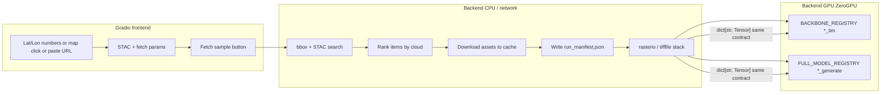

# Plan: Comprehensive TerraMind Gradio.Server demo, ZeroGPU, and Hugging Face Spaces (manual CI)

**Date:** 2026-04-07  
**Audience:** Engineers shipping an **independent** Python demo in this monorepo that exposes **all in-scope TerraMind surfaces** (**`*_tim`** and **`terramind_v1_*_generate`**) via **[Gradio server mode](https://www.gradio.app/main/guides/server-mode/)**, optional **FastAPI** co-hosting, **[Hugging Face Spaces ZeroGPU](https://huggingface.co/docs/hub/spaces-zerogpu)** (`@spaces.GPU`), and **manual** GitHub Actions deployment to a Space.

**Normative repo context:** `rules/06-server-vlm-tim-and-on-device-ml.md`, `rules/12-python-gradio-terramind-server.md`, `plans/2026-04-07-tim-standalone-gradio-poi-dataset.md` (POI tensors, `S2L2A` vs `RGB`), `plans/2026-04-07-gradio-terramind-backend.md` (**§2** script-first hydration + thin **`server/`** + **`inference/*`**). **Out of scope without ADR:** backbone-only TerraMind encoders (no `_tim` / `_generate` suffix).

**Primary references (external):**

| Topic | URL |
|-------|-----|
| Gradio server / `launch` / FastAPI mount | https://www.gradio.app/main/guides/server-mode/ |
| Spaces ZeroGPU + `@spaces.GPU` | https://huggingface.co/docs/hub/spaces-zerogpu |
| TerraTorch TerraMind (TiM, generation, registries, merge) | https://terrastackai.github.io/terratorch/stable/guide/terramind/ |
| IBM TerraMind notebooks (behavioral parity) | https://github.com/IBM/terramind/tree/main/notebooks |

---

## 0. Executive outcomes

| Outcome | Definition of done |
|---------|---------------------|
| **Local demo** | `uv run` (or `python -m`) starts Gradio **`Blocks.launch(...)`**; browser can run **TiM** and **`_generate`** on **canned POI** or **uploaded** zip; logs show **wall time** and **peak VRAM** (when CUDA). |
| **ZeroGPU Space** | Space **SDK** (Gradio or Docker) declares **ZeroGPU**; every **GPU** forward path is behind **`@spaces.GPU`**; CPU-only paths (scan `poi.json`, file IO) stay undecorated. |
| **Manual CI** | **`workflow_dispatch`** workflow syncs **`demos/terramind_space/`** (or agreed path) to **`huggingface.co/spaces/<org>/<name>`** via **`HF_TOKEN`** secret; docs describe one-click run from Actions tab. |
| **Function coverage** | UI + code paths for **all eight** registry IDs `terramind_v1_{tiny,small,base,large}_{tim,generate}` **selectable**; **`tim_modalities`** / **`output_modalities`** / **`merge_method`** (TiM) exposed per TerraTorch docs; **no** invalid `bands=` subset on `S2L2A`. |
| **Optional geospatial loader** | User supplies **lat/lon** (numeric, **map pick**, and/or **paste maps URL**) + STAC/Mapbox parameters → demo **fetches**, **caches**, and builds the **same** `S2L2A` / `RGB` tensors as the POI pipeline, then hands off to **full** **`_*_tim`** and **`terramind_v1_*_generate`** forwards (network off by default in CI; on in Space with secrets). |
| **World map UX** | **Tier 1** (Plotly marker + numeric coords + presets); **Tier 1.5** (paste Google/Apple Maps URL → parse lat/lon); **Tier 2** (plot click → lat/lon) when **`gr.Plot`** supports selection in your pinned Gradio—[Plot component for maps](https://www.gradio.app/guides/plot-component-for-maps); **Tier 3** optional Leaflet. |

### 0.1 End-to-end data flow (coordinates → `_tim` / `_generate`)



---

## 1. Program structure (projects → activities → files → line-level)

Below, **line-level** items are **targets** for the first implementation pass (adjust if file evolves). File paths are **proposed** under a single demo root: **`demos/terramind_space/`** (alternative: `server/gradio_terramind_demo/`—pick one in ADR or first PR; this plan assumes **`demos/terramind_space`** to keep Kotlin `nutonic/` untouched).

**Optional geospatial track:** **Projects P11–P12** add an **on-demand dataloader** (STAC + optional Mapbox) and a **world-map / coordinate** UI. Deep behavioral parity for HTTP/STAC/S3→HTTPS resolution is in **`data/scripts/download_simsat_sources.py`** (`Client.open`, `search`, `resolve_href`, `download_sentinel_item_assets`, `fetch_mapbox_static`). Detailed contracts are in **§5–§6** at the end of this document.

---

### Project **P1** — Monorepo layout, packaging, and entrypoints

**Goal:** Importable package + single CLI entry that runs **Gradio server** (`launch`), suitable for HF Space **`app.py`** re-export.

#### Activity **P1-A** — Directory scaffold

| ID | File-level task | Line-level subtasks |
|----|-----------------|---------------------|
| P1-A-1 | Create `demos/terramind_space/README.md` | **L1–L30:** Title, “not the game client”, link to TerraTorch. **L31–L80:** Local run: `uv sync`, `uv run python -m terramind_space`, env vars (`MAPBOX_TOKEN`, `POI_ROOT`). **L81–End:** Space-specific: ZeroGPU, cold start, `HF_HOME` cache. |
| P1-A-2 | Create `demos/terramind_space/pyproject.toml` | **L1–L25:** `[project]` name `terramind-space-demo`, `requires-python`, deps: `torch` (document CUDA index URL in README, not committed), `terratorch` (pin **exact** version aligned to [guide](https://terrastackai.github.io/terratorch/stable/guide/terramind/)), `gradio>=4`, `numpy`, `pillow`, `pydantic`, `pyyaml`, `rasterio` or `tifffile` (pick one in P2). **L26–L40:** Optional `[project.optional-dependencies]`: `spaces` (HF only). **L41–L55:** `[tool.setuptools.packages.find]` where `src/terramind_space`. |
| P1-A-3 | Create `demos/terramind_space/src/terramind_space/__init__.py` | **L1–L10:** `__version__`. **L11–L20:** `__all__` exporting `build_app` only if you want clean API. |

#### Activity **P1-B** — Application entry (`launch`)

| ID | File-level task | Line-level subtasks |
|----|-----------------|---------------------|
| P1-B-1 | `demos/terramind_space/src/terramind_space/__main__.py` | **L1–L15:** `if __name__ == "__main__":` parse `os.environ` for `HOST`, `PORT`, `SHARE`, `ROOT_PATH`. **L16–L35:** `from terramind_space.app import build_app`; `app = build_app()`; `app.launch(server_name=..., server_port=..., share=..., root_path=...)` per [Gradio server mode](https://www.gradio.app/main/guides/server-mode/). |
| P1-B-2 | `demos/terramind_space/src/terramind_space/app.py` | **L1–L40:** `build_app() -> gr.Blocks`: theme, `gr.Markdown` header, **`gr.TabbedInterface`** or nested `gr.Tabs` for **Geospatial** (optional, `ENABLE_GEOSPATIAL_TAB`) / **TiM** / **Generation** / **About**. **L41–L80:** Wire callbacks from `ui_geospatial.py` (P12), `ui_tim.py` / `ui_generate.py` (P4). **L81–L140:** Global **`gr.State`** keys: `last_bundle` (on-disk sample after STAC fetch), `last_timings`, `last_error`. **L141–L180:** Optional `demo.queue()`; GPU concurrency **1** (see P5). |

---

### Project **P2** — Data plane: POI discovery, Sentinel/Mapbox tensors, validation

**Goal:** Reuse **authoring layout** from `data/scripts/download_geoguessr_poi_imagery.py` and **`plans/2026-04-07-tim-standalone-gradio-poi-dataset.md`** §5; **fail closed** on invalid `S2L2A` band counts.

#### Activity **P2-A** — POI scan and metadata

| ID | File-level task | Line-level subtasks |
|----|-----------------|---------------------|
| P2-A-1 | `.../terramind_space/poi_scan.py` | **L1–L40:** `list_poi_dirs(root: Path) -> list[str]` scanning `poi_*/poi.json`. **L41–L90:** `load_poi_meta(path) -> PoiMeta` Pydantic model mirroring downloader JSON (see script ~597–625). **L91–L120:** Validate required keys for **demo** (lat/lon, stac id optional). |

#### Activity **P2-B** — Tensor builders (S2L2A full vs RGB)

| ID | File-level task | Line-level subtasks |
|----|-----------------|---------------------|
| P2-B-1 | `.../terramind_space/tensors_s2.py` | **L1–L60:** Discover STAC asset files under `sentinel-2-l2a/<item_id>/`. **L61–L140:** Resample to `H=W=224` (configurable), stack **12** bands in **TerraTorch order** (cross-check pinned `terratorch` + [terramind_register.py](https://github.com/IBM/terratorch/blob/main/terratorch/models/backbones/terramind/model/terramind_register.py)). **L141–L180:** Return `torch.FloatTensor` `[1,12,H,W]` + **provenance dict** (SHA256 paths). **L181–L220:** If `<12` bands on disk → **raise** `InsufficientBandsError` with message “use `--sentinel-mode full`”. |
| P2-B-2 | `.../terramind_space/tensors_rgb.py` | **L1–L80:** Load `mapbox/*.png` → numpy → **B,G,R** order → resize → `[1,3,H,W]` float **0–255** per guide RGB note. **L81–L100:** Optional load `visual` JPEG as `RGB` with explicit docstring on calibration limits. |

#### Activity **P2-C** — Upload path (Space users without local POI)

| ID | File-level task | Line-level subtasks |
|----|-----------------|---------------------|
| P2-C-1 | `.../terramind_space/upload_unpack.py` | **L1–L60:** `gr.File` zip/tar → temp dir → validate tree matches §2.1 of tim plan. **L61–L90:** Cleanup on session end (best-effort `tempfile.TemporaryDirectory`). |

---

### Project **P11** — **Backend:** optional geospatial dataloader (STAC → disk → tensors)

**Goal:** From **(lat, lon)** + STAC/Mapbox hyperparameters, materialize a **POI-shaped directory tree** under a **cache root** (or in-memory temp) so **P2-B** tensor builders run **unchanged**. All steps are **CPU / network**—**must not** run inside `@spaces.GPU` (P5).

#### Activity **P11-A** — Geometry and search contract

| ID | File-level task | Line-level subtasks |
|----|-----------------|---------------------|
| P11-A-1 | `.../terramind_space/geospatial/bbox.py` | **L1–L40:** `square_bbox_wgs84(lat: float, lon: float, half_side_km: float) -> tuple[float,float,float,float]` returning `(west, south, east, north)`. **Implement** with **geographiclib** or **pyproj** (preferred over naive `delta_deg = km/111`) so bbox area is stable across latitudes; clamp poles / dateline (document wrap policy: reject lon outside (−180,180) after normalization). **L41–L80:** Unit tests: known point vs reference bbox from `download_simsat_sources.py` defaults (Lausanne-style sanity). |
| P11-A-2 | `.../terramind_space/geospatial/stac_search.py` | **L1–L50:** `open_client(stac_url: str) -> Client` wrapping `pystac_client.Client.open(stac_url)` (same pattern as **`data/scripts/download_simsat_sources.py`** L206–213). **L51–L120:** `search_items(collection_id, bbox, datetime_interval, max_cloud_cover, max_items) -> list[Item]`; pass `query={"eo:cloud_cover": {"lt": max_cloud_cover}}` when property exists. **L121–L160:** If **zero** items → raise `StacNoItemsError` with actionable message (widen bbox, datetime, or cloud). |

#### Activity **P11-B** — Item ranking and download

| ID | File-level task | Line-level subtasks |
|----|-----------------|---------------------|
| P11-B-1 | `.../terramind_space/geospatial/item_rank.py` | **L1–L60:** `rank_items_by_cloud(items) -> list[Item]` ascending `eo:cloud_cover` (missing → worst). **L61–L90:** Optional **seasonal** filter (drop winter for land demos)—feature-flagged, default off. |
| P11-B-2 | `.../terramind_space/geospatial/download_assets.py` | **L1–L80:** **Port** (copy, do not import from `data/scripts` as a package) `resolve_href`, `download_url`, `download_sentinel_item_assets` logic from **`download_simsat_sources.py`** L63–124 so Space has **one** self-contained module; preserve **User-Agent** string identifying `terramind-space-demo`. **L81–L140:** `optional_asset_keys` default `frozenset({"product_metadata"})` matching script L228. **L141–L200:** Return `(item_dir: Path, errors, warnings)`; propagate **hard errors** vs **soft 404** on optional keys exactly as script. |
| P11-B-3 | `.../terramind_space/geospatial/asset_policy.py` | **L1–L80:** Enum `SentinelFetchMode`: **`FULL_STAC`** (every asset key—matches `--sentinel-mode full` in `download_geoguessr_poi_imagery.py`), **`TERRAMIND_SPECTRAL`** (subset: **only** assets required to assemble **12-band `S2L2A`**—implement by loading **`s2_asset_allowlist.yaml`** from §5.7; never infer keys ad hoc). **L81–L120:** **`MINIMAL_RGB`** mode: download only keys needed for **`RGB`** / `visual` path (thumbnail/visual only)—**must not** be labeled `S2L2A` in UI. |

#### Activity **P11-C** — Cache layout, manifest, pipeline orchestration

| ID | File-level task | Line-level subtasks |
|----|-----------------|---------------------|
| P11-C-1 | `.../terramind_space/geospatial/cache_key.py` | **L1–L80:** `cache_key(req: GeoSampleRequest) -> str` as **SHA256** hex of canonical JSON: `lat, lon, half_km, stac_url, collection, datetime, max_cloud, fetch_mode, patch_hw, mapbox_zoom, terratorch_pin`. **L81–L120:** `cache_root() -> Path` from `TERRAMIND_DEMO_CACHE` env or `Path.home() / ".cache" / "terramind_space"`. |
| P11-C-2 | `.../terramind_space/geospatial/manifest.py` | **L1–L100:** Write **`run_manifest.json`** beside download (mirror **`download_simsat_sources.py`** L269–279): `bbox`, `datetime`, `items`, `errors`, `warnings`, **`cache_key`**, **`model_input_branch`** (`S2L2A_full` \| `RGB_mapbox`), **`mapbox_center_mode`** (`user_pin` \| `bbox_centroid`), **`user_pin`**: `{lat, lon}`. **L101–L140:** Add **`copernicus_sentinel_attribution`** string constant per product docs; optional **`band_to_asset_key`** (§5.7) after tensor build. |
| P11-C-3 | `.../terramind_space/geospatial/pipeline.py` | **L1–L60:** Pydantic `GeoSampleRequest` fields: `latitude`, `longitude`, `bbox_half_km`, `datetime_interval` (`str` ISO interval), `max_cloud_cover`, `stac_url`, `collection_id`, `max_items_try`, `sentinel_fetch_mode`, `patch_h`, `patch_w`, `mapbox_zoom`, `retina`, `skip_if_cached`. **L61–L140:** `materialize_sample(req) -> GeoSampleBundle` steps: (1) bbox, (2) STAC search, (3) rank, (4) for item in ranked: download to `cache_root()/samples/<cache_key>/sentinel-2-l2a/<item_id>/` until spectral completeness or exhaust. **L141–L220:** If **`RGB_mapbox`** branch: require `MAPBOX_ACCESS_TOKEN`; call Mapbox static fetch to `.../mapbox/satellite-v9_{lon}_{lat}_z{zoom}.png` (**center = user `longitude`,`latitude`**, not bbox centroid—**differs** from **`download_simsat_sources.py`** L242–244 which uses `(west+east)/2` for batch bbox demos; geospatial tab semantics are **pin-first**). **L221–L280:** Return `GeoSampleBundle(root_path, item_id, manifest_path, warnings)`; **no torch tensors here**—call **P2-B** / **P11-C-4** next. |
| P11-C-4 | `.../terramind_space/geospatial/to_tensors.py` | **L1–L80:** `bundle_to_modality_dict(bundle, branch) -> dict[str, Tensor]` calling existing **`tensors_s2.build_from_item_dir`** / **`tensors_rgb.load_mapbox_png`** (P2-B). **L81–L120:** Catch `InsufficientBandsError` → surface UI string linking to tim plan §5.1. |

#### Activity **P11-D** — Concurrency, limits, Space hygiene

| ID | File-level task | Line-level subtasks |
|----|-----------------|---------------------|
| P11-D-1 | `.../terramind_space/geospatial/limits.py` | **L1–L60:** Global **semaphore** max concurrent STAC downloads **2** per process; total download bytes cap per request (e.g. **8 GiB** soft, **12 GiB** hard abort) to protect Space disk. **L61–L90:** Per-IP rate limit **not** applicable on Space; instead **per-session** debounce: min **60 s** between full `FULL_STAC` refetches unless `FORCE_REFRESH` checkbox. |
| P11-D-2 | `README.md` / About tab | Document **Earth Search** acceptable use, **no scraping**, token headers, and that demo is **not** a bulk archive tool. |

---

### Project **P12** — **Frontend:** world map, coordinate entry, and wiring to TiM / generation

**Goal:** Convenient UX: presets + numeric lat/lon + **map** (Plotly tiers per §6). Produce **`GeoSampleRequest`** → call **`materialize_sample`** (P11) → store **`last_bundle`** in `gr.State` → existing TiM/Generate buttons consume **either** POI dropdown **or** geospatial bundle (**mutual exclusion** with clear radio: `Data source: Prebuilt POI | Live STAC+Mapbox`).

#### Activity **P12-A** — Layout and inputs

| ID | File-level task | Line-level subtasks |
|----|-----------------|---------------------|
| P12-A-1 | `.../terramind_space/ui_geospatial.py` | **L1–L80:** New **Gradio** tab **“Geospatial”**: `gr.Radio` data source; when **Live**, show inputs. **L81–L160:** `gr.Number` lat (−90..90), lon (−180..180), precision **6** decimals; **`gr.Slider`** `bbox_half_km` (0.5–25, default **5**, same semantics as **`download_geoguessr_poi_imagery.py`** `--bbox-km` half-size); **`gr.Slider`** `max_cloud` (0–100); **`gr.Textbox`** `datetime` default rolling **120-day** window string builder in Python on tab load (align **default window length** with **`download_simsat_sources.py`** L201–204 **60-day** only if you want identical first-hit behavior—otherwise document **120-day** as demo-friendly). **L161–L220:** Dropdown **`sentinel_fetch_mode`** (FULL_STAC / TERRAMIND_SPECTRAL / MINIMAL_RGB) with `gr.Markdown` help text tying to **§5.3** / **§5.6** asset policy. **L221–L280:** `gr.Checkbox` `I agree to fetch remote EO data` (gated submit). **L281–L340:** **`gr.Textbox` “Paste maps link”** + button **Parse** (Tier 1.5): regex extract `@lat,lon` or `?q=lat,lon` / `ll=` patterns; on success **update** lat/lon Numbers + map figure; on failure `gr.Warning` with examples. |
| P12-A-2 | `.../terramind_space/ui_geospatial.py` (presets) | **L341–L400:** `gr.Dropdown` **“Quick location”** reading **`demos/terramind_space/fixtures/presets.json`** (name, lat, lon)—e.g. Reykjavik, Nairobi, Lausanne—**on change** copies values into lat/lon Numbers and refreshes map figure. |

#### Activity **P12-B** — World map (Plotly + Gradio Plot)

| ID | File-level task | Line-level subtasks |
|----|-----------------|---------------------|
| P12-B-1 | `.../terramind_space/ui_map_plotly.py` | **L1–L80:** `build_figure(lat, lon) -> go.Figure` using **`go.Scattergeo`** (natural earth projection) with marker at `(lat,lon)`; layout title **“Selected point (edit via fields or map tier-2)”**. **L81–L140:** Export `update_map(lat, lon) -> gr.Plot` value for `gr.Plot` component. |
| P12-B-2 | `.../terramind_space/ui_map_plotly.py` (Tier 2) | **L141–L220:** Register **`plot.select`** (or current Gradio event name for Plotly click—**verify** against pinned `gradio` release notes) callback: parse `SelectData` / plotly payload for **`lat`**/**`lon`** of nearest point; return updated Numbers + figure. **If unsupported:** catch `AttributeError` at build time and **hide** Tier-2-only controls (`gr.update(visible=False)`). Reference: [Plot component for maps](https://www.gradio.app/guides/plot-component-for-maps). |
| P12-B-3 | `.../terramind_space/ui_map_leaflet_optional.py` (Tier 3, optional dep) | **L1–L100:** Behind **`[leafmap]`** extra: embed **Leaflet** via **`leafmap`** / **`folium`** HTML; document **CSP** limitations on HF Spaces—may require **`allowed_paths`** / Gradio **custom JS** per [Custom JS guide](https://www.gradio.app/guides/custom-CSS-and-JS); **default off** in CI. |

#### Activity **P12-C** — Buttons, progress, and handoff to inference tabs

| ID | File-level task | Line-level subtasks |
|----|-----------------|---------------------|
| P12-C-1 | `.../terramind_space/ui_geospatial.py` | **L341–L420:** Button **“Fetch sample”** → `gr.Progress()` trackable **generator** or sequential: STAC search (10%) → per-asset download (10–80%) → manifest (90%) → **“Build tensors”** preview (optional `gr.JSON` with band count, shape). **L421–L480:** On success: `return gr.State({"bundle_root": str, "branch": ...})` into **`last_bundle`**; **`gr.Info`** “Ready for TiM / Generate tabs”. **L481–L540:** On failure: `gr.Warning` + structured `gr.JSON` error (`StacNoItemsError`, HTTP 4xx, disk cap). |
| P12-C-2 | `.../terramind_space/ui_tim.py` / `ui_generate.py` (P4 deltas) | **At top of run handler:** if `data_source=="Live"` and `last_bundle` set, load tensors via **P11-C-4** instead of POI scanner; else existing POI path. **L10–L40:** If both selected, **prefer explicit** user click “Use live sample” to avoid accidental multi-GB fetch. |

#### Activity **P12-D** — Dependencies

| ID | File-level task | Line-level subtasks |
|----|-----------------|---------------------|
| P12-D-1 | `pyproject.toml` (delta on P1-A-2) | Add **`pystac-client`**, **`plotly`**, **`geographiclib`** or **`pyproj`**, **`requests`**. Optional extras: **`leafmap`**, **`folium`**. |

---

### Project **P3** — TerraMind runtime: registries, lazy load, merge_method, standardize

**Goal:** Centralize **`BACKBONE_REGISTRY`** / **`FULL_MODEL_REGISTRY`** builds so UI only passes **validated** kwargs.

#### Activity **P3-A** — Configuration models

| ID | File-level task | Line-level subtasks |
|----|-----------------|---------------------|
| P3-A-1 | `.../terramind_space/config_models.py` | **L1–L80:** `TimRunConfig` (`model_id`, `modalities`, `tim_modalities`, `merge_method`, `standardize: bool`). **L81–L140:** `GenerateRunConfig` (`model_id`, `modalities`, `output_modalities`, `standardize`). **L141–L200:** `@field_validator` ensuring `model_id` in **allowlist** of 8 IDs + rejecting `bands=` in any serialized dict. |

#### Activity **P3-B** — Model manager (singleton + device)

| ID | File-level task | Line-level subtasks |
|----|-----------------|---------------------|
| P3-B-1 | `.../terramind_space/models_manager.py` | **L1–L60:** Class `ModelSlot` enum `TIM | GENERATE` + LRU dict **max 2** loaded full models if memory tight (unload opposite slot when switching). **L61–L140:** `load_tim(config) -> nn.Module` using `BACKBONE_REGISTRY.build(...)`. **L141–L220:** `load_generate(config)` using `FULL_MODEL_REGISTRY.build(...)`. **L221–L280:** `torch.inference_mode()` context helper; **CUDA cache clear** optional between large and tiny swaps. |

#### Activity **P3-C** — Forward wrappers (library-facing)

| ID | File-level task | Line-level subtasks |
|----|-----------------|---------------------|
| P3-C-1 | `.../terramind_space/forward_tim.py` | **L1–L80:** Accept dict of modality tensors; call model; apply **`merge_method`** mapping per TerraTorch return type; return **serializable** dict: timing ms, tensor stats (mean/std), optional **flattened** small array for UI chart (not full token dump). |
| P3-C-2 | `.../terramind_space/forward_generate.py` | **L1–L120:** Mirror IBM notebooks: forward → decode **PNG** thumbnails via matplotlib or `torchvision` utils where applicable; return **list of `(modality_name, bytes)`** for `gr.Image` / `gr.File`. |

---

### Project **P4** — Gradio UI: comprehensive coverage of TiM + generation “functions”

**Goal:** One **tab per major function**; advanced drawer for **matrix** runs (optional “batch” checkbox).

**Function matrix (must be reachable in UI or documented as disabled with reason):**

| # | User-visible “function” | Backend call | Reference notebook (parity) |
|---|-------------------------|--------------|-------------------------------|
| F1 | TiM forward, **`S2L2A`**, pick **`tim_modalities`** | `terramind_v1_*_tim` + full bands | TiM sections / IBM configs |
| F2 | TiM forward, **`RGB`** (Mapbox path) | same registry, `modalities=["RGB"]` | tim plan §5.2 |
| F3 | TiM **`merge_method`** sweep (educational) | same model, vary `merge_method` if API exposes | TerraTorch guide merge list |
| F4 | TiM **model size** compare | run **tiny vs small** on **same** tensor (sequential) | Model Versions table |
| F5 | Generation **`output_modalities`** single | `terramind_v1_*_generate` | [terramind_generation.ipynb](https://github.com/IBM/terramind/blob/main/notebooks/terramind_generation.ipynb) |
| F6 | Generation **multi-output** (if supported by pinned `terratorch`) | `output_modalities=[...]` | [terramind_any_to_any_generation.ipynb](https://github.com/IBM/terramind/blob/main/notebooks/terramind_any_to_any_generation.ipynb) |
| F7 | Generation **large tile** (optional, **off** by default) | chunked / notebook pattern | [large_tile_generation.ipynb](https://github.com/IBM/terramind/blob/main/notebooks/large_tile_generation.ipynb) |
| F8 | **Coordinates** modality (optional tab, **feature flag**) | requires **`terratorch>=1.1`** + extra tensor | [TerraMind guide](https://terrastackai.github.io/terratorch/stable/guide/terramind/) coordinates note |
| F9 | **Live geospatial fetch** → TiM / generate | **P11** pipeline + **P12** UI → same forwards as F1–F7 | Parity with **`data/scripts/download_simsat_sources.py`** + tim plan §5 |

#### Activity **P4-A** — TiM tabs

| ID | File-level task | Line-level subtasks |
|----|-----------------|---------------------|
| P4-A-1 | `.../terramind_space/ui_tim.py` | **L1–L50:** Dropdown `model_id` ∈ 4×`_tim`. **L51–L100:** Radio `input_branch`: `S2L2A_full` \| `RGB_mapbox`. **L101–L150:** `gr.Dropdown(multiselect=True)` for **`tim_modalities`** constrained to allowed set (`rules/06` / tim plan §3.4). **L151–L220:** Button **Run TiM** → call **P5** GPU wrapper → populate `gr.JSON` + `gr.Image` (optional heatmap from token norms). **L221–L280:** `merge_method` dropdown (`mean`, `max`, `concat`, `dict`, `None` per guide—**validate** against installed version). |

#### Activity **P4-B** — Generation tabs

| ID | File-level task | Line-level subtasks |
|----|-----------------|---------------------|
| P4-B-1 | `.../terramind_space/ui_generate.py` | **L1–L60:** Dropdown `model_id` ∈ 4×`_generate`. **L61–L120:** Multiselect **`output_modalities`**. **L121–L200:** **Run generate** → GPU wrapper → gallery of outputs. **L201–L240:** Warning `gr.Markdown` on latency (guide: decoder dominates). |

#### Activity **P4-C** — Matrix / “all models” smoke (operator)

| ID | File-level task | Line-level subtasks |
|----|-----------------|---------------------|
| P4-C-1 | `.../terramind_space/ui_matrix.py` | **L1–L100:** `gr.Dataframe` input: one frozen **fixture** path in repo `demos/terramind_space/fixtures/minimal_poi/` (subset **RGB** only) so CI can run **without** multi-GB Sentinel. **L101–L200:** Loop models **tiny→large**; record time + **success/fail**; **never** parallel on one GPU. |

---

### Project **P5** — Hugging Face ZeroGPU: `@spaces.GPU` boundaries

**Goal:** Satisfy **`rules/12`** ZeroGPU rule: GPU only inside decorated callables; **import torch** at module level is OK; **model load** should occur **inside** GPU function **first call** or use **lazy** pattern recommended in [ZeroGPU doc](https://huggingface.co/docs/hub/spaces-zerogpu).

#### Activity **P5-A** — Conditional `spaces` import

| ID | File-level task | Line-level subtasks |
|----|-----------------|---------------------|
| P5-A-1 | `.../terramind_space/gpu_zero.py` | **L1–L30:** `try: import spaces` / `HAS_SPACES = True` except `ImportError`. **L31–L50:** `def maybe_gpu(fn): return spaces.GPU(fn) if HAS_SPACES else fn`. **L51–L90:** Document **no-op** on local laptop. |

#### Activity **P5-B** — Decorate **only** GPU forwards

| ID | File-level task | Line-level subtasks |
|----|-----------------|---------------------|
| P5-B-1 | `.../terramind_space/gpu_tim_runner.py` | **L1–L40:** `@maybe_gpu` on `run_tim_forward tensors, config -> TimResult`. **L41–L100:** Inside: ensure `model.to("cuda")` when `torch.cuda.is_available()`. **L101–L140:** **Single-flight** `threading.Lock` to prevent concurrent GPU from two Gradio tabs. |
| P5-B-2 | `.../terramind_space/gpu_generate_runner.py` | **L1–L120:** Same pattern; **stricter timeout** (signal or `torch.cuda.Event` optional); catch OOM → return structured error string to UI. |

#### Activity **P5-C** — Space `README.md` headers (YAML)

| ID | File-level task | Line-level subtasks |
|----|-----------------|---------------------|
| P5-C-1 | `demos/terramind_space/hf_space/README.md` | **L1–L25:** YAML frontmatter: `title`, `emoji`, `colorFrom`, `colorTo`, `sdk: gradio`, **`sdk_version`**, `app_file: app.py`. **L26–L45:** `hardware: zero-gpu` (or current Hub key per doc). **L46–L80:** `secrets` list if Mapbox token needed (`MAPBOX_ACCESS_TOKEN`). |

| P5-C-2 | `demos/terramind_space/hf_space/app.py` | **L1–L25:** Thin shim: `import sys; sys.path.insert(0, "src")` **or** install package in Space **Dockerfile** / build step. **L26–L40:** `from terramind_space.app import build_app; demo = build_app(); demo.launch()` **only if** Space runtime expects it—**prefer** exporting `demo = build_app()` **without** launch when Hub supplies server (follow HF Gradio Space template). |

---

### Project **P6** — Docker / Space runtime reproducibility

**Goal:** Pin CUDA + PyTorch for Space; optional **CPU** image for forked testing.

#### Activity **P6-A** — Dockerfile (if not pure Gradio SDK)

| ID | File-level task | Line-level subtasks |
|----|-----------------|---------------------|
| P6-A-1 | `demos/terramind_space/hf_space/Dockerfile` | **L1–L30:** `FROM` NVIDIA CUDA base matching `torch` wheel. **L31–L60:** `COPY` `pyproject.toml` + `src/`. **L61–L90:** `pip install --no-cache-dir .` with `--extra-index-url` for torch. **L91–L110:** `ENV GRADIO_SERVER_NAME=0.0.0.0`. **L111–L130:** `CMD` invoking `python app.py` or `uvicorn` if FastAPI wrapper added (P8). |

---

### Project **P7** — Optional FastAPI co-host (same process)

**Goal:** Align with **`rules/12`** “FastAPI root + mount Gradio” for teams who want **`/healthz`** and **`/api/v1/terramind/*`** alongside demo.

#### Activity **P7-A** — ASGI composition

| ID | File-level task | Line-level subtasks |
|----|-----------------|---------------------|
| P7-A-1 | `.../terramind_space/asgi_optional.py` | **L1–L60:** `FastAPI()` app with `GET /healthz` returning `{ "ok": true, "torch": ..., "terratorch": ... }`. **L61–L100:** `gr.mount_gradio_app(app, build_app(), path="/")` or `path="/demo"` per product preference. **L101–L140:** `uvicorn` entry in `pyproject` scripts. |

**Note:** HF **Gradio SDK** Spaces often expect a single `app` object—confirm latest Hub template; if conflict, **ship Space without FastAPI** (Gradio only) and keep FastAPI path for **self-hosted** demo.

---

### Project **P8** — GitHub Actions: **manual** publish to Hugging Face Spaces

**Goal:** `workflow_dispatch` only (no push trigger), secrets documented, idempotent sync.

#### Activity **P8-A** — Workflow file

| ID | File-level task | Line-level subtasks |
|----|-----------------|---------------------|
| P8-A-1 | `.github/workflows/deploy-terramind-space.yml` | **L1–L25:** `name: Deploy TerraMind Gradio demo to HF Space`. **L26–L35:** `on: workflow_dispatch:` with `inputs` for `space_repo` (string, default `org/space-name`). **L36–L55:** `permissions: contents: read`. **L56–L90:** Job `runs-on: ubuntu-latest`; `actions/checkout@v4`. **L91–L130:** `pip install huggingface_hub` + `huggingface-cli login` from `secrets.HF_TOKEN` (fine-grained token with **write** to target Space). **L131–L200:** `hf upload` **or** `huggingface_hub.HfApi().upload_folder` pointing to `demos/terramind_space/hf_space/` root so Space sees `README.md` + `app.py` + optional `packages.txt` / `requirements.txt` per Hub convention. **L201–L230:** Step summary echoing Space URL. |

#### Activity **P8-B** — Repository secrets checklist (docs only)

| ID | File-level task | Line-level subtasks |
|----|-----------------|---------------------|
| P8-B-1 | `demos/terramind_space/README.md` §Secrets | **Bullets:** `HF_TOKEN` (GitHub Actions), `MAPBOX_ACCESS_TOKEN` (Space **Settings → Secrets** if RGB downloads in-Space), optional `HF_HOME` for cache. **Never** commit tokens. |

---

### Project **P9** — CI smoke (CPU, no Space) inside monorepo

**Goal:** PR validation that **imports** and **tensor builders** work; **skip** heavy weight download in default CI.

#### Activity **P9-A** — Pytest

| ID | File-level task | Line-level subtasks |
|----|-----------------|---------------------|
| P9-A-1 | `demos/terramind_space/tests/test_tensor_rgb.py` | **L1–L40:** Synthetic PNG → tensor shape `[1,3,224,224]`. |
| P9-A-2 | `demos/terramind_space/tests/test_config_validation.py` | **L1–L60:** Reject invalid `model_id`; reject `bands` kwargs in internal builder. |
| P9-A-3 | `demos/terramind_space/tests/test_bbox.py` | **L1–L40:** `square_bbox_wgs84` monotonicity vs `half_side_km`; poles/dateline behavior. |
| P9-A-4 | `demos/terramind_space/tests/test_cache_key.py` | **L1–L30:** Canonical JSON key stable across key order. |
| P9-A-5 | `demos/terramind_space/tests/test_stac_search_mocked.py` | **L1–L80:** **`responses`** or **`pytest-httpserver`** mock STAC JSON → `search_items` returns fixture item; **no network** in CI. |
| P9-A-6 | `demos/terramind_space/tests/test_parse_maps_url.py` | **L1–L120:** Table-driven tests: Google `@lat,lon`, `!3d…!4d…`, Apple `ll=`, ambiguous comma string (expect reject or lat-first flag). **L121–L160:** Invalid URLs → `None`. |

#### Activity **P9-B** — Optional workflow `pull_request`

| ID | File-level task | Line-level subtasks |
|----|-----------------|---------------------|
| P9-B-1 | `.github/workflows/terramind-demo-ci.yml` | **L1–L40:** `on: pull_request: paths: ["demos/terramind_space/**"]`. **L41–L90:** `pip install .` from demo dir; `pytest -q` (no CUDA). |

---

### Project **P10** — Documentation and cross-links (repo hygiene)

| ID | File-level task | Line-level subtasks |
|----|-----------------|---------------------|
| P10-1 | Update `rules/12-python-gradio-terramind-server.md` | Add one bullet under **Related** pointing to **this plan** file path (single-line edit near file end). |
| P10-2 | Update `plans/2026-04-07-tim-standalone-gradio-poi-dataset.md` | **§6** or **§10:** “See **`plans/2026-04-07-terramind-gradio-spaces-comprehensive-demo.md`** for Space + ZeroGPU + CI matrix.” |
| P10-3 | `docs/SERVER-AND-INFERENCE-ARCHITECTURE.md` | Short paragraph: **standalone** `demos/terramind_space` is **not** the game API; shares inference patterns only. |

---

## 2. Dependency and risk register (implementation order)

| Order | Dependency | Risk | Mitigation |
|-------|------------|------|------------|
| 1 | Pin `torch` + `terratorch` | ABI / CUDA mismatch on Space | Lock versions in `pyproject.toml`; document CUDA wheel URL; test Docker locally |
| 2 | POI **full** Sentinel | Multi-GB per POI | Default UI to **RGB** + tiny fixture; document `full` for S2L2A tab only |
| 3 | ZeroGPU cold start | First click slow | `gr.Markdown` “warming GPU…”; optional warmup button |
| 4 | Eight models × two registries | OOM if user swaps fast | LRU unload (P3-B); disable parallel runs (P5-B) |
| 5 | `Coordinates` modality | Version gating | Tab hidden unless `terratorch>=1.1` import check passes |
| 6 | **Live STAC** from Space | Disk / quota blowout; abuse | **Byte caps**, debounce, consent checkbox, default **TERRAMIND_SPECTRAL** not **FULL_STAC**; document Hub **ephemeral** disk |
| 7 | **Map click → coords** | Gradio event API drift | Feature-detect Tier 2; fall back to Tier 1 + numeric entry; pin **`gradio`** in Space `README` |
| 8 | **Mapbox token** missing | RGB branch fails | Clear UI + About; allow Sentinel-only `S2L2A` path without Mapbox |
| 9 | **Maps URL parse** | Ambiguous lat/lon order | Require explicit “lat first” toggle for generic regex; unit tests with fixtures |
| 10 | **Earth Search asset rename** | `TERRAMIND_SPECTRAL` breaks | Versioned **`s2_asset_allowlist.yaml`** + `print_stac_item_assets` runbook (§5.7) |
| 11 | **REST + Gradio duplication** | Two surfaces drift | Single **`materialize_sample`** implementation; REST thin wrapper only |

---

## 3. Verification checklist (acceptance)

- [ ] Local: `uv run python -m terramind_space` opens UI; **TiM** and **Generate** each complete on **fixture RGB** without external download.
- [ ] Local (developer machine with GPU + full POI): **S2L2A** tab succeeds when `sentinel-2-l2a/` contains full bands.
- [ ] Space: Hardware shows **ZeroGPU**; logs show **`spaces`** allocation on first GPU call.
- [ ] Manual workflow: dispatch run completes; Space revision updates; public URL loads.
- [ ] **About** tab lists upstream **TerraMind / TerraTorch** versions used by the demo Space.
- [ ] **Geospatial:** With **mocked** STAC (CI), pipeline returns a **bundle path** and tensor builder reports expected **band count** for `TERRAMIND_SPECTRAL` fixture.
- [ ] **Geospatial:** Manual smoke: numeric lat/lon → **Fetch sample** → **TiM** run on resulting `S2L2A` or `RGB` without prebuilt POI zip.
- [ ] **Map:** Tier 1 marker tracks numeric lat/lon updates; Tier 2 (if enabled) updates Numbers from plot selection without double-fetch.
- [ ] **Maps URL:** Paste fixture link → **Parse** → lat/lon fields match expected within **1e-5** degrees.
- [ ] **Reuse tensors:** Run **TiM** then **Generate** without second fetch when **Reuse** checked; VRAM stays within single-model budget when switching (unload verified in log).
- [ ] **REST (if P7):** `POST /api/v1/geospatial/materialize` returns the **same** `cache_key` as the UI path for an identical request body.

---

## 4. Out of scope (explicit)

- **Kotlin / `nutonic/`** client changes (demo is Python-only unless separate ADR).
- **Backbone-only** TerraMind (`terramind_v1_base` without `_tim` / `_generate`) inference surfaces.
- **Automatic** deploy on every `push` to `main` (this plan specifies **manual** `workflow_dispatch` only; widen later via ADR).

---

## 5. Specification — **backend** dataloader (end-to-end)

This section is the **normative contract** for implementers; **Projects P11** and **P2-B** must stay aligned with it.

### 5.1 Data classes

- **`GeoSampleRequest`:** all user-tunable STAC/Mapbox parameters + **`sentinel_fetch_mode`** (P11-B-3). Immutable after submit (new fetch = new request object).
- **`GeoSampleBundle`:** `root: Path` pointing to `.../samples/<cache_key>/` containing at least `sentinel-2-l2a/<item_id>/` tree **or** (RGB-only) `mapbox/*.png` + optional minimal STAC metadata; **`manifest_path: Path`**; **`item_id: str`**; **`warnings: list[str]`**.

### 5.2 Ordered pipeline (pseudo-steps)

1. **Validate** `latitude ∈ [−90, 90]`, `longitude ∈ (−180, 180]` (normalize **180** ↔ **−180** policy in code comments).
2. **BBox** via **P11-A-1**; assert `west < east`, `south < north` after construction.
3. **STAC** `Client.open(stac_url)` → `client.search(collections=[collection_id], bbox=bbox, datetime=dt, max_items=max_items_try, query=cloud_filter)`.
4. **Materialize** `items = list(search.items())`; **rank** (P11-B-1).
5. **Iterate** ranked items: `item_dir = cache_root / "samples" / cache_key / "sentinel-2-l2a" / safe_filename(item.id)`; run **`download_sentinel_item_assets`** equivalent with **`SentinelFetchMode`**:
   - **`FULL_STAC`:** all `item.assets` keys (same as **`download_simsat_sources.py`** loop).
   - **`TERRAMIND_SPECTRAL`:** download **only** keys needed to populate **12** L2A reflectance bands used by TerraTorch `S2L2A` enum—**maintain** `REQUIRED_ASSET_KEYS: frozenset[str]` updated when Earth Search schema changes; **dry-run** doc command in README.
   - **`MINIMAL_RGB`:** thumbnail/visual only; **UI must** force `input_branch=RGB_mapbox` or `RGB` from `visual` with calibration warning.
6. **Verify** post-download: call **`assert_s2l2a_assets_present(item_dir) -> bool`** (file existence + optional COG header read); if false, **next** ranked item.
7. **Mapbox** (when RGB branch): center **`(longitude, latitude)` from the user pin** (§5.6—not bbox centroid); use same URL template as **`fetch_mapbox_static`**; write under `bundle/mapbox/`.
8. **Manifest** JSON (P11-C-2) including **`cache_key`**, **`items_tried`**, **`bytes_downloaded`** estimate.
9. **Return** `GeoSampleBundle` **without** loading GeoTIFFs into RAM yet.
10. **Tensor build** (separate callable, still **CPU**): **`to_tensors`** (P11-C-4) reads rasters → `dict[str, Tensor]`; only then **`@maybe_gpu`** forwards run (P5).

### 5.3 Cache and invalidation

- **Directory:** `$TERRAMIND_DEMO_CACHE/samples/<sha256>/`.
- **Hit policy:** if `run_manifest.json` exists and **`items_tried[0]`** matches ranked top item **and** `req.skip_if_cached` → skip download; still **re-run** tensor build if `patch_h`/`patch_w` changed (include in cache key).
- **Prune:** optional **LRU** max **N** samples (demo only); **never** delete partial `.part` downloads without user action—script uses `.part` then atomic replace (same as **`download_url`** in simsat).

### 5.4 Threading and ZeroGPU interaction

| Stage | Thread | `@spaces.GPU` |
|-------|--------|---------------|
| STAC search + HTTP download | Main Gradio thread or `asyncio.to_thread` | **No** |
| Raster read / warp / stack | Same | **No** |
| `model.forward` | Inside `run_tim_forward` / `run_generate_forward` | **Yes** |

**Rule:** Passing **large tensors** from CPU thread to GPU thread is fine; avoid loading **two** full models concurrently (P3-B lock).

### 5.5 Reference parity table (repo scripts)

| Behavior | Source of truth in monorepo |
|----------|----------------------------|
| STAC URL + collection default | `download_simsat_sources.py` L33–34 |
| `bbox` + `datetime` + `eo:cloud_cover` query | L197–213 |
| S3 → HTTPS `resolve_href` | L63–73 |
| Streaming download + `.part` | L76–91 |
| Mapbox static URL | L127–150 |
| POI tree shape for offline builder | `download_geoguessr_poi_imagery.py` + tim plan §2.1 |

### 5.6 **Mapbox center vs bbox centroid** (normative for this demo)

| Context | Mapbox `lon,lat` in static URL | Rationale |
|---------|-------------------------------|-----------|
| **`download_simsat_sources.py`** batch | **Bbox centroid** `(west+east)/2`, `(south+north)/2` | Script L242–244; sensible when bbox is arbitrary. |
| **Geospatial demo (coordinate-first)** | **User pin** `GeoSampleRequest.longitude`, `GeoSampleRequest.latitude` | Matches “I typed / clicked / pasted this location”; STAC search still uses **square bbox** around the same pin via **P11-A-1**. |

Document this in **`run_manifest.json`** as `"mapbox_center_mode": "user_pin"` vs `"bbox_centroid"` for debugging.

### 5.7 Earth Search **asset keys → `S2L2A` stack** (backend maintenance task)

Earth Search `sentinel-2-l2a` items expose **many** `item.assets` keys (per-band COGs, thumbnails, JP2 duplicates, metadata). **`TERRAMIND_SPECTRAL`** mode **must not** guess at runtime; ship a **versioned mapping table** in-repo:

| Implementation artifact | Purpose |
|-------------------------|---------|
| `demos/terramind_space/src/terramind_space/geospatial/s2_asset_allowlist.yaml` | For each **required** TerraTorch `S2L2A` band (canonical name), list **acceptable STAC asset keys** and **preferred** key order (COG over JP2 when both exist). |
| `scripts/print_stac_item_assets.py` (optional dev tool) | Given `--stac-url`, `--collection`, `--bbox`, `--datetime`, prints `sorted(item.assets.keys())` for **one** dry-run item—used when Earth Search schema drifts. |

**Line-level subtasks for `tensors_s2.py` extension (P2-B-1 delta):**

- **L221–L280:** `load_s2l2a_from_item_dir(item_dir: Path, mapping: S2AssetMapping) -> Tensor`: for each band in **TerraTorch `S2L2A` order**, resolve first existing file from allowlist; **missing any** → `InsufficientBandsError` listing which bands failed.
- **L281–L320:** Log **which asset key** was chosen per band into `run_manifest.json` under `"band_to_asset_key"` for reproducibility.

**Discovery procedure (human, once per STAC schema bump):**

1. Run Earth Search search for a land tile with low cloud (same `Client.open` / `search` as **`download_simsat_sources.py`** L206–213).
2. `dry_run` print `list(it.assets.keys())`.
3. Cross-walk against [TerraMind guide band lists](https://terrastackai.github.io/terratorch/stable/guide/terramind/) and [terramind_register.py](https://github.com/IBM/terratorch/blob/main/terratorch/models/backbones/terramind/model/terramind_register.py).
4. Update YAML; bump **`s2_asset_mapping_version`** inside `GeoSampleRequest` cache key (P11-C-1).

### 5.8 HTTP session, retries, and timeouts (backend)

Mirror **`download_simsat_sources.py`** patterns unless you adopt a **session** wrapper:

| Concern | Spec |
|---------|------|
| **User-Agent** | Set to `nutonic-terramind-space-demo/1.0` (or similar) on **`requests.Session`** used for **all** STAC and Mapbox GETs—parity with L226. |
| **Per-asset timeout** | Default **600 s** stream read (`download_url` L81); **Mapbox** **120 s** (L150). |
| **Retries** | For **5xx** and **429**, exponential backoff **max 3** attempts per asset; **do not** retry unbounded on Space (cost + hang). |
| **S3 href resolution** | Always **`resolve_href`** (L63–73) before GET—**mandatory** for Earth Search JP2/S3 listings. |
| **Atomic writes** | Keep **`.part` → rename** pattern (L84–91) so partial downloads never masquerade as complete COGs. |

### 5.9 **`GeoSampleBundle` → modality `dict` → both registries** (full `_tim` and `_generate`)

This subsection ties **P11** output to **P3**/**P5** without ambiguity.

1. **`bundle_to_modality_dict`** (P11-C-4) returns **`inputs: dict[str, torch.Tensor]`** whose **keys** are exactly the **`modalities=[...]`** list you will pass to TerraTorch:
   - **`S2L2A_full`:** `{"S2L2A": tensor_1x12xHxW}` with `H,W` from `patch_h/patch_w`.
   - **`RGB_mapbox`:** `{"RGB": tensor_1x3xHxW}` in **B,G,R** order, **0–255** float32 (tim plan §5.2).
2. **`_*_tim` forward:** `BACKBONE_REGISTRY.build(model_id, pretrained=True, modalities=list(inputs.keys()), tim_modalities=..., merge_method=..., standardize=...)`. **Forward** with **`inputs`** dict—**same** code path whether tensors came from **POI** or **live STAC** (only `last_bundle` vs POI root differs).
3. **`terramind_v1_*_generate` forward:** `FULL_MODEL_REGISTRY.build(model_id, pretrained=True, modalities=list(inputs.keys()), output_modalities=..., standardize=...)`. **Same `inputs` dict**; **do not** re-fetch STAC between TiM and Generate unless user toggles **Refresh**—offer checkbox **“Reuse last tensors”** default **on** to save quota.
4. **Concurrency rule:** User may run **TiM** then **Generate** sequentially on same tensors; **forbid** parallel **two GPU** forwards (P5-B lock). If user switches **`model_id`** between runs, **unload** previous slot (P3-B LRU) before second `build`.

### 5.10 Error taxonomy (backend → UI)

Define **`GeoDataLoaderError`** subclasses with **stable `code` strings** for `gr.JSON` / logs:

| `code` | Meaning | Typical user action |
|--------|---------|---------------------|
| `INVALID_COORDS` | NaN / out of range / failed maps-URL parse | Fix lat/lon or paste format |
| `STAC_NO_ITEMS` | Search returned zero items | Widen datetime, bbox, or cloud slider |
| `STAC_HTTP` | STAC API non-success | Retry; check outage |
| `ASSET_INCOMPLETE` | Missing band file after download | Try next item (auto) or switch to `FULL_STAC` |
| `MAPBOX_TOKEN` | RGB path without token | Add Space secret or use `S2L2A` only |
| `DISK_CAP` | Byte cap exceeded (P11-D) | Smaller bbox / spectral mode / clear cache |
| `MODALITY_MISMATCH` | e.g. `MINIMAL_RGB` + user chose TiM `S2L2A` | Align fetch mode and TiM branch radio |

### 5.11 Optional **REST** dataloader (convenient for scripts)

If **P7** ships FastAPI alongside Gradio:

| Route | Method | Body | Response |
|-------|--------|------|----------|
| `/api/v1/geospatial/materialize` | `POST` | JSON **same fields** as `GeoSampleRequest` | `202` + `{ "cache_key", "status": "ready" }` or `200` + bundle paths when sync |
| `/api/v1/geospatial/tensor_summary` | `POST` | `{ "cache_key" }` | Shape + dtype + band keys **without** returning raw tensor bytes |

**Auth:** off by default for demo; if exposed publicly, add **static bearer** or HF **OAuth** in a later ADR.

### 5.12 **`refs/`** audit — dataloaders vs this plan (2026-04-07)

**Search scope:** `refs/terramind-geogen-main`, `refs/terramind-ad-main`, `refs/terramind-flood-main`, `refs/Terramind_Blue_Sky_Challenge_Code`, plus **`data/scripts/`** (implemented STAC/Mapbox; not under `refs/` but cited throughout this plan).

| Location | What it loads | TerraTorch surface | Usable as-is for coordinate-first Gradio demo? |
|----------|----------------|--------------------|--------------------------------------------------|
| **`refs/terramind-geogen-main/src/terramesh.py`** | **`build_terramesh_dataset`**: **WebDataset** `.tar` shards from **TerraMesh** (`{split}/{modality}/shard_*.tar`); optional `return_metadata` (`center_lon`, `center_lat`, …) | **`FULL_MODEL_REGISTRY`** **`*_generate`** in **`scripts/generate_and_evaluate.py`** and **`notebooks/3-any_generation_terramesh.ipynb`** (`terramind_v1_base_generate`, `standardize=True`, `MultimodalTransforms` + `CenterCrop(224,224)`) | **No** for “map lat/lon → Earth Search” — source is **HF TerraMesh**, not STAC. **Yes** as **behavioral reference** for transforms and **dict[str, Tensor] → `FULL_MODEL_REGISTRY.build`**. **`*_tim`**: **not** present in these loaders (no `BACKBONE_REGISTRY` / `tim_modalities` in geogen scripts searched). |
| **`refs/terramind-ad-main/src/terramind_ad/stac.py`** | **Planetary Computer** STAC + signing; bbox from disaster GeoJSON | Domain pipeline, not generic TerraMind demo | **No** drop-in (different API vs Earth Search plan). |
| **`refs/terramind-flood-main` notebooks** | Sen1Floods11 | **`BACKBONE_REGISTRY.build('terramind_v1_base', …)`** — backbone fine-tune, **not** `*_tim` / `*_generate` per `rules/06` | **No** for product-scoped demo. |
| **`refs/Terramind_Blue_Sky_Challenge_Code/*.ipynb`** | Dynamic World / embeddings | N/A | **No**. |
| **`data/scripts/download_simsat_sources.py`** + **`download_geoguessr_poi_imagery.py`** | **Earth Search** + Mapbox; on-disk layout per **`plans/2026-04-07-tim-standalone-gradio-poi-dataset.md`** | I/O only; tensors in **demo** `tensors_*.py` | **Yes** — **primary satisficing path** for the plan: port STAC/HTTP (§5.5–5.8), stack bands (§5.7). |

**Conclusion:** **`refs/`** does not ship a **`*_tim`** dataloader. The only end-to-end **`*_generate`** reference loader there is **TerraMesh WebDataset**. Coordinate-first UX still depends on **P11** + **`data/scripts`** parity, not on vendoring `build_terramesh_dataset` unless you also **materialize TerraMesh** for arbitrary pins (typically infeasible).

**Satisficing vs IBM (TerraTorch guide):** `MINIMAL_RGB` = satisficing for **`RGB`** demos only; **`TERRAMIND_SPECTRAL`/`FULL_STAC`** + correct band order = satisficing toward **`S2L2A`** contract (verify empirically); TerraMesh **`DataLoader`** = strong reference for **generation** tensor shapes / `standardize=True` patterns, orthogonal to live STAC fetch.

---

## 6. Specification — **frontend** (Gradio) world map & dataloader UX

### 6.1 Information architecture (tabs)

- **Geospatial** tab groups: **(A)** source toggle, **(B)** coordinate + STAC params, **(B′)** paste maps URL, **(C)** world map, **(D)** fetch progress + manifest preview, **(E)** tensor summary + “data ready” banner, **(F)** instruction `gr.Markdown` pointing user to **TiM** and **Generation** tabs (Gradio has **no programmatic tab switch**—user selects tab manually; optionally duplicate **Run** buttons inside Geospatial that **delegate** to same handlers as TiM/Gen via shared Python functions).

### 6.1b Row-by-row component map (frontend implementers)

Use **`gr.Blocks`** with **`gr.Row` / `gr.Column`** for predictable reading order (screen readers and demos).

| Row | Components | `elem_id` (recommended) | Events |
|-----|------------|-------------------------|--------|
| R1 | `gr.Radio` **Data source**: `Prebuilt POI` \| `Live STAC+Mapbox` | `data_source` | `.change` → show/hide R2–R8 |
| R2 | `gr.Dropdown` POI ids (hidden if Live) | `poi_dropdown` | `.change` |
| R3 | `gr.Number` lat, `gr.Number` lon (side by side) | `lat`, `lon` | `.change` → Tier-1 map refresh |
| R4 | `gr.Dropdown` **Quick location** presets | `preset_loc` | `.change` → copy into lat/lon |
| R5 | `gr.Textbox` **Paste maps link** + `gr.Button` **Parse** | `maps_url`, `parse_maps` | `parse_maps.click` |
| R6 | `gr.Plot` **World map** (Plotly figure) | `world_map` | `.select` (Tier 2 if available) |
| R7 | Sliders: bbox km, max cloud; Textbox datetime; Dropdown fetch mode | `bbox_km`, `max_cloud`, `datetime`, `fetch_mode` | — |
| R8 | Checkbox **consent** + `gr.Button` **Fetch sample** | `consent`, `fetch_btn` | `fetch_btn.click` uses `gr.Progress` |
| R9 | `gr.JSON` manifest preview + `gr.JSON` tensor summary | `manifest_preview`, `tensor_preview` | outputs of fetch |
| R10 | `gr.State` **`last_bundle`** | `last_bundle` | written by fetch; read by TiM/Gen |

**Accessibility:** every **interactive** control in R3–R8 gets an explicit **`label=`**; map row R6 adds **`gr.Markdown`** “Map is visual aid—edit coordinates in fields for exact values.”

### 6.2 Tiered map strategy (pick by milestone)

| Tier | UX | Implementation notes |
|------|-----|------------------------|
| **1** | Numeric lat/lon + presets + **read-only** world map with marker | **`plotly.graph_objects.Scattergeo`** inside **`gr.Plot`**; update figure on **`.change`** of `gr.Number` / preset dropdown. No click handling. Guide: [Plot component for maps](https://www.gradio.app/guides/plot-component-for-maps). |
| **2** | User **clicks** map → lat/lon update | Attach **`gr.Plot`** **select** event (verify exact event name in target Gradio version); parse Plotly **`points[0].lat` / `lon`**. **Guard:** if event payload empty, no-op. |
| **3** | Pan/zoom **web map** (Leaflet) | Optional **`leafmap`** / **`folium`** → **`gr.HTML`** or custom component; watch **Space CSP** and **iframe** sandbox; **postMessage** bridge if embedding static HTML file from **`allowed_paths`**. |

### 6.3 `gr.State` contract (TiM / Generate consumers)

```python
# Conceptual shape (document in ui_geospatial.py docstring)
last_bundle: None | {
  "root": str,           # POSIX path string for portability
  "item_id": str,
  "input_branch": "S2L2A_full" | "RGB_mapbox",
  "manifest_path": str,
  "fetched_at_iso": str,
  "tensor_cache_key": str | None,  # optional: hash of tensor bytes for reuse banner
}
```

- **TiM tab** `run_click`: if `last_bundle` not `None` and radio **Live**, call **`bundle_to_modality_dict`**; elif **POI**, use P2-A path; else **`gr.Warning("No data")`**.
- **Generation tab** `run_click`: **identical** branch—**same** `last_bundle` → **same** `inputs` dict → **`FULL_MODEL_REGISTRY`** only differs by **`output_modalities`** and `model_id`.
- **Race:** if user clicks **Fetch** and **Run TiM** concurrently, **disable** Run buttons until fetch completes (`gr.Button.interactive=False` during callback).

### 6.3b Callback dependency graph (frontend wiring)

Document this in `app.py` / `ui_geospatial.py` header comment.

```text
lat.change, lon.change, preset_loc.change  →  update_plot_figure  →  world_map
parse_maps.click(maps_url)  →  parse_url_to_latlon  →  lat, lon, world_map
world_map.select (optional)  →  select_to_latlon  →  lat, lon, world_map
fetch_btn.click(..., progress)  →  materialize_sample  →  last_bundle, manifest_preview, tensor_preview
fetch_btn.click  →  gr.Button.update(interactive=True/False) on TiM/Gen run buttons (outputs list)
```

**Rule:** **`materialize_sample`** must be a **pure I/O** Python function returning serializable metadata; **do not** close over **`gr`** context inside core geospatial package (keeps unit tests simple).

### 6.3c Tier 1.5 — paste maps URL (regex contract)

Implement **`parse_maps_url(url: str) -> tuple[float,float] | None`** in `ui_geospatial_parse.py` (new file):

- **Google Maps:** common patterns `@lat,lon`, `!3dLAT!4dLON`, `/@LAT,LON,` (three capture groups).
- **Apple Maps:** `ll=LAT%2CLON` or `ll=LAT,LON`.
- **Generic decimal:** fallback `\b(-?\d{1,2}\.\d+)\s*[,;]\s*(-?\d{1,3}\.\d+)\b` with **latitude first** vs **longitude first** ambiguity—**require** user to pick **“Lat first”** checkbox if using generic fallback, or reject ambiguous parses.

On success: return `(lat, lon)` validated to ranges; on failure: return **`None`** and UI shows **`gr.Warning`** with one-line example URLs.

### 6.3d Tier 2 — plot click → coordinates

1. Pin **`gradio`** in `pyproject.toml`; in Space `README` YAML pin **same** `sdk_version`.
2. In CI, add a **smoke test** that imports `gradio` and **`hasattr(gr.Plot, "select")`** or inspects version tuple—if false, **`ENABLE_MAP_CLICK=false`** env hides `.select` wiring.
3. **Select handler** must **clamp** lat/lon to valid ranges and **round** to 6 decimals before STAC (avoid denormal floats breaking cache key JSON).

### 6.3e Cross-tab “convenience run” (optional)

To avoid forcing users to find **TiM** tab after fetch:

- Add **`gr.Accordion`** “Quick infer” inside Geospatial with **two** buttons: **Run TiM (tiny)** and **Run Generate (small)** using **fixed safe defaults** (`tim_modalities`, `output_modalities`) read-only in UI—still call **same** `run_tim_forward` / `run_generate_forward` as main tabs (single source of truth). Label clearly **“demo defaults—not for science.”**

### 6.4 Progress and cancellation

- Use **`gr.Progress()`** in fetch callback; track **per-asset** loop (denominator = expected asset count from policy).
- **Cancellation:** Gradio **stop** button only if using **queue** + generator pattern; document limitation: hard kill of HTTP stream may leave `.part` files—**next** fetch uses `skip_existing` logic in downloader.

### 6.5 Accessibility and validation

- **`gr.Number`** for lat/lon must expose **clear labels** (“Latitude (WGS84)”, “Longitude (WGS84)”).
- On invalid combo (e.g. `MINIMAL_RGB` + user selected **S2L2A** in TiM tab), **block** TiM run with `gr.Info` explaining modality mismatch (tim plan §3.1).

### 6.6 **`ENABLE_GEOSPATIAL_TAB`** feature flag

| Environment | Default | Behavior |
|-------------|---------|----------|
| CI / unit tests | `false` | Geospatial tab **not** built; TiM/Gen use fixtures only—**no** network in pytest. |
| Local dev | `true` | Full tab. |
| HF Space | `true` | Full tab; secrets for Mapbox. |

Implement in `build_app()` as early `if os.getenv("ENABLE_GEOSPATIAL_TAB", "true").lower() in ("1","true","yes")`.

### 6.7 Default **fetch mode** and user guidance (product copy)

- **Default dropdown:** **`TERRAMIND_SPECTRAL`** (not `FULL_STAC`) to limit accidental **multi-GB** downloads on first-time users.
- **`gr.Markdown` callout:** “`FULL_STAC` downloads **every** STAC asset for the item—only for operators debugging asset keys.”
- **`MINIMAL_RGB`:** “**RGB / Mapbox-style** path only; cannot feed **`S2L2A`** TiM.”

### 6.8 `gr.Progress` stages (exact labels for UX consistency)

Inside **`fetch_btn.click`** handler, call **`progress(0, desc="STAC search")`**, **`progress(0.2, desc="Ranking items")`**, then loop assets with **`progress(0.2 + 0.7 * i/n, desc=f"Asset {key}")`**, **`progress(0.95, desc="Writing manifest")`**, **`progress(1.0, desc="Building tensor summary")`**. Users correlate logs with support screenshots.

### 6.9 **World map figure** defaults (Plotly)

- **Projection:** `natural earth` or `orthographic` (pick one; document in README—orthographic polar distortion near poles).
- **Marker:** single point; **size** 12; **color** high-contrast against basemap.
- **Auto-fit:** `geo.fitbounds` **off** for global context; instead fixed `lataxis.range` / `lonaxis.range` **−90..90** / **−180..180** with aspect **coerce**—prevents jumpy camera when lat/lon updates from slider nudges.

### 6.10 Full **`_*_tim`** and **`_*_generate`** exposure from Geospatial flow

After successful fetch, show **`gr.Markdown`** checklist:

1. **TiM:** open **TiM** tab → confirm **Input branch** matches manifest `input_branch` (auto-set via `gr.State` **`suggested_branch`** optional).
2. **Generation:** open **Generation** tab → pick **`output_modalities`** → **Run generate**.

**Auto-set (optional P12-C-3 delta):** when `last_bundle` updates, emit **`gr.update(value=...)`** to TiM tab’s **`input_branch` radio** if `last_bundle["input_branch"]` is present—reduces user error.

---

*This document is the master implementation breakdown for the comprehensive TerraMind Gradio.Server + ZeroGPU + HF Space track; pair it with **`plans/2026-04-07-tim-standalone-gradio-poi-dataset.md`** for raster truth tables.*
