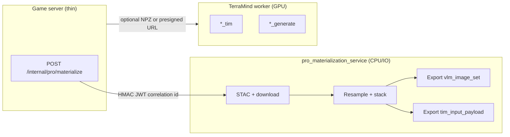

# Plan: PRO materialization service — Sentinel-2 + Mapbox fetch, downscaling, and dual contracts (on-device LFM-VL vs TerraMind)

**Date:** 2026-04-12  
**Status:** Normative **implementation** plan for the **standalone** service behind **`PRO_MATERIALIZATION_SERVICE_URL`** (`docs/SERVER-AND-INFERENCE-ARCHITECTURE.md` §5.3, `docs/PRO-TAB-VLM-ORCHESTRATION-SPEC.md` §4.2).  
**Audience:** Backend / ML engineers implementing **`inference/pro_materialization_service/`** (name illustrative until scaffold lands), game-server integrators, and client engineers pinning **`vlm_image_set`** + **`materialization_revision`**.

**This plan does not replace** the product spec in **`docs/PRO-TAB-VLM-ORCHESTRATION-SPEC.md`**; it **instantiates** it with file-level tasks, **explicit contracts**, and phased delivery. **TerraMind forward passes** remain on the **TerraMind worker** (GPU) unless an ADR colocates them; this service is **fetch + resample + pack** (CPU/IO first; optional **`numpy`/`rasterio`** only—**no `torch`/`terratorch` in-process** recommended so the same container can scale horizontally without CUDA).

---

## 1. Executive summary

| Question | Answer |
|----------|--------|
| **What ships in this service?** | **Authoritative** pipeline from **`(lat, lon, policy)`** → **downloaded** Mapbox still + optional Sentinel-2 L2A assets → **normalized rasters** → **(A)** **`vlm_image_set`** PNG/WebP bytes + metadata for **on-device LFM-VL** (`refs/VLMExample/`, `refs/satellite-vlm/`) and **(B)** **server-internal** tensor payloads (or **signed blob handles**) sized for **TiM** / **`_generate`** per **`plans/2026-04-07-tim-standalone-gradio-poi-dataset.md`**. |
| **What must never happen?** | Label **`S2L2A`** while feeding **band subsets** into **`*_tim`** (IBM forbids `bands=` subset for TiM on pre-trained raw `S2L2A`—see tim plan §3.2). Ship **raw COGs** to mobile clients. Run **unbounded** full-STAC downloads on the **sync** hot path without byte caps. |
| **Primary code references in this repo** | **`data/scripts/download_simsat_sources.py`** (STAC client, `resolve_href`, Mapbox static URL, asset download semantics), **`data/scripts/download_geoguessr_poi_imagery.py`** (POI layout, `poi.json`, Sentinel modes, Mapbox naming), **`plans/2026-04-07-terramind-gradio-spaces-comprehensive-demo.md`** **Projects P11–P12** + **§5** contracts (bbox, pin-first Mapbox, cache key, manifest). |
| **Primary behavioral references (`refs/`)** | **`refs/VLMExample/`** — multi-part **`ChatMessage`**: text + **multiple** `Image` byte arrays; one-shot UX. **`refs/satellite-vlm/`** — satellite **captioning + grounding**: **normalized [0,1] bboxes**, VRSBench-style tasks; informs **prompt** and **evaluation** shape for on-device decode (**not** required to run Modal training in production). |
| **Game server role** | **Control plane only:** HMAC/mTLS **`POST`** with **small JSON** to this service → receives **`MaterializationResult`** (paths, checksums, **presigned read URLs** for rasters/NPZ)—**does not** re-download or **proxy-stream** those bytes; forwards **handles** to **`TERRAMIND_*_URL`**; returns client **`job`/`bundle` metadata + signed download URLs** (or **HTTP redirect**) so **Kotlin** still uses **one session** to the game API (`rules/13`). **Merging** full **`ProVisionBundle`** binaries may occur **here** (materialization) or on **object storage** workflows—**not** by buffering COGs through `server/`. **`AiGuessStore`** **`Coordinates` → ai_lat/ai_lon** only for **`map_id`** / registered cache rows (`plans/2026-04-07-game-server-thin-orchestrator.md` §0.1, §1.6, `docs/PRO-TAB-VLM-ORCHESTRATION-SPEC.md` §5). |

**`AiGuessStore` boundary:** This service outputs tensors/images for **PRO** and TiM ingest. It **does not** decide **`AiGuessStore`** membership — the **game server** does. **Normative:** PRO materialization + TiM **`Coordinates`** feed **`ProVisionBundle`** for the client; copying **`Coordinates` → `ai_lat` / `ai_lon`** into **`AiGuessStore`** / Dataset happens **only** on **`map_id`** clue / Job / operator paths or explicit OpenAPI registration — **`docs/PRO-TAB-VLM-ORCHESTRATION-SPEC.md` §1.1.1**. Default **ad-hoc PRO** jobs **must not** append catalog AI-guess rows.

---

## 2. Authority, rules, and cross-links

| Document | Use |
|----------|-----|
| `docs/PRO-TAB-VLM-ORCHESTRATION-SPEC.md` | **`vlm_image_set`**, **`canonical_surface_id`**, job states, bundle fields, ranked isolation. |
| `docs/SERVER-AND-INFERENCE-ARCHITECTURE.md` §5.3 | Env **`PRO_MATERIALIZATION_SERVICE_URL`**, separation from game server. |
| `rules/06-server-vlm-tim-and-on-device-ml.md` | PRO dashboard + TiM merge + on-device VLM. |
| `rules/12-python-gradio-terramind-server.md` | TiM / **`_generate`** registry discipline (pin **terratorch**). |
| `rules/13-client-cache-and-data-plane.md` | Clients never hold Hub tokens; bundles via game server. |
| `rules/05-networking-leaderboard.md` | Sanitization, rate limits, error shapes. |
| `plans/2026-04-07-tim-standalone-gradio-poi-dataset.md` | **Branch A** (full `S2L2A` 12-band) vs **Branch B** (`RGB` Mapbox), resample to **common grid**, **`standardize=True`** parity, anti-patterns table §5.3. |
| `plans/2026-04-07-game-server-thin-orchestrator.md` | No **`torch`** in `server/`; **`httpx`** orchestration. |
| `plans/2026-04-07-lfm-vl-inference-spaces-satellite-and-streetview.md` | **Server-side** LFM-VL Spaces (**not** default PRO path); optional QA of materialized PNGs. |
| `docs/GAME-ENGINE.md` §9 | **SCAN** optional assists (Street View text, useful-hint tiers) are **bundle/Job** artifacts for the **game loop**, **not** produced by this **PRO** materialization service. |

**External (pin versions in `pyproject.toml`):**

- [TerraTorch TerraMind guide](https://terrastackai.github.io/terratorch/stable/guide/terramind/) — `S2L2A` band names, **`RGB`** = B,G,R, TiM “all bands”, **`_generate`** input completeness.  
- [Liquid AI LFM-VL Hub cards](https://huggingface.co/LiquidAI) — **max image resolution / token** assumptions for the **exact** on-device checkpoint you ship (e.g. **LFM2.5-VL-1.6B** vs **450M**); materialization **`model_bundle_id`** must echo the **same** revision the client downloads.

---

## 3. Architecture and process boundaries

### 3.1 Recommended topology (normative default)



- **Materialization service** outputs **immutable artifacts** for a **`materialization_id`** (UUID): files under object storage or local **`/data`** volume + a **JSON result** listing paths, hashes, dimensions, and **`tim_input_branch`** enum.  
- **TerraMind worker** accepts **`modalities` keys** identical to the tensor dict contract (§6). The **game server** attaches **`tim_modality_outputs`** to the **client-visible** bundle and **cache plane**; **raw float tensors** do not go to Kotlin.

### 3.2 Why omit `torch` here

- **Horizontal scaling** on cheap CPU Spaces / k8s without GPU.  
- **Blast radius**: STAC download bugs do not OOM GPU neighbors.  
- **Contract testing**: **`numpy`/`npz`** consumed by TerraMind worker tests without importing **`terratorch`** in the fetch tier.

**ADR escape hatch:** If you must run **sanity decode** (e.g. verify NPZ loads in TerraTorch) in CI only, use a **separate** `Dockerfile.ci` with GPU—not production materialization.

---

## 4. Dual contracts — LFM-VL (`vlm_image_set`) vs TerraMind inputs

### 4.1 On-device LFM-VL (`vlm_image_set`)

**Source of truth:** shipped **`model_bundle_id`** in **`ProVisionBundle`** + LEAP / SDK docs for that quant.

| Parameter | Implementation rule |
|-----------|----------------------|
| **Image count** | **1–N** roles (e.g. `mapbox_rgb`, `sentinel_falsecolor`, `scl_alpha`, `cloud_mask_thumb`) — order is **normative**; client builds **`ChatMessageContent.Image`** in that order (`docs/PRO-TAB-VLM-ORCHESTRATION-SPEC.md` §6.1, `refs/VLMExample/` pattern). |
| **Dimensions** | **Fixed WxH per role** for a given `model_bundle_id` (e.g. all **512×512** or canonical **448×448**—pick **one** row per bundle revision and **document** in OpenAPI). **Do not** mix arbitrary sizes within one bundle revision. |
| **Color space** | **sRGB** 8-bit PNG or lossy WebP **only if** client decoder supports it; default **PNG**. |
| **`canonical_surface_id`** | Usually **`mapbox_rgb`** — all bbox JSON from on-device VLM is **[0,1] relative to this surface’s pixel width/height** (`refs/satellite-vlm/README.md` grounding convention). |
| **Prompt alignment** | Reuse **instruction blocks** from `refs/satellite-vlm/` for “caption + JSON bboxes” phrasing in **client** code; materialization may inject only **`vlm_prompt_injection`** allowlist per spec §5. |

**Engineering task:** Add **`nutonic/shared`** (or OpenAPI) table **`ProVlmContractV1`** mapping `model_bundle_id` → `{ roles: [{id, width, height, mime}], max_images, max_side }` so materialization **fails fast** if Sentinel branch cannot fill optional roles.

### 4.2 TerraMind (`tim_input` / worker payload)

Aligned with **`plans/2026-04-07-tim-standalone-gradio-poi-dataset.md`** §5:

| Branch | `modalities` | Tensor shape (example) | When to use |
|--------|--------------|-------------------------|-------------|
| **A — `S2L2A_full`** | `["S2L2A"]` | `[1, 12, H, W]` with **H=W=224** (or model doc default) | **`sentinel_fetch_mode=TERRAMIND_SPECTRAL`** or **`FULL_STAC`** with **verified** 12-band stack in **TerraMind order**; **no** `bands=` subset. |
| **B — `RGB_mapbox`** | `["RGB"]` | `[1, 3, H, W]` **B,G,R**, values **0–255** `float32` | **`MINIMAL_RGB`** or user disables heavy Sentinel; TiM **`tim_modalities`** must stay within IBM-allowed set. |

**Failure modes (fail closed):**

- **`InsufficientBandsError`** — cannot assemble 12 channels at target grid → **HTTP 422** with code `S2L2A_INCOMPLETE` (game server maps to job `FAILED`).  
- **`STAC_NO_ITEMS`** — widen window suggestion in message (mirror comprehensive plan §5.5).

**Handoff format to TerraMind worker (pick one in first PR):**

1. **`application/octet-stream`** **NPZ** with keys **`S2L2A`** / **`RGB`** + **`meta.json`** (CRS, transform optional for debugging only), or  
2. **Presigned S3** URL + checksum; worker streams download.

---

## 5. Fetching specification

### 5.1 Inputs (internal API — mirror `GeoSampleRequest` from comprehensive demo §5.4)

**HTTP route (normative for first implementation):** thin game server → this service uses **`POST /internal/pro/materialize`** (same path as **`docs/PRO-TAB-VLM-ORCHESTRATION-SPEC.md`** §2 sequence diagram). If you version or split routers, keep **one** path in **`server/docs/TOPOLOGY.md`** and the service README so orchestration does not drift.

Canonical JSON (Pydantic model **`MaterializeRequest`**):

| Field | Type | Notes |
|-------|------|-------|
| `latitude`, `longitude` | `float` | Already clamped by game server; **re-validate** here. |
| `bbox_half_km` | `float` | Default **5** km half-side (align `download_geoguessr_poi_imagery.py` semantics). |
| `datetime_interval` | `str` | ISO8601 interval; default rolling **60–120 day** window (document; comprehensive plan uses demo-friendly **120d**). |
| `max_cloud_cover` | `float` | 0–100; STAC query `eo:cloud_cover`. |
| `stac_url`, `collection_id` | `str` | Default Earth Search **`https://earth-search.aws.element84.com/v1`**, **`sentinel-2-l2a`**. |
| `sentinel_fetch_mode` | enum | **`MINIMAL_RGB`** \| **`TERRAMIND_SPECTRAL`** \| **`FULL_STAC`** — same semantics as **`plans/2026-04-07-terramind-gradio-spaces-comprehensive-demo.md`** §5.3 / P11-B-3. |
| `mapbox_zoom` | `int` | Default **12**; cap **0–18**. |
| `retina` | `bool` | `@2x` static API multiplier; **doubles** pixel budget—account in **VLM contract** (either fetch @1x and upscale server-side, or define contract expecting @2x size). |
| `vlm_contract_id` | `str` | Selects **`vlm_image_set`** dimensions + role list. |
| `enable_tim` | `bool` | If false, skip tensor export beyond optional **debug** (saves egress). |
| `tim_branch` | `S2L2A_full` \| `RGB_mapbox` | If `enable_tim`: must match **`sentinel_fetch_mode`** feasibility (see §5.3 matrix). |

### 5.2 STAC search and ranking

**Implement** by **porting** (copy into package—avoid importing `data/scripts` as unstable module path):

- `Client.open` + `search` bbox + datetime + cloud query — `download_simsat_sources.py` L206–213 pattern.  
- **`rank_items_by_cloud`** — tim plan §5 + comprehensive P11-B-1.  
- **`resolve_href`** for `s3://` → HTTPS — L63–73 (critical for Earth Search).

### 5.3 Mode matrix (normative)

| `sentinel_fetch_mode` | TiM branch allowed | VLM roles available |
|----------------------|-------------------|---------------------|
| **`MINIMAL_RGB`** | **`RGB_mapbox` only** | Mapbox-based RGB + derived overlays from Mapbox only (**do not** claim S2 spectral facts). |
| **`TERRAMIND_SPECTRAL`** | **`S2L2A_full`** | Mapbox + false-color / masks from **full** 12-band stack at VLM sizes. |
| **`FULL_STAC`** | **`S2L2A_full`** (preferred) or **`RGB_mapbox`** if operator toggles | All; **disk** cost highest—async job or stricter caps. |

### 5.4 Mapbox static imagery

- **URL template** and style **`mapbox/satellite-v9`** — parity with **`fetch_mapbox_static`** / `download_geoguessr_poi_imagery.py` / `download_simsat_sources.py`.  
- **Center** for PRO: **`(longitude, latitude)` user pin** — **not** bbox centroid (`plans/2026-04-07-terramind-gradio-spaces-comprehensive-demo.md` §5.6). STAC search still uses **square bbox** around pin (`square_bbox_wgs84` with **geographiclib** or **pyproj** — comprehensive P11-A-1).  
- **Attribution** string: store verbatim in result for game server to place in bundle **`mapbox_attribution`**.

### 5.5 Sentinel-2 assets

- **Download** per ranked STAC item into `.../sentinel-2-l2a/<item_id>/` mirroring POI layout (`plans/2026-04-07-tim-standalone-gradio-poi-dataset.md` §2.4).  
- **`TERRAMIND_SPECTRAL`:** maintain **`s2_asset_allowlist.yaml`** in this package (comprehensive plan §5.7 — **add file in first PR**) listing **only** STAC asset keys required to read **12 bands**; bump **`s2_asset_mapping_version`** in cache key when Earth Search drifts.  
- **Cloud / SCL:** optional **extra VLM role** `scl_thumb` — resize SCL to same **`canonical_surface_id`** size for overlay hints (uint8 colormap, not raw SCL values on wire if avoidable).

### 5.6 Limits and abuse controls

| Limit | Suggested value |
|-------|-----------------|
| Max download bytes / request | **8 GiB** soft warn, **12 GiB** hard abort (comprehensive P11-D-1). |
| Concurrent STAC item tries | **2–3** items before giving up. |
| Mapbox max dimension | **1280** base (@1x); enforce **product** cap consistent with **`docs/PRO-TAB-VLM-ORCHESTRATION-SPEC.md`** §4.1. |
| Rate limit | Enforce at **game server**; materialization trusts **mTLS/HMAC** but should still implement **per-API-key** Mapbox quota backoff (`429` retry-after). |

---

## 6. Downscaling and geospatial processing

### 6.1 Reference grid

1. Choose **one** **CRS** for stacking: typically **UTM** zone from pin, or **EPSG:4326** with georeferenced warp to metric CRS for **meter-accurate** `bbox_half_km` (prefer **warp** then crop—document).  
2. **Resample** all Sentinel bands to **common affine** (`rasterio.warp.reproject` or **`pyproj` + `scipy.ndimage`**—pick one; **`rasterio`** preferred for COG reads).  
3. **Interpolation:** **bilinear** for continuous reflectance; **nearest** for SCL / categorical masks.  
4. **Output grids:**  
   - **`H_vlm`, `W_vlm`** from **`vlm_contract_id`**.  
   - **`H_tim`, `W_tim`** from TerraMind demo defaults (**224×224**) unless worker team pins otherwise—**must match** worker **`MaterializeRequest`** echo.

### 6.2 Band ordering for `S2L2A`

- **Verify** order against pinned **`terratorch`** `terramind_register` for **`S2L2A`** (`plans/2026-04-07-tim-standalone-gradio-poi-dataset.md` §5.1 step 4).  
- **Unit test:** first pixel vector against a **frozen** **`tests/fixtures/s2_mini_stack.npz`** from public domain tile clip.

### 6.3 Standardization

- Materialization service stores **`scale_offset`** metadata per band **if** worker uses `standardize=False`; **preferred** is worker applies **`standardize=True`** so NPZ stays **physical reflectance** where possible. **Document** the split in **`run_manifest.json`**.

### 6.4 `vlm_image_set` construction

| Role | Source | Processing |
|------|--------|------------|
| `mapbox_rgb` | Mapbox PNG | Resize to **`H_vlm`×`W_vlm`**, ensure **RGB** order for **display**; if TiM branch B needs BGR, keep **separate** tensor path—**do not** confuse file bytes with tensor layout. |
| `sentinel_fc` | 3-band composite from SWIR/NIR/R | Histogram stretch optional; **document** stretch in manifest. |
| `cloud_mask_thumb` | SCL downsampled | Nearest-neighbor; semi-transparent PNG for client overlay. |

---

## 7. HTTP API (service ↔ game server)

### 7.1 `POST /internal/v1/materialize`

- **Auth:** `Authorization: Bearer <service_token>` or **HMAC** headers (`X-Nutonic-Timestamp`, `X-Nutonic-Signature`) per **`plans/2026-04-07-game-server-thin-orchestrator.md`**.  
- **Body:** `MaterializeRequest` (§5.1).  
- **Response:** `MaterializeResult`:

| Field | Description |
|-------|-------------|
| `materialization_id` | UUID. |
| `cache_key` | SHA256 of canonical request + **`vlm_contract_id`** + **`s2_asset_mapping_version`**. |
| `vlm_artifacts` | `[{ "role", "sha256", "bytes", "mime", "width", "height" }]` — **inline** only if small; else **`presigned_get`** URLs with TTL **≤ 15 min**. |
| `tim_payload` | **`null`** if `enable_tim=false`; else `{ "branch", "npz_url" \| "npz_base64", "modalities_keys": ["S2L2A"] }`. |
| `run_manifest` | JSON object (comprehensive P11-C-2 fields + **`vlm_contract_id`**, **`tim_branch`**). |
| `errors` / `warnings` | Arrays of structured codes. |

### 7.2 `GET /internal/v1/healthz`

`{ "ok": true, "version": "...", "s2_asset_mapping_version": "..." }`

---

## 8. Repository layout (proposed)

```text
inference/pro_materialization_service/
  pyproject.toml              # fastapi, uvicorn, pydantic, rasterio|rio-cogeo, numpy, pillow,
                              # pyproj OR geographiclib, pystac-client, httpx, structlog
                              # NO torch / terratorch (default)
  README.md                   # env vars: MAPBOX_ACCESS_TOKEN, STAC_*, DISK_ROOT, SERVICE_TOKEN
  Dockerfile                  # CPU slim; non-root user
  src/pro_materialization/
    main.py                   # FastAPI app
    api/routes_internal.py    # POST materialize, GET health
    models/request_response.py
    geospatial/
      bbox.py                 # square_bbox_wgs84 (P11-A-1 parity)
      stac_search.py
      item_rank.py
      download_assets.py      # port from download_simsat_sources.py
      asset_policy.py         # SentinelFetchMode + allowlist loader
      mapbox_static.py        # pin-centered fetch
      pipeline.py             # orchestration + caps
      resample.py             # common grid + warp
      vlm_export.py           # roles → PNG bytes
      tim_export.py           # branch → NPZ builder
    tests/
      test_bbox.py
      test_band_order.py
      test_materialize_golden.py   # httpx against app with mocked STAC (vcrpy)
```

**Game server delta:** `InferenceClient.materialize_pro(...)` + persistence of artifact refs before TerraMind calls (`plans/2026-04-07-game-server-thin-orchestrator.md`).

---

## 9. Phased delivery

| Phase | Scope | Exit criteria |
|-------|--------|---------------|
| **P0** | Scaffold package, **`GET /healthz`**, Dockerfile CPU, CI **`pytest`** smoke | Image builds; no secrets in image |
| **P1** | **`bbox.py` + STAC search + rank** + **Mapbox** fetch (no Sentinel) | **`RGB_mapbox`** end-to-end; manifest includes **`mapbox_center_mode": "user_pin"`** |
| **P2** | Sentinel download **`TERRAMIND_SPECTRAL`** + **`s2_asset_allowlist.yaml`** | **12-band** stack at **224** validates shape; **`InsufficientBandsError`** tested |
| **P3** | **`vlm_export.py`** wired to **`vlm_contract_id`** fixture (**512×512** example) | PNG series matches contract table |
| **P4** | **`tim_export.py`** NPZ + **`run_manifest.json`** checksum | TerraMind worker integration test consumes NPZ in **GPU CI** (nightly) |
| **P5** | **`FULL_STAC`** optional path + byte caps + soft cancel | Stress test aborts at cap with `DISK_CAP` |
| **P6** | Game server **`httpx`** integration + feature flag **`PRO_MATERIALIZATION_SERVICE_URL`** | E2E test with WireMock STAC + fake Mapbox |
| **P7** | HF **CPU Space** deploy + **`workflow_dispatch`** sync | Operators can materialize one pin from internal UI |

---

## 10. Testing strategy

1. **Golden files:** Small **`tests/fixtures/`** bbox in France or US desert with **low cloud**; commit **redacted** `run_manifest.json` only (no tokens).  
2. **VCR / vcrpy** for STAC HTTP; **replace** auth query params in cassettes.  
3. **Contract test:** Import **pinned** `terratorch` **only** in **`tests_gpu/`** optional job: `load_npz → model.forward` for **one** step smoke.  
4. **Regression:** When Earth Search changes asset keys, **`s2_asset_mapping_version`** bump must **fail** old cache keys (intentional invalidation).

---

## 11. Observability and operations

- **Structured logs:** `materialization_id`, `cache_key`, durations for STAC / Mapbox / resample / export, **bytes_downloaded**.  
- **Metrics:** Prometheus counters **`pro_materialize_total{status}`**, histogram **`pro_materialize_duration_seconds`**.  
- **Tracing:** OpenTelemetry span per external dependency.

---

## 12. Hardening (technical)

- **No** user-supplied URLs for STAC (allowlist hosts only).  
- **`MAPBOX_ACCESS_TOKEN`** from env; do not echo full token in logs.

---

## 13. Open decisions (ADR candidates)

1. **Single shared `H×W` for VLM and TiM** vs **two grids** (extra resample cost vs simpler client).  
2. **Inline PNG in JSON** (base64) for tiny bundles vs **always** presigned object storage.  
3. **WebP** for `vlm_image_set` on Android only — requires **per-platform** contract rows.  
4. **Colocate TiM** inside materialization container on GPU **for latency** — contradicts default §3.1; requires ADR.

---

## 14. Document history

| Version | Date | Notes |
|---------|------|-------|
| 0.1 | 2026-04-12 | Initial plan: dual contracts, STAC/Mapbox parity with `data/scripts` + P11, TiM branches, phased delivery |
| 0.2 | 2026-04-12 | Game server merges **`tim_modality_outputs`**; **`Coordinates` → AiGuessStore** alignment (`docs/PRO-TAB-VLM-ORCHESTRATION-SPEC.md` v0.4) |
| 0.3 | 2026-04-12 | **§1 exec summary** — explicit **`AiGuessStore`** boundary: materialization does not decide catalog rows; link **`docs/PRO-TAB-VLM-ORCHESTRATION-SPEC.md` §1.1.1** |

*End of plan.*
