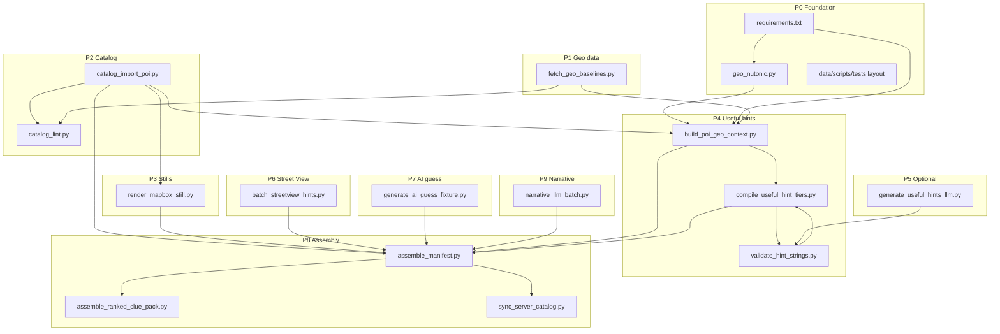

# NU:TONIC — Implementation track: `data/scripts` + `tools/` cache pipeline

**Date:** 2026-04-14  
**Status:** Engineering implementation plan (ordered tracks, PR boundaries, tests, acceptance).  
**Normative specs:** [`docs/scripts/README.md`](../docs/scripts/README.md) and each **`docs/scripts/SPEC-*.md`**.  
**Parent orchestration:** [`plans/2026-04-14-shipped-cache-narrative-hint-pipeline.md`](2026-04-14-shipped-cache-narrative-hint-pipeline.md).  
**Backlog mapping:** **IMP-081** (P3), **IMP-082** (P7–P8), **IMP-083** exit enablers (P2–P4), **IMP-110+** (P6), **IMP-120** (P8 `sync_server_catalog` SQL mode later).

---

## 0. Conventions

| Rule | Detail |
|------|--------|
| **Spec parity** | Any behavior change in code **updates** the matching **`SPEC-*.md`** in the **same PR**. |
| **PR size** | Prefer **one script (+ its tests)** per PR; assembly scripts may land together if tightly coupled. |
| **Default dataset** | All new integration tests use **`data/downloads/geoguessr_poi_12`** unless the test needs bbox metadata from **`geoguessr_poi_120`**. |
| **Secrets** | No tokens in tests; use **`--reuse-only`**, fixtures, or `pytest` `monkeypatch` empty env. |
| **Python version** | Match **`server/`** or repo standard (document in `data/scripts/README.md` once chosen). |

---

## 1. Dependency graph

Implement in **topological order** (below). Optional nodes are dashed.

---

## 2. Track P0 — Foundation

**Specs:** [SPEC-geo-nutonic.md](../docs/scripts/SPEC-geo-nutonic.md); implicit test harness.

### P0.1 — Extract `geo_nutonic.py`

| Item | Detail |
|------|--------|
| **Deliverable** | `data/scripts/geo_nutonic.py` with `haversine_km` (+ optional `bearing_deg`). |
| **Refactor** | `download_geoguessr_poi_imagery.py` imports from `geo_nutonic` (no duplicate). |
| **Tests** | `data/scripts/tests/test_geo_nutonic.py`: table-driven distances vs `pyproj.Geod` or hand-picked pairs; tolerance **≤ 0.01 km** at 100 km scale. |
| **Acceptance** | `./pytest` (or `python -m pytest data/scripts/tests`) green; downloader still runs on smoke subset. |

### P0.2 — Packaging layout

| Item | Detail |
|------|--------|
| **Deliverable** | `data/scripts/tests/conftest.py` (repo root path), optional `data/scripts/pyproject.toml` **or** document “run from repo root with `PYTHONPATH=data/scripts`”. |
| **CI** | Add job **or** extend `nutonic-ci.yml` with path filter `data/scripts/**` running **P0 + P4a** tests only (fast). |

### P0.3 — `requirements.txt`

| Item | Detail |
|------|--------|
| **Deliverable** | Pin `geopandas`, `shapely`, `pyproj`, `pyyaml`, `pydantic` (versions compatible with Python chosen). |
| **Acceptance** | `pip install -r data/scripts/requirements.txt` documented in `data/scripts/README.md`. |

---

## 3. Track P1 — `fetch_geo_baselines.py`

**Spec:** [SPEC-fetch-geo-baselines.md](../docs/scripts/SPEC-fetch-geo-baselines.md)

| Work unit | Implementation detail |
|-----------|-------------------------|
| **P1.1** | Implement download + unzip Natural Earth 1:50m layers; write **`data/geo/MANIFEST.json`** with expected SHA256 per artifact. |
| **P1.2** | `--skip-geonames` default; optional GeoNames `countryInfo.txt` with attribution file **`data/geo/geonames/NOTICE.txt`**. |
| **P1.3** | **`data/geo/README.md`** — directory purpose, license, how to re-fetch. |
| **Tests** | **Offline:** commit **tiny truncated** geojson fixture under `data/scripts/tests/fixtures/geo/` (single country + one river) for CI **without** downloading NE; separate **manual** test documented for full fetch. |
| **Acceptance** | `python data/scripts/fetch_geo_baselines.py --output-dir /tmp/geo_test` idempotent; CI uses fixtures path via `NE_FIXTURE_ROOT` env. |

---

## 4. Track P2 — Catalog ingest + lint

**Specs:** [SPEC-catalog-import-poi.md](../docs/scripts/SPEC-catalog-import-poi.md), [SPEC-catalog-lint.md](../docs/scripts/SPEC-catalog-lint.md)

### P2.1 — `catalog_import_poi.py`

| Item | Detail |
|------|--------|
| **P2.1a** | Parse **Layout A** (`geoguessr_poi_manifest.json`) and **Layout B** (`poi_*/poi.json`). |
| **P2.1b** | **`mapbox.path` normalization** to repo-relative; reject path traversal. |
| **P2.1c** | Emit **`data/catalog/maps.yaml`** slice + **`data/catalog/locations/<id>.yaml`**. |
| **Tests** | Fixture tree under `data/scripts/tests/fixtures/poi_mini/` (2 fake POIs, both layouts). |
| **Acceptance** | `python data/scripts/catalog_import_poi.py --poi-root data/downloads/geoguessr_poi_12 --dry-run` prints planned files; without `--dry-run` writes to temp catalog in test. |

### P2.2 — `catalog_lint.py`

| Item | Detail |
|------|--------|
| **P2.2a** | Implement checks per spec §2; machine-readable JSON lines on stderr optional flag `--json-errors`. |
| **Tests** | Positive catalog + broken catalog fixtures. |
| **Acceptance** | Fails on deliberate duplicate `location_id`. |

### P2.3 — Developer docs

| Item | Detail |
|------|--------|
| **Deliverable** | Short **`data/scripts/README.md`** (operator runbook): install, import, lint order. |

---

## 5. Track P3 — `render_mapbox_still.py`

**Spec:** [SPEC-render-mapbox-still.md](../docs/scripts/SPEC-render-mapbox-still.md) — **IMP-081**

| Work unit | Detail |
|-----------|-------------------------|
| **P3.1** | **`--reuse-only`:** copy from `still_source.bundled_relative`, optional Pillow resize to policy width/height, export JPEG to temp output dir. |
| **P3.2** | **`still_sha256`** sidecar JSON next to output image. |
| **P3.3** | Optional network render behind `--allow-network` + `MAPBOX_ACCESS_TOKEN` (retry/backoff). |
| **P3.4** | Sidecar / index fields **`width_px`**, **`height_px`**, **`center_*`**, **`zoom`** per [SPEC-render-mapbox-still.md](../docs/scripts/SPEC-render-mapbox-still.md) so **P6 satellite caption** and **QA** can detect center drift vs Street View sampling. |
| **Tests** | Reuse-only with tiny PNG fixture; assert JPEG output dimensions and non-zero file size. |
| **Acceptance** | Produces at least one **`nutonic.bundle.v1.*`** compatible blob matching `server` bundle loader expectations (coordinate with `bundles.py` registry extension in same or follow-up PR). |

---

## 6. Track P4 — Useful hints (deterministic)

**Specs:** [SPEC-validate-hint-strings.md](../docs/scripts/SPEC-validate-hint-strings.md), [SPEC-build-poi-geo-context.md](../docs/scripts/SPEC-build-poi-geo-context.md), [SPEC-compile-useful-hint-tiers.md](../docs/scripts/SPEC-compile-useful-hint-tiers.md)

### P4a — `validate_hint_strings.py` (land **first**)

| Item | Detail |
|------|--------|
| **P4a.1** | Implement coordinate regex, length caps, empty-tier policy, optional `--policy` YAML. |
| **P4a.2** | Library mode: `validate_hints(obj) -> list[Violation]` for import from other scripts. |
| **Tests** | Golden files: `tests/fixtures/hints_valid.json`, `hints_bad_coords.json`, `hints_empty_tier.json`. |
| **Acceptance** | Exit code **1** on bad fixtures; **0** on good. |

### P4b — `build_poi_geo_context.py`

| Item | Detail |
|------|--------|
| **P4b.1** | Load NE layers from `NE_FIXTURE_ROOT` in CI or `data/geo` locally; build GeoDataFrame spatial index. |
| **P4b.2** | Implement **R** radius query; nearest river/lake; coast distance; admin0/1 containment. |
| **P4b.3** | Write **`geo_context/<location_id>.json`** per [SPEC-build-poi-geo-context.md](../docs/scripts/SPEC-build-poi-geo-context.md) schema. |
| **Tests** | Synthetic point inside known fixture polygon; assert `admin0_name` / `nearest_river` keys stable. |
| **Acceptance** | Run on **`geoguessr_poi_12`** end-to-end in < 2 minutes on typical laptop with fixture geo. |

### P4c — `compile_useful_hint_tiers.py`

| Item | Detail |
|------|--------|
| **P4c.1** | Default **`tier_policy.yaml`** with templates + max lengths + `easy_hints: false`. |
| **P4c.2** | After compile, call **`validate_hints`**; fail on violations. |
| **Tests** | One `context.json` → expected `tier_*` substrings (admin0, river name). |
| **Acceptance** | **`geoguessr_poi_12`** produces 12 `useful_hints/*.json` files, all pass validator. |

---

## 7. Track P5 — Optional `generate_useful_hints_llm.py`

**Spec:** [SPEC-generate-useful-hints-llm.md](../docs/scripts/SPEC-generate-useful-hints-llm.md)

| Item | Detail |
|------|--------|
| **P5.1** | Implement **sector binning** preprocessor from `geo_context` (no raw lat/lon in prompt). |
| **P5.2** | Backend adapter interface: `OllamaBackend`, `OpenAICompatibleBackend` stub for tests. |
| **P5.3** | Append **`model_pins.json`** per spec. |
| **Tests** | Mock backend returns fixed JSON; validator still runs. |
| **Acceptance** | Default **`--dry-run`** without backend credentials exits 0 (no-op) or documented skip. |

**Dependency:** P4 complete.

---

## 8. Track P6 — `tools/batch_streetview_hints.py`

**Spec:** [SPEC-batch-streetview-hints.md](../docs/scripts/SPEC-batch-streetview-hints.md)

| Item | Detail |
|------|--------|
| **P6.1** | HTTP client with timeouts; read **`--pano-service-url`** / **`--lfm-service-url`**. |
| **P6.2** | Wire **`POST /v1/suggestions/from_frames`** response → `streetview_hint_pack`; run caption subset through **validator** rules. Implement **S0–S2**: **`--poi-limit`**, **`--sv-screenshots-per-location`**, chunking via **`--lfm-max-frames-per-request`**. |
| **P6.3** | **`--skip-streetview-hints`** no-op for CI. |
| **P6.4** | Optional **`--satellite-caption-service-url`** + **`--still-index`** from **P3** → call **`lfm_vl_satellite_caption_service`**; write **separate** provenance-labeled fields for manifest assembly (never mix unlabeled with SV pack). |
| **P6.5** | Default **omit** `useful_hints` text from LFM request body (see spec §3.1 — anchoring footgun); gate behind **`--inject-useful-hint-tone`** if ever needed. |
| **P6.6** | Optional **S3** narrative: **`--enable-narrative-pass`** + text backend; emit **`streetview_assist_narrative`**; validate; pin model in **`model_pins`**. |
| **Tests** | Integration tests **skipped** unless `RUN_STREETVIEW_BATCH=1`; unit test with `responses`/`httpx` mocking. |
| **Acceptance** | Manual smoke: 1 POI against local Docker services per `plans/2026-04-07-streetview-lfm-vl-hint-inference-plane.md`. |

**Dependency:** **IMP-110**/**IMP-111** services usable; until then track P6 remains **optional** / stubbed. **Soft dependency on P3** when satellite caption hop is enabled (still bytes + sha256 from `render_mapbox_still`).

---

## 9. Track P7 — `generate_ai_guess_fixture.py`

**Spec:** [SPEC-generate-ai-guess-fixture.md](../docs/scripts/SPEC-generate-ai-guess-fixture.md)

| Item | Detail |
|------|--------|
| **P7.1** | Implement **`decoy_offset`** + **`fixed_table`** modes first; **`random_seeded`** last. |
| **P7.2** | Output **`ai_guesses.json`** array. |
| **P7.3** | Implement **`terramind_tim_jsonl`** / **`terramind_tim_dir`** importers: read **`tim_modality_outputs.Coordinates`** (full lat/lon) per `docs/PRO-TAB-VLM-ORCHESTRATION-SPEC.md`; **`--prefer-tim`** default true; exit codes **12–13** on schema/precedence failures. |
| **Tests** | `decoy_offset`: distance from truth within configured delta ± tolerance using `geo_nutonic`. TiM: golden fixture JSONL → expected `ai_lat`/`ai_lon`. |
| **Acceptance** | Generated rows joinable to catalog `map_id` / `location_id` keys. |

**Dependency:** P2 catalog exists. TiM JSON fixtures may live under `data/scripts/tests/fixtures/tim_export/`.

---

## 10. Track P8 — Assembly + server sync

**Specs:** [SPEC-assemble-manifest.md](../docs/scripts/SPEC-assemble-manifest.md), [SPEC-assemble-ranked-clue-pack.md](../docs/scripts/SPEC-assemble-ranked-clue-pack.md), [SPEC-sync-server-catalog.md](../docs/scripts/SPEC-sync-server-catalog.md)

### P8.1 — `assemble_manifest.py`

| Item | Detail |
|------|--------|
| **P8.1a** | Merge catalog + useful_hints + optional streetview + ai_guesses + still index. |
| **P8.1b** | Emit **`manifest.full.json`** + **`manifest.public.json`**; canonical JSON for ETag note in spec. |
| **P8.1c** | Pre-flight: run **catalog_lint** logic inline + **validate** all hints. |
| **Tests** | Snapshot test: golden `manifest.full.json` for 2-POI fixture catalog. |

### P8.2 — `assemble_ranked_clue_pack.py`

| Item | Detail |
|------|--------|
| **P8.2a** | Strip `truth_lat`/`truth_lon`; **assert** no golden leak string patterns. |
| **P8.2b** | Emit **`ranked_clue_pack.json`**. |
| **Tests** | Parse output JSON and grep-fail if `"truth_lat"` key present. |

### P8.3 — `sync_server_catalog.py`

| Item | Detail |
|------|--------|
| **P8.3a** | **`--mode codegen`**: print diff or write `catalog_generated.py` with **`--write`**. |
| **P8.3b** | Document **`noop`** / future **`sql`** mode placeholder for **IMP-120**. |
| **Tests** | Golden manifest → expected Python snippet substring (stable sort). |

**Dependency:** P8.1 after P2–P4 (and optionally P6–P7).

---

## 11. Track P9 — `narrative_llm_batch.py` (optional)

**Spec:** [SPEC-narrative-llm-batch.md](../docs/scripts/SPEC-narrative-llm-batch.md)

| Item | Detail |
|------|--------|
| **P9.1** | Template renderer for `prompts/llm/*.md` (create minimal `prompts/` tree if absent). |
| **P9.2** | Output `llm_sidecar.json`; Gradle merge strategy documented in **`nutonic/`** follow-up PR. |
| **Tests** | Mock LLM; assert no raw coordinates in output when `ranked_safe: true`. |

---

## 12. Existing downloader — hardening (optional track)

**Spec:** [SPEC-download-geoguessr-poi-imagery.md](../docs/scripts/SPEC-download-geoguessr-poi-imagery.md)

| Item | Detail |
|------|--------|
| **H.1** | Migrate **`haversine_km`** to **`geo_nutonic`** (P0). |
| **H.2** | Add `--emit-relative-paths` post-pass or document that **catalog_import** is mandatory for portability. |

---

## 13. Gradle `:shared:validateCatalog` (parallel track)

**Spec pointer:** [SPEC-catalog-lint.md](../docs/scripts/SPEC-catalog-lint.md) §5

| Item | Detail |
|------|--------|
| **G.1** | Gradle task reads packaged catalog subset or `manifest.full.json` in resources. |
| **G.2** | Fails build if `still_bundled_resource` path missing under `composeResources`. |

**Dependency:** P8.1 produces manifest that Gradle can consume, **or** interim hand-maintained manifest for pilot.

---

## 14. CI matrix (recommended)

| Job | Trigger paths | Command |
|-----|----------------|---------|
| **`data-scripts-unit`** | `data/scripts/**`, `docs/scripts/**` | `pytest data/scripts/tests` (P0, P4a, P2, P4b with fixtures) |
| **`data-scripts-integration`** | manual / nightly | `catalog_import` + `build_poi_geo_context` + `compile` on `geoguessr_poi_12` with cached `data/geo` artifact |
| **`server`** (existing) | unchanged | OpenAPI parity |

---

## 15. Risks and mitigations

| Risk | Mitigation |
|------|------------|
| **Natural Earth size + CI time** | Fixture subset for PR CI; full `data/geo` on nightly or developer machine. |
| **CRS error at poles / antimeridian** | Unit tests for POI near date line (optional); document UTM zone selection. |
| **Mapbox path Windows vs POSIX** | Normalization + tests with mixed separators. |
| **Street View batch flakiness** | Retries, partial report JSON, `--allow-partial`. |
| **Golden leak in ranked pack** | Automated test grep + manual review checklist in PR template. |

---

## 16. Milestone exit criteria (cross-track)

| Milestone | Criteria |
|-----------|----------|
| **M1 — Catalog ready** | P2 complete; `catalog_lint` green on `geoguessr_poi_12` import. |
| **M2 — Hints ready (no LLM, no SV)** | P4 complete; 12/12 `useful_hints` JSON validated. |
| **M3 — Ship-ready manifest** | P8.1 + P8.2 complete; embedded `manifest.full.json` + `ranked_clue_pack.json` consumed by KMP follow-up (**IMP-083**). |

---

## 17. Document history

| Version | Date | Notes |
|---------|------|-------|
| 0.1 | 2026-04-14 | Initial implementation track for all **`docs/scripts/SPEC-*.md`** scripts |
| 0.2 | 2026-04-14 | **P3.4** still sidecar for LFM satellite + SV alignment; **P6.4–P6.5** batch hops + prompt footgun; **P7.3** TerraMind TiM coordinate import |
| 0.3 | 2026-04-14 | **P6.2** / **P6.6**: POI limit + **K** SV frames + optional narrative LLM pass per **`SPEC-batch-streetview-hints.md`** §1.1 |

---

*End of implementation track.*
