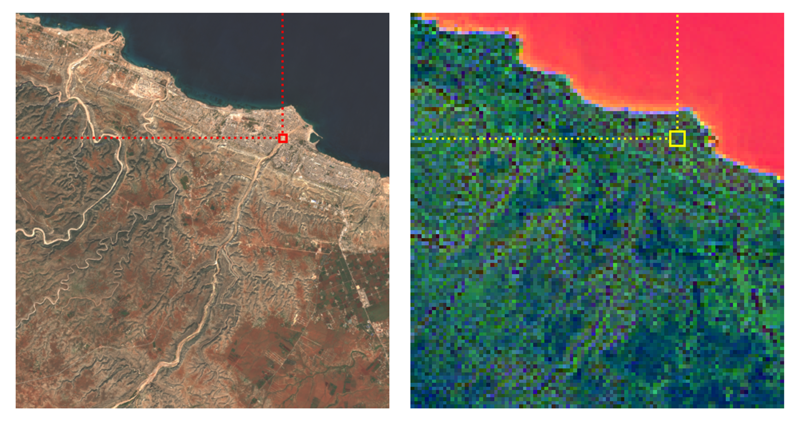

# TerraMind Anomaly Detection

Unsupervised spatial change detection using TerraMind embeddings for temporal anomaly detection.



## Overview

This project implements an unsupervised change detection system that extends temporal embedding analysis to maintain full 2D spatial information. Instead of collapsing to image-level embeddings, it applies per-patch temporal anomaly detection using TerraMind embeddings to generate spatial change heatmaps without any training.

**Methodology**: Inspired by Element84's [temporal embedding approach](https://element84.com/machine-learning/exploring-unsupervised-change-detection-with-sentinel-2-vector-embeddings/), extended to preserve spatial resolution.

## Installation

```bash
# Clone the repository
git clone <repository-url>
cd terramind-ad

# Install dependencies with uv
uv sync
```

## Quick Start

The workflow consists of four main steps: download, inference, detection, and visualization.

### 1. Download Sentinel-2 Data

Download satellite imagery for a specific event from Microsoft Planetary Computer:

```bash
uv run tools/download.py libya_floods_2023
```

### 2. Generate TerraMind Embeddings

Run inference using the TerraMind foundation model to extract spatial embeddings,
as well as cloud detection and PCA for time series analysis:

```bash
uv run tools/infer.py features --site-id libya_floods_2023
uv run tools/infer.py clouds --site-id libya_floods_2023
uv run tools/infer.py pca --site-id libya_floods_2023 --n-components 1
```

### 3. Detect Changes

Apply temporal anomaly detection (RANSAC-based robust PCA) to identify spatial changes:

```bash
uv run tools/detect.py run --site-id libya_floods_2023
uv run tools/detect.py filter --site-id libya_floods_2023
```

### 4. Interactive Dashboard

Launch an interactive Streamlit dashboard to explore results:

```bash
uv run tools/app.py
```

The dashboard provides:
- Spatial heatmap of detected changes
- Interactive patch selection
- Temporal analysis with embedding trajectories
- RGB imagery overlay with detected change areas

## Event Configuration

Pre-configured events are defined in [resources/events.json](resources/events.json):

- `libya_floods_2023` - Derna flooding from Storm Daniel (Sept 2023)
- `beirut_explosion_2020` - Beirut Port explosion (Aug 2020)
- `greece_wildfire_2025` - Chios Island wildfire (Aug 2025)

Each event includes spatial extent, event date, historical time range, and reference geometries.

## Architecture

### Core Components

- **Data Pipeline** ([src/terramind_an/data.py](src/terramind_ad/data.py)): STAC query and Sentinel-2 data loading via `stackstac`
- **Cloud Masking** ([src/terramind_ad/cloudmask.py](src/terramind_ad/cloudmask.py)): OmniCloudMask for cloud/shadow filtering
- **Tiling** ([src/terramind_ad/tiling/](src/terramind_ad/tiling/)): Spatial tiling with overlap handling
- **Inference** ([src/terramind_ad/processing.py](src/terramind_ad/processing.py)): TerraMind embedding extraction
- **Detection** ([src/terramind_ad/detect/](src/terramind_ad/detect/)): RANSAC-based robust PCA for temporal anomaly detection
- **Dashboard** ([src/terramind_ad/dashboard/](src/terramind_ad/dashboard/)): Streamlit-based interactive visualization

### Key Technologies

- **Foundation Model**: [TerraTorch](https://github.com/IBM/terratorch) with TerraMind encoder
- **Geospatial**: `stackstac`, `rasterio`, `rioxarray`, `geopandas`
- **Change Detection**: RANSAC-based robust PCA with scikit-learn
- **Data Access**: Microsoft Planetary Computer STAC API
- **Visualization**: Streamlit, Matplotlib

## Development

Code style follows PEP 8 with line length 119. Use the provided Makefile for common tasks:

```bash
make lint       # Run ruff linter
```

## License

MIT
